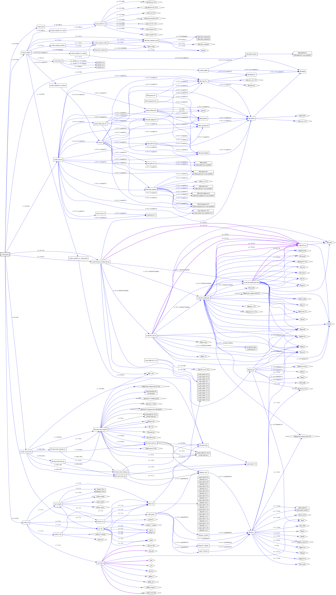
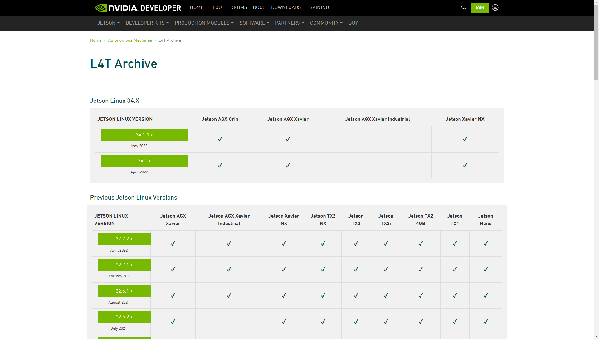

# Analyze Disk Usage

## Commands to Analyze Disk Usage

### `df`

If you already have a running Jetson system, you may want to start by knowing how much disk space you are using and left available.

```
df -h /dev/mmcblk0p1
```

!!! info ":material-numeric-4-box-multiple-outline:  Example outputs on Jetson Xavier NX Developer Kit with JetPack 4.6.1:"
    ```
    $ df -h /dev/mmcblk0p1
	Filesystem      Size  Used Avail Use% Mounted on
	/dev/mmcblk0p1   59G   13G   44G  22% /
    ```

??? info ":material-numeric-5-box-multiple:  Example outputs on Jetson Xavier NX Developer Kit with JetPack 5.0.1 DP:"
    ```
    $ df -h /dev/mmcblk0p1
	Filesystem      Size  Used Avail Use% Mounted on
	/dev/mmcblk0p1   59G   13G   44G  22% /
    ```

### `tree` command output filtered by disk usage size

To understand what takes up your disk space, `Disk Usage Analyzer` app on Ubuntu Desktop is a great tool, but you can also run the following tree based command to show what takes up a big chunk of disk space.

Below is an example of listing directories and files that are over 100MB.

```
sudo apt-get install tree
sudo bash -c "cd /; tree --du  -h  | grep -E \"\[[0-9]*M]|G]\""
```

??? info "Example output of the `tree` command on JetPack 4.6.1 and JetPack 5.0.1 DP:"

	=== ":material-numeric-4-box-multiple-outline: JetPack 4.6.x"

		```
		├── [442M]  lib
		│   ├── [325M]  firmware
		├── [298M]  opt
		│   ├── [123M]  nvidia
		│   │   └── [107M]  vpi1
		│   └── [175M]  ota_package
		│       └── [150M]  t19x
		├── [359M]  sys
		│   ├── [258M]  kernel
		│   │   ├── [238M]  slab
		├── [ 10G]  usr
		│   ├── [466M]  bin
		│   ├── [5.0G]  lib
		│   │   ├── [3.7G]  aarch64-linux-gnu
		│   │   │   ├── [535M]  dri
		│   │   │   ├── [104M]  libcudnn_adv_infer.so.8.2.1
		│   │   │   ├── [396M]  libcudnn_cnn_infer.so.8.2.1
		│   │   │   ├── [121M]  libcudnn_ops_infer.so.8.2.1
		│   │   │   ├── [810M]  libcudnn_static_v8.a
		│   │   │   ├── [157M]  libnvinfer.so.8.2.1
		│   │   │   ├── [345M]  libnvinfer_static.a
		│   │   │   ├── [142M]  tegra
		│   │   ├── [296M]  chromium-browser
		│   │   │   ├── [176M]  chromium-browser
		│   │   ├── [265M]  libreoffice
		│   │   │   ├── [207M]  program
		│   │   ├── [185M]  python3
		│   │   │   └── [185M]  dist-packages
		│   │   ├── [200M]  thunderbird
		│   │   │   ├── [119M]  libxul.so
		│   ├── [2.8G]  local
		│   │   ├── [2.8G]  cuda-10.2
		│   │   │   ├── [328M]  doc
		│   │   │   │   ├── [209M]  html
		│   │   │   │   └── [116M]  pdf
		│   │   │   ├── [203M]  samples
		│   │   │   ├── [2.2G]  targets
		│   │   │   │   └── [2.2G]  aarch64-linux
		│   │   │   │       └── [2.2G]  lib
		│   │   │   │           ├── [192M]  libcufft.so.10.1.2.300
		│   │   │   │           ├── [184M]  libcufft_static.a
		│   │   │   │           ├── [201M]  libcufft_static_nocallback.a
		│   │   │   │           ├── [209M]  libcusolver.so.10.3.0.300
		│   │   │   │           ├── [118M]  libcusolver_static.a
		│   │   │   │           ├── [135M]  libcusparse.so.10.3.1.300
		│   │   │   │           ├── [143M]  libcusparse_static.a
		│   │   │   │           ├── [157M]  libnvgraph.so.10.2.300
		│   │   │   │           ├── [160M]  libnvgraph_static.a
		│   ├── [988M]  share
		│   │   ├── [162M]  fonts
		│   │   ├── [117M]  locale
		│   └── [754M]  src
		│       └── [536M]  tensorrt
		│           ├── [532M]  data
		│           │   ├── [294M]  resnet50
		└── [1.4G]  var
			├── [1.0G]  cuda-repo-l4t-10-2-local
			│   ├── [105M]  libcufft-10-2_10.1.2.300-1_arm64.deb
			│   ├── [188M]  libcufft-dev-10-2_10.1.2.300-1_arm64.deb
			├── [201M]  lib
			│   ├── [136M]  apt
			│   │   ├── [136M]  lists
		```

	=== ":material-numeric-5-box-multiple: JetPack 5.0.1 DP"

		```
		├── [109M]  boot
		├── [1.1G]  opt
		│   ├── [861M]  nvidia
		│   │   ├── [724M]  nsight-systems
		│   │   │   └── [724M]  2022.2.3
		│   │   │       ├── [472M]  host-linux-armv8
		│   │   │       │   ├── [234M]  libQt6WebEngineCore.so.6
		│   │   │       ├── [115M]  target-linux-sbsa-armv8
		│   │   │       └── [116M]  target-linux-tegra-armv8
		│   │   └── [121M]  vpi2
		│   └── [279M]  ota_package
		│       ├── [165M]  t19x
		│       └── [114M]  t23x
		├── [110M]  sys
		├── [ 12G]  usr
		│   ├── [354M]  bin
		│   ├── [7.0G]  lib
		│   │   ├── [6.6G]  aarch64-linux-gnu
		│   │   │   ├── [873M]  dri
		│   │   │   ├── [154M]  libcudnn_adv_infer.so.8.3.2
		│   │   │   ├── [157M]  libcudnn_adv_infer_static.a
		│   │   │   ├── [104M]  libcudnn_adv_train.so.8.3.2
		│   │   │   ├── [106M]  libcudnn_adv_train_static.a
		│   │   │   ├── [863M]  libcudnn_cnn_infer.so.8.3.2
		│   │   │   ├── [1.1G]  libcudnn_cnn_infer_static.a
		│   │   │   ├── [101M]  libcudnn_cnn_train.so.8.3.2
		│   │   │   ├── [149M]  libcudnn_cnn_train_static.a
		│   │   │   ├── [228M]  libnvinfer_builder_resource.so.8.4.0
		│   │   │   ├── [451M]  libnvinfer.so.8.4.0
		│   │   │   ├── [1.1G]  libnvinfer_static.a
		│   │   │   ├── [229M]  tegra
		│   ├── [3.8G]  local
		│   │   ├── [3.8G]  cuda-11.4
		│   │   │   ├── [157M]  samples
		│   │   │   ├── [3.5G]  targets
		│   │   │   │   └── [3.5G]  aarch64-linux
		│   │   │   │       └── [3.5G]  lib
		│   │   │   │           ├── [354M]  libcublasLt.so.11.6.5.24
		│   │   │   │           ├── [480M]  libcublasLt_static.a
		│   │   │   │           ├── [160M]  libcublas.so.11.6.5.24
		│   │   │   │           ├── [203M]  libcublas_static.a
		│   │   │   │           ├── [167M]  libcufft.so.10.6.0.71
		│   │   │   │           ├── [206M]  libcufft_static.a
		│   │   │   │           ├── [179M]  libcufft_static_nocallback.a
		│   │   │   │           ├── [247M]  libcusolverMg.so.11.2.0.165
		│   │   │   │           ├── [208M]  libcusolver.so.11.2.0.165
		│   │   │   │           ├── [202M]  libcusolver_static.a
		│   │   │   │           ├── [220M]  libcusparse.so.11.6.0.165
		│   │   │   │           ├── [245M]  libcusparse_static.a
		│   ├── [250M]  share
		│   └── [762M]  src
		│       └── [525M]  tensorrt
		│           ├── [521M]  data
		│           │   ├── [294M]  resnet50
		└── [206M]  var
			├── [169M]  lib
			│   ├── [141M]  apt
			│   │   ├── [141M]  lists
		```

!!! note "For listing directories and files over 10MB:"

	```
	sudo bash -c "cd /; tree --du  -h  | grep -E \"\[[0-9[:space:]][0-9]*M]|G]\""
	```

### `dpkg-query` to count the number of installed packages

```
dpkg-query -W | wc -l
```

??? info "Example outputs summarized into a table format for JetPack versions"

    |  | JetPack 5.0.1 DP<br>(Rel 34.1.1)<br>Jetson AGX Orin<br>Developer Kit | JetPack 4.6.2<br>(Rel 32.7.2)<br>Jetson AGX Xavier<br>Developer Kit | JetPack 4.6.1<br>(Rel 32.7.1)<br>Jetson Xavier NX<br>Developer Kit |
    |---|--:|--:|--:|
    | [a] Regular L4T BSP | 1920 | 2217 |  |
    | [A] Full JetPack    | 2013 | 2340 | 2348 |
    | [B] GUI removed     | 1063 | 993 | 1003 |
    | [C] Docs/Samples removed | 1059 | 988 | 998 |
    | [D] dev packages removed | **1040** | **969** | **979** |

### `dpkg-query` with Size

```
dpkg-query -Wf '${Installed-Size;8} KiB \t${Package;-30}\t${binary:Summary}\n'
```

??? info ":material-numeric-5-box-multiple:  Example output of the `dpkg-query` command on Jetson AGX Xavier Developer Kit with JetPack 5.0.1 DP (Full JetPack components):"
    ```
		 624 KiB 	adduser                       	add and remove users and groups
		5135 KiB 	adwaita-icon-theme            	default icon theme of GNOME (small subset)
		 338 KiB 	alsa-ucm-conf                 	ALSA Use Case Manager configuration files
		2348 KiB 	alsa-utils                    	Utilities for configuring and using ALSA
		1884 KiB 	apparmor                      	user-space parser utility for AppArmor
		 792 KiB 	apport                        	automatically generate crash reports for debugging
		  61 KiB 	apport-symptoms               	symptom scripts for apport
		4009 KiB 	apt                           	commandline package manager
		 387 KiB 	base-files                    	Debian base system miscellaneous files
		 229 KiB 	base-passwd                   	Debian base system master password and group files
		1680 KiB 	bash                          	GNU Bourne Again SHell
		 218 KiB 	bc                            	GNU bc arbitrary precision calculator language
		 228 KiB 	binfmt-support                	Support for extra binary formats
		 107 KiB 	binutils                      	GNU assembler, linker and binary utilities
	   13184 KiB 	binutils-aarch64-linux-gnu    	GNU binary utilities, for aarch64-linux-gnu target
		 424 KiB 	binutils-common               	Common files for the GNU assembler, linker and binary utilities
		4782 KiB 	bluez                         	Bluetooth tools and daemons
		 109 KiB 	bridge-utils                  	Utilities for configuring the Linux Ethernet bridge
		 585 KiB 	bsdmainutils                  	collection of more utilities from FreeBSD
		 284 KiB 	bsdutils                      	basic utilities from 4.4BSD-Lite
		  95 KiB 	bubblewrap                    	setuid wrapper for unprivileged chroot and namespace manipulation
		  21 KiB 	build-essential               	Informational list of build-essential packages
		 175 KiB 	bzip2                         	high-quality block-sorting file compressor - utilities
		 380 KiB 	ca-certificates               	Common CA certificates
		 103 KiB 	ca-certificates-mono          	Common CA certificates (Mono keystore)
		 517 KiB 	can-utils                     	SocketCAN userspace utilities and tools
		 265 KiB 	cli-common                    	common files between all CLI packages
		 428 KiB 	console-setup                 	console font and keymap setup program
		1766 KiB 	console-setup-linux           	Linux specific part of console-setup
	  122369 KiB 	containerd                    	daemon to control runC
		6480 KiB 	coreutils                     	GNU core utilities
		  64 KiB 	cpp                           	GNU C preprocessor (cpp)
	   19215 KiB 	cpp-9                         	GNU C preprocessor
		 269 KiB 	crda                          	wireless Central Regulatory Domain Agent
		 512 KiB 	cryptsetup-bin                	disk encryption support - command line tools
	   12351 KiB 	cuda-cccl-11-4                	CUDA CCCL
		   7 KiB 	cuda-command-line-tools-11-4  	CUDA command-line tools
		   7 KiB 	cuda-compiler-11-4            	CUDA compiler
		 731 KiB 	cuda-cudart-11-4              	CUDA Runtime native Libraries
		4963 KiB 	cuda-cudart-dev-11-4          	CUDA Runtime native dev links, headers
		 279 KiB 	cuda-cuobjdump-11-4           	CUDA cuobjdump
	   21777 KiB 	cuda-cupti-11-4               	CUDA profiling tools runtime libs.
		1308 KiB 	cuda-cupti-dev-11-4           	CUDA profiling tools interface.
		1553 KiB 	cuda-cuxxfilt-11-4            	CUDA cuxxfilt
		 378 KiB 	cuda-documentation-11-4       	CUDA documentation
		 131 KiB 	cuda-driver-dev-11-4          	CUDA Driver native dev stub library
	   13984 KiB 	cuda-gdb-11-4                 	CUDA-GDB
		   7 KiB 	cuda-libraries-11-4           	CUDA Libraries 11.4 meta-package
		   7 KiB 	cuda-libraries-dev-11-4       	CUDA Libraries 11.4 development meta-package
	  100442 KiB 	cuda-nvcc-11-4                	CUDA nvcc
	   32610 KiB 	cuda-nvdisasm-11-4            	CUDA disassembler
		 559 KiB 	cuda-nvml-dev-11-4            	NVML native dev links, headers
		  88 KiB 	cuda-nvprof-11-4              	CUDA Profiler tools
		 154 KiB 	cuda-nvprune-11-4             	CUDA nvprune
	   46801 KiB 	cuda-nvrtc-11-4               	NVRTC native runtime libraries
		 117 KiB 	cuda-nvrtc-dev-11-4           	NVRTC native dev links, headers
		 444 KiB 	cuda-nvtx-11-4                	NVIDIA Tools Extension
	  161640 KiB 	cuda-samples-11-4             	CUDA example applications
	   26027 KiB 	cuda-sanitizer-11-4           	CUDA Sanitizer
		  14 KiB 	cuda-toolkit-11-4             	CUDA Toolkit 11.4 meta-package
		  70 KiB 	cuda-toolkit-11-4-config-commo	Common config package for CUDA Toolkit 11.4.
		  74 KiB 	cuda-toolkit-11-config-common 	Common config package for CUDA Toolkit 11.
		  74 KiB 	cuda-toolkit-config-common    	Common config package for CUDA Toolkit.
		   7 KiB 	cuda-tools-11-4               	CUDA Tools meta-package
		  10 KiB 	cuda-visual-tools-11-4        	CUDA visual tools
		 220 KiB 	dash                          	POSIX-compliant shell
		 574 KiB 	dbus                          	simple interprocess messaging system (daemon and utilities)
		 126 KiB 	dbus-user-session             	simple interprocess messaging system (systemd --user integration)
		 152 KiB 	dbus-x11                      	simple interprocess messaging system (X11 deps)
		  78 KiB 	dconf-gsettings-backend       	simple configuration storage system - GSettings back-end
		 110 KiB 	dconf-service                 	simple configuration storage system - D-Bus service
		 520 KiB 	debconf                       	Debian configuration management system
		 217 KiB 	debianutils                   	Miscellaneous utilities specific to Debian
		 446 KiB 	device-tree-compiler          	Device Tree Compiler for Flat Device Trees
		 496 KiB 	diffutils                     	File comparison utilities
		 872 KiB 	dirmngr                       	GNU privacy guard - network certificate management service
		  17 KiB 	distro-info-data              	information about the distributions' releases (data files)
		 277 KiB 	dmsetup                       	Linux Kernel Device Mapper userspace library
		  18 KiB 	dns-root-data                 	DNS root data including root zone and DNSSEC key
		 760 KiB 	dnsmasq-base                  	Small caching DNS proxy and DHCP/TFTP server
	  131139 KiB 	docker.io                     	Linux container runtime
		6704 KiB 	dpkg                          	Debian package management system
		2075 KiB 	dpkg-dev                      	Debian package development tools
		1406 KiB 	e2fsprogs                     	ext2/ext3/ext4 file system utilities
		 219 KiB 	fakeroot                      	tool for simulating superuser privileges
		 486 KiB 	fdisk                         	collection of partitioning utilities
		  82 KiB 	file                          	Recognize the type of data in a file using "magic" numbers
		 648 KiB 	findutils                     	utilities for finding files--find, xargs
		2008 KiB 	fio                           	flexible I/O tester
		 333 KiB 	fontconfig                    	generic font configuration library - support binaries
		 170 KiB 	fontconfig-config             	generic font configuration library - configuration
		2954 KiB 	fonts-dejavu-core             	Vera font family derivate with additional characters
		  99 KiB 	fuse                          	Filesystem in Userspace
		  16 KiB 	g++                           	GNU C++ compiler
	   20922 KiB 	g++-9                         	GNU C++ compiler
		  50 KiB 	gcc                           	GNU C compiler
		 265 KiB 	gcc-10-base                   	GCC, the GNU Compiler Collection (base package)
	   22627 KiB 	gcc-9                         	GNU C compiler
		 265 KiB 	gcc-9-base                    	GCC, the GNU Compiler Collection (base package)
		1893 KiB 	gdal-data                     	Geospatial Data Abstraction Library - Data files
		 789 KiB 	gdbserver                     	GNU Debugger (remote server)
		 804 KiB 	gdisk                         	GPT fdisk text-mode partitioning tool
		 650 KiB 	gir1.2-glib-2.0               	Introspection data for GLib, GObject, Gio and GModule
		 237 KiB 	gir1.2-gst-plugins-bad-1.0    	GObject introspection data for the GStreamer libraries from the "bad" set
		 469 KiB 	gir1.2-gst-plugins-base-1.0   	GObject introspection data for the GStreamer Plugins Base library
		1427 KiB 	gir1.2-gstreamer-1.0          	GObject introspection data for the GStreamer library
	   34904 KiB 	git                           	fast, scalable, distributed revision control system
		1779 KiB 	git-man                       	fast, scalable, distributed revision control system (manual pages)
		 187 KiB 	glib-networking               	network-related giomodules for GLib
		  52 KiB 	glib-networking-common        	network-related giomodules for GLib - data files
		  47 KiB 	glib-networking-services      	network-related giomodules for GLib - D-Bus services
		 413 KiB 	gnupg                         	GNU privacy guard - a free PGP replacement
		 380 KiB 	gnupg-l10n                    	GNU privacy guard - localization files
		1485 KiB 	gnupg-utils                   	GNU privacy guard - utility programs
		1107 KiB 	gpg                           	GNU Privacy Guard -- minimalist public key operations
		 878 KiB 	gpg-agent                     	GNU privacy guard - cryptographic agent
		 275 KiB 	gpg-wks-client                	GNU privacy guard - Web Key Service client
		 247 KiB 	gpg-wks-server                	GNU privacy guard - Web Key Service server
		 389 KiB 	gpgconf                       	GNU privacy guard - core configuration utilities
		 548 KiB 	gpgsm                         	GNU privacy guard - S/MIME version
		 487 KiB 	gpgv                          	GNU privacy guard - signature verification tool
		  81 KiB 	graphsurgeon-tf               	GraphSurgeon for TensorRT package
		 472 KiB 	grep                          	GNU grep, egrep and fgrep
		3526 KiB 	groff-base                    	GNU troff text-formatting system (base system components)
		 284 KiB 	gsettings-desktop-schemas     	GSettings desktop-wide schemas
		 200 KiB 	gstreamer1.0-alsa             	GStreamer plugin for ALSA
		 381 KiB 	gstreamer1.0-libav            	ffmpeg plugin for GStreamer
		6406 KiB 	gstreamer1.0-plugins-bad      	GStreamer plugins from the "bad" set
		2087 KiB 	gstreamer1.0-plugins-base     	GStreamer plugins from the "base" set
		5696 KiB 	gstreamer1.0-plugins-good     	GStreamer plugins from the "good" set
		 828 KiB 	gstreamer1.0-plugins-ugly     	GStreamer plugins from the "ugly" set
		1234 KiB 	gstreamer1.0-tools            	Tools for use with GStreamer
		 324 KiB 	gstreamer1.0-x                	GStreamer plugins for X11 and Pango
		 146 KiB 	gtk-update-icon-cache         	icon theme caching utility
		 244 KiB 	gzip                          	GNU compression utilities
		  73 KiB 	haveged                       	Linux entropy source using the HAVEGE algorithm
		 440 KiB 	hicolor-icon-theme            	default fallback theme for FreeDesktop.org icon themes
		  46 KiB 	hostname                      	utility to set/show the host name or domain name
	   20754 KiB 	humanity-icon-theme           	Humanity Icon theme
		 272 KiB 	i2c-tools                     	heterogeneous set of I2C tools for Linux
		 133 KiB 	init-system-helpers           	helper tools for all init systems
		2680 KiB 	iproute2                      	networking and traffic control tools
		2096 KiB 	iptables                      	administration tools for packet filtering and NAT
		 108 KiB 	iputils-ping                  	Tools to test the reachability of network hosts
		 722 KiB 	isc-dhcp-client               	DHCP client for automatically obtaining an IP address
		1479 KiB 	isc-dhcp-server               	ISC DHCP server for automatic IP address assignment
	   19553 KiB 	iso-codes                     	ISO language, territory, currency, script codes and their translations
		 275 KiB 	iw                            	tool for configuring Linux wireless devices
		  52 KiB 	jetson-gpio-common            	Jetson GPIO library package (common files)
		1272 KiB 	kbd                           	Linux console font and keytable utilities
		 827 KiB 	keyboard-configuration        	system-wide keyboard preferences
		 247 KiB 	kmod                          	tools for managing Linux kernel modules
		   9 KiB 	language-pack-en              	translation updates for language English
		3828 KiB 	language-pack-en-base         	translations for language English
		 301 KiB 	less                          	pager program similar to more
		  66 KiB 	liba52-0.7.4                  	library for decoding ATSC A/52 streams
		 146 KiB 	libaa1                        	ASCII art library
		  65 KiB 	libacl1                       	access control list - shared library
		  49 KiB 	libaec0                       	Adaptive Entropy Coding library
		  31 KiB 	libaio1                       	Linux kernel AIO access library - shared library
		 106 KiB 	libalgorithm-diff-perl        	module to find differences between files
		  42 KiB 	libalgorithm-diff-xs-perl     	module to find differences between files (XS accelerated)
		  42 KiB 	libalgorithm-merge-perl       	Perl module for three-way merge of textual data
		2315 KiB 	libaom0                       	AV1 Video Codec Library
		 159 KiB 	libapparmor1                  	changehat AppArmor library
		3107 KiB 	libapt-pkg6.0                 	package management runtime library
		 808 KiB 	libarchive13                  	Multi-format archive and compression library (shared library)
		  51 KiB 	libargon2-1                   	memory-hard hashing function - runtime library
		 662 KiB 	libarmadillo9                 	streamlined C++ linear algebra library
		 257 KiB 	libarpack2                    	Fortran77 subroutines to solve large scale eigenvalue problems
	   14943 KiB 	libasan5                      	AddressSanitizer -- a fast memory error detector
		 732 KiB 	libasn1-8-heimdal             	Heimdal Kerberos - ASN.1 library
		1098 KiB 	libasound2                    	shared library for ALSA applications
		 215 KiB 	libasound2-data               	Configuration files and profiles for ALSA drivers
		 167 KiB 	libass9                       	library for SSA/ASS subtitles rendering
		 101 KiB 	libassuan0                    	IPC library for the GnuPG components
		  39 KiB 	libasyncns0                   	Asynchronous name service query library
		 230 KiB 	libatk-bridge2.0-0            	AT-SPI 2 toolkit bridge - shared library
		 199 KiB 	libatk1.0-0                   	ATK accessibility toolkit
		  44 KiB 	libatk1.0-data                	Common files for the ATK accessibility toolkit
		  52 KiB 	libatomic1                    	support library providing __atomic built-in functions
		 156 KiB 	libatopology2                 	shared library for handling ALSA topology definitions
		 235 KiB 	libatspi2.0-0                 	Assistive Technology Service Provider Interface - shared library
		  52 KiB 	libattr1                      	extended attribute handling - shared library
		  24 KiB 	libaudit-common               	Dynamic library for security auditing - common files
		 148 KiB 	libaudit1                     	Dynamic library for security auditing
		 124 KiB 	libavahi-client3              	Avahi client library
		 112 KiB 	libavahi-common-data          	Avahi common data files
		 109 KiB 	libavahi-common3              	Avahi common library
		  53 KiB 	libavc1394-0                  	control IEEE 1394 audio/video devices
	   17329 KiB 	libavcodec-dev                	FFmpeg library with de/encoders for audio/video codecs - development files
	   11696 KiB 	libavcodec58                  	FFmpeg library with de/encoders for audio/video codecs - runtime files
		3271 KiB 	libavfilter7                  	FFmpeg library containing media filters - runtime files
		5298 KiB 	libavformat-dev               	FFmpeg library with (de)muxers for multimedia containers - development files
		2513 KiB 	libavformat58                 	FFmpeg library with (de)muxers for multimedia containers - runtime files
		 233 KiB 	libavresample-dev             	FFmpeg compatibility library for resampling - development files
		 152 KiB 	libavresample4                	FFmpeg compatibility library for resampling - runtime files
		1634 KiB 	libavutil-dev                 	FFmpeg library with functions for simplifying programming - development files
		 644 KiB 	libavutil56                   	FFmpeg library with functions for simplifying programming - runtime files
		2092 KiB 	libbinutils                   	GNU binary utilities (private shared library)
		 375 KiB 	libblas3                      	Basic Linear Algebra Reference implementations, shared library
		 977 KiB 	libblkid-dev                  	block device ID library - headers and static libraries
		 443 KiB 	libblkid1                     	block device ID library
		 213 KiB 	libbluetooth3                 	Library to use the BlueZ Linux Bluetooth stack
		 344 KiB 	libbluray2                    	Blu-ray disc playback support library (shared library)
		2105 KiB 	libboost-iostreams1.71.0      	Boost.Iostreams Library
		2129 KiB 	libboost-thread1.71.0         	portable C++ multi-threading
		 694 KiB 	libbrotli1                    	library implementing brotli encoder and decoder (shared libraries)
		  36 KiB 	libbs2b0                      	Bauer stereophonic-to-binaural DSP library
		 191 KiB 	libbsd0                       	utility functions from BSD systems - shared library
		  94 KiB 	libbz2-1.0                    	high-quality block-sorting file compressor library - runtime
		3182 KiB 	libc-bin                      	GNU C Library: Binaries
		 422 KiB 	libc-dev-bin                  	GNU C Library: Development binaries
	   10447 KiB 	libc6                         	GNU C Library: Shared libraries
	   15765 KiB 	libc6-dev                     	GNU C Library: Development Libraries and Header Files
		1025 KiB 	libcaca0                      	colour ASCII art library
		  94 KiB 	libcairo-gobject2             	Cairo 2D vector graphics library (GObject library)
		1250 KiB 	libcairo2                     	Cairo 2D vector graphics library
		 118 KiB 	libcanberra0                  	simple abstract interface for playing event sounds
		  37 KiB 	libcap-ng0                    	An alternate POSIX capabilities library
		  52 KiB 	libcap2                       	POSIX 1003.1e capabilities (library)
		 100 KiB 	libcap2-bin                   	POSIX 1003.1e capabilities (utilities)
		  78 KiB 	libcbor0.6                    	library for parsing and generating CBOR (RFC 7049)
		 148 KiB 	libcc1-0                      	GCC cc1 plugin for GDB
		 287 KiB 	libcdio18                     	library to read and control CD-ROM
		 118 KiB 	libcdparanoia0                	audio extraction tool for sampling CDs (library)
		1375 KiB 	libcfitsio8                   	shared library for I/O with FITS format data files
		 267 KiB 	libcharls2                    	Implementation of the JPEG-LS standard
		  94 KiB 	libchromaprint1               	audio fingerprint library
	   14180 KiB 	libcodec2-0.9                 	Codec2 runtime library
		 600 KiB 	libcolord2                    	system service to manage device colour profiles -- runtime
		  91 KiB 	libcom-err2                   	common error description library
		 328 KiB 	libcrypt-dev                  	libcrypt development files
		 221 KiB 	libcrypt1                     	libcrypt shared library
		 479 KiB 	libcryptsetup12               	disk encryption support - shared library
		 185 KiB 	libctf-nobfd0                 	Compact C Type Format library (runtime, no BFD dependency)
		 121 KiB 	libctf0                       	Compact C Type Format library (runtime, BFD dependency)
	  527675 KiB 	libcublas-11-4                	CUBLAS native runtime libraries
	  699018 KiB 	libcublas-dev-11-4            	CUBLAS native dev links, headers
		 232 KiB 	libcudla-11-4                 	CUDLA native runtime libraries
		 111 KiB 	libcudla-dev-11-4             	CUDLA native dev links, headers
	 1419681 KiB 	libcudnn8                     	cuDNN runtime libraries
	 1718597 KiB 	libcudnn8-dev                 	cuDNN development libraries and headers
		2117 KiB 	libcudnn8-samples             	cuDNN samples
	  171408 KiB 	libcufft-11-4                 	CUFFT native runtime libraries
	  393703 KiB 	libcufft-dev-11-4             	CUFFT native dev links, headers
		 757 KiB 	libcups2                      	Common UNIX Printing System(tm) - Core library
	   79647 KiB 	libcurand-11-4                	CURAND native runtime libraries
	   81676 KiB 	libcurand-dev-11-4            	CURAND native dev links, headers
		 641 KiB 	libcurl3-gnutls               	easy-to-use client-side URL transfer library (GnuTLS flavour)
	  466273 KiB 	libcusolver-11-4              	CUDA solver native runtime libraries
	  223245 KiB 	libcusolver-dev-11-4          	CUDA solver native dev links, headers
	  225282 KiB 	libcusparse-11-4              	CUSPARSE native runtime libraries
	  251151 KiB 	libcusparse-dev-11-4          	CUSPARSE native dev links, headers
		1535 KiB 	libdap25                      	Open-source Project for a Network Data Access Protocol library
		 270 KiB 	libdapclient6v5               	Client library for the Network Data Access Protocol
		  57 KiB 	libdatrie1                    	Double-array trie library
		1613 KiB 	libdb5.3                      	Berkeley v5.3 Database Libraries [runtime]
		 461 KiB 	libdbus-1-3                   	simple interprocess messaging system (library)
		 233 KiB 	libdc1394-22                  	high level programming interface for IEEE 1394 digital cameras
		 589 KiB 	libdc1394-22-dev              	high level programming interface for IEEE 1394 digital cameras - development
		 181 KiB 	libdca0                       	decoding library for DTS Coherent Acoustics streams
		 102 KiB 	libdconf1                     	simple configuration storage system - runtime library
		 552 KiB 	libde265-0                    	Open H.265 video codec implementation
		  69 KiB 	libdebconfclient0             	Debian Configuration Management System (C-implementation library)
		 492 KiB 	libdevmapper1.02.1            	Linux Kernel Device Mapper userspace library
		2123 KiB 	libdns-export1109             	Exported DNS Shared Library
		2180 KiB 	libdpkg-perl                  	Dpkg perl modules
		  80 KiB 	libdrm-amdgpu1                	Userspace interface to amdgpu-specific kernel DRM services -- runtime
		  45 KiB 	libdrm-common                 	Userspace interface to kernel DRM services -- common files
		 695 KiB 	libdrm-dev                    	Userspace interface to kernel DRM services -- development files
		  62 KiB 	libdrm-etnaviv1               	Userspace interface to etnaviv-specific kernel DRM services -- runtime
		  79 KiB 	libdrm-freedreno1             	Userspace interface to msm/kgsl kernel DRM services -- runtime
		  74 KiB 	libdrm-nouveau2               	Userspace interface to nouveau-specific kernel DRM services -- runtime
		  83 KiB 	libdrm-radeon1                	Userspace interface to radeon-specific kernel DRM services -- runtime
		  49 KiB 	libdrm-tegra0                 	Userspace interface to tegra-specific kernel DRM services -- runtime
		 116 KiB 	libdrm2                       	Userspace interface to kernel DRM services -- runtime
		 143 KiB 	libdv4                        	software library for DV format digital video (runtime lib)
		 116 KiB 	libdvdnav4                    	DVD navigation library
		 143 KiB 	libdvdread7                   	library for reading DVDs
		 242 KiB 	libedit2                      	BSD editline and history libraries
		 117 KiB 	libegl-dev                    	Vendor neutral GL dispatch library -- EGL development files
		 332 KiB 	libegl-mesa0                  	free implementation of the EGL API -- Mesa vendor library
		 108 KiB 	libegl1                       	Vendor neutral GL dispatch library -- EGL support
		  70 KiB 	libegl1-mesa                  	transitional dummy package
		  79 KiB 	libegl1-mesa-dev              	free implementation of the EGL API -- development files
		 192 KiB 	libelf1                       	library to read and write ELF files
		1448 KiB 	libepoxy0                     	OpenGL function pointer management library
		 110 KiB 	libepsilon1                   	Library for wavelet image compression
		  71 KiB 	liberror-perl                 	Perl module for error/exception handling in an OO-ish way
		  25 KiB 	libestr0                      	Helper functions for handling strings (lib)
		 131 KiB 	libevdev2                     	wrapper library for evdev devices
		 392 KiB 	libevent-2.1-7                	Asynchronous event notification library
		 262 KiB 	libevent-core-2.1-7           	Asynchronous event notification library (core)
		  41 KiB 	libevent-pthreads-2.1-7       	Asynchronous event notification library (pthreads)
		 508 KiB 	libexif-dev                   	library to parse EXIF files (development files)
		 360 KiB 	libexif12                     	library to parse EXIF files
		 354 KiB 	libexpat1                     	XML parsing C library - runtime library
		 535 KiB 	libext2fs2                    	ext2/ext3/ext4 file system libraries
		 497 KiB 	libfaad2                      	freeware Advanced Audio Decoder - runtime files
		 161 KiB 	libfakeroot                   	tool for simulating superuser privileges - shared libraries
		  57 KiB 	libfastjson4                  	fast json library for C
		 549 KiB 	libfdisk1                     	fdisk partitioning library
		  58 KiB 	libfdt1                       	Flat Device Trees manipulation library
		 271 KiB 	libffi-dev                    	Foreign Function Interface library (development files)
		  57 KiB 	libffi7                       	Foreign Function Interface library runtime
		 830 KiB 	libfftw3-double3              	Library for computing Fast Fourier Transforms - Double precision
		1382 KiB 	libfftw3-single3              	Library for computing Fast Fourier Transforms - Single precision
		 160 KiB 	libfido2-1                    	library for generating and verifying FIDO 2.0 objects
		 248 KiB 	libflac8                      	Free Lossless Audio Codec - runtime C library
	   26566 KiB 	libflite1                     	Small run-time speech synthesis engine - shared libraries
		 502 KiB 	libfluidsynth2                	Real-time MIDI software synthesizer (runtime library)
		 313 KiB 	libfontconfig1                	generic font configuration library - runtime
		  42 KiB 	libfontenc1                   	X11 font encoding library
		 780 KiB 	libfreetype6                  	FreeType 2 font engine, shared library files
		  90 KiB 	libfreexl1                    	library for direct reading of Microsoft Excel spreadsheets
		 135 KiB 	libfribidi0                   	Free Implementation of the Unicode BiDi algorithm
		 300 KiB 	libfuse2                      	Filesystem in Userspace (library)
		 293 KiB 	libfyba0                      	FYBA library to read and write Norwegian geodata standard format SOSI
		 456 KiB 	libgail-common                	GNOME Accessibility Implementation Library -- common modules
		  97 KiB 	libgail18                     	GNOME Accessibility Implementation Library -- shared libraries
		 139 KiB 	libgbm1                       	generic buffer management API -- runtime
		9948 KiB 	libgcc-9-dev                  	GCC support library (development files)
		  95 KiB 	libgcc-s1                     	GCC support library
		  95 KiB 	libgcc1                       	GCC support library (dependency package)
		 835 KiB 	libgcrypt20                   	LGPL Crypto library - runtime library
		 436 KiB 	libgd3                        	GD Graphics Library
	   18671 KiB 	libgdal26                     	Geospatial Data Abstraction Library
		  40 KiB 	libgdbm-compat4               	GNU dbm database routines (legacy support runtime version) 
		  82 KiB 	libgdbm6                      	GNU dbm database routines (runtime version) 
		2973 KiB 	libgdcm-dev                   	Grassroots DICOM development libraries and headers
	   10912 KiB 	libgdcm3.0                    	Grassroots DICOM runtime libraries
		 540 KiB 	libgdk-pixbuf2.0-0            	GDK Pixbuf library
		  52 KiB 	libgdk-pixbuf2.0-common       	GDK Pixbuf library - data files
		2055 KiB 	libgeos-3.8.0                 	Geometry engine for Geographic Information Systems - C++ Library
		 294 KiB 	libgeos-c1v5                  	Geometry engine for Geographic Information Systems - C Library
		 246 KiB 	libgeotiff5                   	GeoTIFF (geografic enabled TIFF) library -- run-time files
		 221 KiB 	libgfapi0                     	GlusterFS gfapi shared library
		1513 KiB 	libgfortran5                  	Runtime library for GNU Fortran applications
		 289 KiB 	libgfrpc0                     	GlusterFS libgfrpc shared library
		 140 KiB 	libgfxdr0                     	GlusterFS libgfxdr shared library
		  68 KiB 	libgif7                       	library for GIF images (library)
		 249 KiB 	libgirepository-1.0-1         	Library for handling GObject introspection data (runtime library)
		1356 KiB 	libgl-dev                     	Vendor neutral GL dispatch library -- GL development files
		1041 KiB 	libgl1                        	Vendor neutral GL dispatch library -- legacy GL support
		  70 KiB 	libgl1-mesa-dev               	transitional dummy package
	  893647 KiB 	libgl1-mesa-dri               	free implementation of the OpenGL API -- DRI modules
		  87 KiB 	libgl2ps1.4                   	Lib providing high quality vector output for OpenGL application
		 501 KiB 	libglapi-mesa                 	free implementation of the GL API -- shared library
		 701 KiB 	libgles-dev                   	Vendor neutral GL dispatch library -- GLES development files
		 170 KiB 	libgles1                      	Vendor neutral GL dispatch library -- GLESv1 support
		 182 KiB 	libgles2                      	Vendor neutral GL dispatch library -- GLESv2 support
		  70 KiB 	libgles2-mesa                 	transitional dummy package
		  70 KiB 	libgles2-mesa-dev             	transitional dummy package
		4042 KiB 	libglib2.0-0                  	GLib library of C routines
		 306 KiB 	libglib2.0-bin                	Programs for the GLib library
		 283 KiB 	libglib2.0-cil                	CLI binding for the GLib utility library 2.12
		 150 KiB 	libglib2.0-cil-dev            	CLI binding for the GLib utility library 2.12
		 104 KiB 	libglib2.0-data               	Common files for GLib library
	   10542 KiB 	libglib2.0-dev                	Development files for the GLib library
		 611 KiB 	libglib2.0-dev-bin            	Development utilities for the GLib library
	   21460 KiB 	libglib2.0-doc                	Documentation files for the GLib library
		8779 KiB 	libglib2.0-tests              	GLib library of C routines - installed tests
		 415 KiB 	libglu1-mesa                  	Mesa OpenGL utility library (GLU)
		1104 KiB 	libglusterfs0                 	GlusterFS shared library
		  65 KiB 	libglvnd-dev                  	Vendor neutral GL dispatch library -- development files
		1509 KiB 	libglvnd0                     	Vendor neutral GL dispatch library
		  89 KiB 	libglx-dev                    	Vendor neutral GL dispatch library -- GLX development files
		 623 KiB 	libglx-mesa0                  	free implementation of the OpenGL API -- GLX vendor library
		 159 KiB 	libglx0                       	Vendor neutral GL dispatch library -- GLX support
		 289 KiB 	libgme0                       	Playback library for video game music files - shared library
		 519 KiB 	libgmp10                      	Multiprecision arithmetic library
		2240 KiB 	libgnutls30                   	GNU TLS library - main runtime library
		 274 KiB 	libgomp1                      	GCC OpenMP (GOMP) support library
		 168 KiB 	libgpg-error0                 	GnuPG development runtime library
		3144 KiB 	libgphoto2-6                  	gphoto2 digital camera library
		3596 KiB 	libgphoto2-dev                	gphoto2 digital camera library (development files)
		 308 KiB 	libgphoto2-port12             	gphoto2 digital camera port library
		  59 KiB 	libgpm2                       	General Purpose Mouse - shared library
		 163 KiB 	libgraphite2-3                	Font rendering engine for Complex Scripts -- library
		  67 KiB 	libgsm1                       	Shared libraries for GSM speech compressor
		 410 KiB 	libgssapi-krb5-2              	MIT Kerberos runtime libraries - krb5 GSS-API Mechanism
		 300 KiB 	libgssapi3-heimdal            	Heimdal Kerberos - GSSAPI support library
		 111 KiB 	libgssdp-1.2-0                	GObject-based library for SSDP
		 588 KiB 	libgstreamer-gl1.0-0          	GStreamer GL libraries
		 165 KiB 	libgstreamer-opencv1.0-0      	GStreamer OpenCV libraries
		1026 KiB 	libgstreamer-plugins-bad1.0-0 	GStreamer libraries from the "bad" set
		1142 KiB 	libgstreamer-plugins-bad1.0-de	GStreamer development files for libraries from the "bad" set
		2456 KiB 	libgstreamer-plugins-base1.0-0	GStreamer libraries from the "base" set
		4926 KiB 	libgstreamer-plugins-base1.0-d	GStreamer development files for libraries from the "base" set
		 195 KiB 	libgstreamer-plugins-good1.0-0	GStreamer development files for libraries from the "good" set
		 184 KiB 	libgstreamer-plugins-good1.0-d	GStreamer development files for libraries from the "good" set
		3856 KiB 	libgstreamer1.0-0             	Core GStreamer libraries and elements
		4936 KiB 	libgstreamer1.0-0-dbg         	Core GStreamer libraries and elements
		6671 KiB 	libgstreamer1.0-dev           	GStreamer core development files
		9816 KiB 	libgtk-3-0                    	GTK graphical user interface library
		 420 KiB 	libgtk-3-common               	common files for the GTK graphical user interface library
		5840 KiB 	libgtk2.0-0                   	GTK graphical user interface library - old version
		  70 KiB 	libgtk2.0-bin                 	programs for the GTK graphical user interface library
		 268 KiB 	libgtk2.0-common              	common files for the GTK graphical user interface library
		  60 KiB 	libgudev-1.0-0                	GObject-based wrapper library for libudev
		 244 KiB 	libgupnp-1.2-0                	GObject-based library for UPnP
		  51 KiB 	libgupnp-igd-1.0-4            	library to handle UPnP IGD port mapping
		 991 KiB 	libharfbuzz0b                 	OpenType text shaping engine (shared library)
		 121 KiB 	libhavege1                    	entropy source using the HAVEGE algorithm - shared library
		 274 KiB 	libhcrypto4-heimdal           	Heimdal Kerberos - crypto library
		 724 KiB 	libhdf4-0-alt                 	Hierarchical Data Format library (without NetCDF)
		4536 KiB 	libhdf5-103                   	Hierarchical Data Format 5 (HDF5) - runtime files - serial version
		4658 KiB 	libhdf5-openmpi-103           	Hierarchical Data Format 5 (HDF5) - runtime files - OpenMPI version
		 104 KiB 	libheimbase1-heimdal          	Heimdal Kerberos - Base library
		  81 KiB 	libheimntlm0-heimdal          	Heimdal Kerberos - NTLM support library
		 237 KiB 	libhogweed5                   	low level cryptographic library (public-key cryptos)
		  70 KiB 	libhwloc-plugins              	Hierarchical view of the machine - plugins
		 312 KiB 	libhwloc15                    	Hierarchical view of the machine - shared libs
		 348 KiB 	libhx509-5-heimdal            	Heimdal Kerberos - X509 support library
		  28 KiB 	libi2c0                       	userspace I2C programming library
		 159 KiB 	libibverbs1                   	Library for direct userspace use of RDMA (InfiniBand/iWARP)
		 108 KiB 	libice6                       	X11 Inter-Client Exchange library
	   32597 KiB 	libicu66                      	International Components for Unicode
		 239 KiB 	libidn11                      	GNU Libidn library, implementation of IETF IDN specifications
		 208 KiB 	libidn2-0                     	Internationalized domain names (IDNA2008/TR46) library
		  74 KiB 	libiec61883-0                 	partial implementation of IEC 61883 (shared lib)
		 587 KiB 	libilmbase-dev                	development files for IlmBase
		 523 KiB 	libilmbase24                  	several utility libraries from ILM used by OpenEXR
		 110 KiB 	libinput-bin                  	input device management and event handling library - udev quirks
		 312 KiB 	libinput10                    	input device management and event handling library - shared library
		 816 KiB 	libinstpatch-1.0-2            	MIDI instrument editing library
		  78 KiB 	libip4tc2                     	netfilter libip4tc library
		  78 KiB 	libip6tc2                     	netfilter libip6tc library
		  86 KiB 	libirs-export161              	Exported IRS Shared Library
		 497 KiB 	libisc-export1105             	Exported ISC Shared Library
		 215 KiB 	libisccfg-export163           	Exported ISC CFG Shared Library
		1946 KiB 	libisl22                      	manipulating sets and relations of integer points bounded by linear constraints
		 110 KiB 	libitm1                       	GNU Transactional Memory Library
		  56 KiB 	libiw30                       	Wireless tools - library
		1098 KiB 	libjack-jackd2-0              	JACK Audio Connection Kit (libraries)
		  79 KiB 	libjansson4                   	C library for encoding, decoding and manipulating JSON data
		  80 KiB 	libjbig-dev                   	JBIGkit development files
		  69 KiB 	libjbig0                      	JBIGkit libraries
		  26 KiB 	libjpeg-dev                   	Independent JPEG Group's JPEG runtime library (dependency package)
		 286 KiB 	libjpeg-turbo8                	IJG JPEG compliant runtime library.
		 582 KiB 	libjpeg-turbo8-dev            	Development files for the IJG JPEG library
		  26 KiB 	libjpeg8                      	Independent JPEG Group's JPEG runtime library (dependency package)
		  26 KiB 	libjpeg8-dev                  	Independent JPEG Group's JPEG runtime library (dependency package)
		 729 KiB 	libjs-jquery                  	JavaScript library for dynamic web applications
		  88 KiB 	libjson-c4                    	JSON manipulation library - shared library
		 190 KiB 	libjson-glib-1.0-0            	GLib JSON manipulation library
		  40 KiB 	libjson-glib-1.0-common       	GLib JSON manipulation library (common files)
		 221 KiB 	libjsoncpp1                   	library for reading and writing JSON for C++
		 291 KiB 	libk5crypto3                  	MIT Kerberos runtime libraries - Crypto Library
		 104 KiB 	libkate1                      	Codec for karaoke and text encapsulation
		  42 KiB 	libkeyutils1                  	Linux Key Management Utilities (library)
		 143 KiB 	libkmlbase1                   	Library to manipulate KML 2.2 OGC standard files - libkmlbase
		 721 KiB 	libkmldom1                    	Library to manipulate KML 2.2 OGC standard files - libkmldom
		 264 KiB 	libkmlengine1                 	Library to manipulate KML 2.2 OGC standard files - libkmlengine
		 129 KiB 	libkmod2                      	libkmod shared library
		 644 KiB 	libkrb5-26-heimdal            	Heimdal Kerberos - libraries
		1097 KiB 	libkrb5-3                     	MIT Kerberos runtime libraries
		 163 KiB 	libkrb5support0               	MIT Kerberos runtime libraries - Support library
		 226 KiB 	libksba8                      	X.509 and CMS support library
		5335 KiB 	liblapack3                    	Library of linear algebra routines 3 - shared version
		 377 KiB 	liblcms2-2                    	Little CMS 2 color management library
		 511 KiB 	libldap-2.4-2                 	OpenLDAP libraries
		 102 KiB 	libldap-common                	OpenLDAP common files for libraries
		2663 KiB 	liblept5                      	image processing library
		 126 KiB 	liblilv-0-0                   	library for simple use of LV2 plugins
	   81948 KiB 	libllvm12                     	Modular compiler and toolchain technologies, runtime library
		  54 KiB 	liblocale-gettext-perl        	module using libc functions for internationalization in Perl
		3199 KiB 	liblsan0                      	LeakSanitizer -- a memory leak detector (runtime)
		 418 KiB 	libltdl7                      	System independent dlopen wrapper for GNU libtool
		 140 KiB 	liblz4-1                      	Fast LZ compression algorithm library - runtime
		 575 KiB 	liblzma-dev                   	XZ-format compression library - development files
		 251 KiB 	liblzma5                      	XZ-format compression library
		 150 KiB 	liblzo2-2                     	data compression library
		5723 KiB 	libmagic-mgc                  	File type determination library using "magic" numbers (compiled magic file)
		 208 KiB 	libmagic1                     	Recognize the type of data in a file using "magic" numbers - library
		 401 KiB 	libmbim-glib4                 	Support library to use the MBIM protocol
		  32 KiB 	libmbim-proxy                 	Proxy to communicate with MBIM ports
		  55 KiB 	libminizip1                   	compression library - minizip library
		  69 KiB 	libmjpegutils-2.1-0           	MJPEG capture/editing/replay and MPEG encoding toolset (library)
		1037 KiB 	libmm-glib0                   	D-Bus service for managing modems - shared libraries
		  74 KiB 	libmms0                       	MMS stream protocol library - shared library
		  42 KiB 	libmnl0                       	minimalistic Netlink communication library
		 307 KiB 	libmodplug1                   	shared libraries for mod music based on ModPlug
		 111 KiB 	libmono-btls-interface4.0-cil 	Mono Mono.Btls.Interface library (for CLI 4.0)
		4780 KiB 	libmono-corlib4.5-cil         	Mono core library (for CLI 4.5)
		 153 KiB 	libmono-i18n-west4.0-cil      	Mono I18N.West library (for CLI 4.0)
		 122 KiB 	libmono-i18n4.0-cil           	Mono I18N base library (for CLI 4.0)
		 339 KiB 	libmono-security4.0-cil       	Mono Security library (for CLI 4.0)
		 210 KiB 	libmono-system-configuration4.	Mono System.Configuration library (for CLI 4.0)
		1225 KiB 	libmono-system-core4.0-cil    	Mono System.Core library (for CLI 4.0)
		 208 KiB 	libmono-system-numerics4.0-cil	Mono System.Numerics library (for CLI 4.0)
		 408 KiB 	libmono-system-security4.0-cil	Mono System.Security library (for CLI 4.0)
		3371 KiB 	libmono-system-xml4.0-cil     	Mono System.Xml library (for CLI 4.0)
		2791 KiB 	libmono-system4.0-cil         	Mono System libraries (for CLI 4.0)
		1006 KiB 	libmount-dev                  	device mounting library - headers and static libraries
		 478 KiB 	libmount1                     	device mounting library
		 301 KiB 	libmp3lame0                   	MP3 encoding library
		 109 KiB 	libmpc3                       	multiple precision complex floating-point library
		  80 KiB 	libmpcdec6                    	MusePack decoder - library
		 235 KiB 	libmpdec2                     	library for decimal floating point arithmetic (runtime library)
		 134 KiB 	libmpeg2-4                    	MPEG1 and MPEG2 video decoder library
		 173 KiB 	libmpeg2encpp-2.1-0           	MJPEG capture/editing/replay and MPEG encoding toolset (library)
		1044 KiB 	libmpfr6                      	multiple precision floating-point computation
		 292 KiB 	libmpg123-0                   	MPEG layer 1/2/3 audio decoder (shared library)
		 129 KiB 	libmplex2-2.1-0               	MJPEG capture/editing/replay and MPEG encoding toolset (library)
		  54 KiB 	libmtdev1                     	Multitouch Protocol Translation Library - shared library
		 109 KiB 	libmysofa1                    	library to read HRTFs stored in the AES69-2015 SOFA format
		7308 KiB 	libmysqlclient21              	MySQL database client library
		 308 KiB 	libncurses6                   	shared libraries for terminal handling
		 392 KiB 	libncursesw6                  	shared libraries for terminal handling (wide character support)
		  40 KiB 	libndp0                       	Library for Neighbor Discovery Protocol
		 153 KiB 	libnetcdf-c++4                	legacy NetCDF C++ interface
		1278 KiB 	libnetcdf15                   	Interface for scientific data access to large binary data
		 134 KiB 	libnetfilter-conntrack3       	Netfilter netlink-conntrack library
		 384 KiB 	libnettle7                    	low level cryptographic library (symmetric and one-way cryptos)
		 188 KiB 	libnewt0.52                   	Not Erik's Windowing Toolkit - text mode windowing with slang
		  40 KiB 	libnfnetlink0                 	Netfilter netlink library
		 216 KiB 	libnftnl11                    	Netfilter nftables userspace API library
		 208 KiB 	libnghttp2-14                 	library implementing HTTP/2 protocol (shared library)
		 362 KiB 	libnice10                     	ICE library (shared library)
		 176 KiB 	libnl-3-200                   	library for dealing with netlink sockets
		  52 KiB 	libnl-genl-3-200              	library for dealing with netlink sockets - generic netlink
		 531 KiB 	libnl-route-3-200             	library for dealing with netlink sockets - route interface
		1394 KiB 	libnm0                        	GObject-based client library for NetworkManager
		 666 KiB 	libnorm1                      	NACK-Oriented Reliable Multicast (NORM) library
	  207464 KiB 	libnpp-11-4                   	NPP native runtime libraries
	  219342 KiB 	libnpp-dev-11-4               	NPP native dev links, headers
		  32 KiB 	libnpth0                      	replacement for GNU Pth using system threads
		 310 KiB 	libnspr4                      	NetScape Portable Runtime Library
		 403 KiB 	libnss-systemd                	nss module providing dynamic user and group name resolution
		3653 KiB 	libnss3                       	Network Security Service libraries
		  68 KiB 	libnuma1                      	Libraries for controlling NUMA policy
		  67 KiB 	libnvidia-container-tools     	NVIDIA container runtime library (command-line tools)
		 163 KiB 	libnvidia-container0          	NVIDIA container runtime library
		3082 KiB 	libnvidia-container1          	NVIDIA container runtime library
		 458 KiB 	libnvinfer-bin                	TensorRT binaries
	 1157390 KiB 	libnvinfer-dev                	TensorRT development libraries and headers
	   15924 KiB 	libnvinfer-doc                	TensorRT documentation
	   29878 KiB 	libnvinfer-plugin-dev         	TensorRT plugin libraries
	   27016 KiB 	libnvinfer-plugin8            	TensorRT plugin libraries
	  536874 KiB 	libnvinfer-samples            	TensorRT samples
	  694687 KiB 	libnvinfer8                   	TensorRT runtime libraries
		2759 KiB 	libnvonnxparsers-dev          	TensorRT ONNX libraries
		2760 KiB 	libnvonnxparsers8             	TensorRT ONNX libraries
		4730 KiB 	libnvparsers-dev              	TensorRT parsers libraries
		3374 KiB 	libnvparsers8                 	TensorRT parsers libraries
	  131734 KiB 	libnvvpi2                     	NVIDIA Vision Programming Interface library
		 569 KiB 	libodbc1                      	ODBC library for Unix
		 155 KiB 	libofa0                       	library for acoustic fingerprinting
		 568 KiB 	libogdi4.1                    	Open Geographic Datastore Interface Library -- library
		  62 KiB 	libogg0                       	Ogg bitstream library
		 206 KiB 	libopenal-data                	Software implementation of the OpenAL audio API (data files)
		 930 KiB 	libopenal1                    	Software implementation of the OpenAL audio API (shared library)
		 175 KiB 	libopencore-amrnb0            	Adaptive Multi Rate speech codec - shared library
		  92 KiB 	libopencore-amrwb0            	Adaptive Multi-Rate - Wideband speech codec - shared library
	   61984 KiB 	libopencv                     	Open Computer Vision Library
		1365 KiB 	libopencv-calib3d4.2          	computer vision Camera Calibration library
		8383 KiB 	libopencv-contrib4.2          	computer vision contrlib library
		2693 KiB 	libopencv-core4.2             	computer vision core library
		6336 KiB 	libopencv-dev                 	Open Computer Vision Library
		2855 KiB 	libopencv-dnn4.2              	computer vision Deep neural network module
		 665 KiB 	libopencv-features2d4.2       	computer vision Feature Detection and Descriptor Extraction library
		 369 KiB 	libopencv-flann4.2            	computer vision Clustering and Search in Multi-Dimensional spaces library
		 120 KiB 	libopencv-highgui4.2          	computer vision High-level GUI and Media I/O library
		 333 KiB 	libopencv-imgcodecs4.2        	computer vision Image Codecs library
		3000 KiB 	libopencv-imgproc4.2          	computer vision Image Processing library
		 636 KiB 	libopencv-ml4.2               	computer vision Machine Learning library
		 381 KiB 	libopencv-objdetect4.2        	computer vision Object Detection library
		 668 KiB 	libopencv-photo4.2            	computer vision computational photography library
	   11731 KiB 	libopencv-python              	Open Computer Vision Library
		1065 KiB 	libopencv-samples             	Open Computer Vision Library
		 188 KiB 	libopencv-shape4.2            	computer vision shape descriptors and matchers library
		 669 KiB 	libopencv-stitching4.2        	computer vision image stitching library
		 180 KiB 	libopencv-superres4.2         	computer vision Super Resolution library
		 417 KiB 	libopencv-video4.2            	computer vision Video analysis library
		 445 KiB 	libopencv-videoio4.2          	computer vision Video I/O library
		 324 KiB 	libopencv-videostab4.2        	computer vision video stabilization library
		 408 KiB 	libopencv-viz4.2              	computer vision 3D data visualization library
		 958 KiB 	libopencv4.2-java             	Java bindings for the computer vision library
		1806 KiB 	libopencv4.2-jni              	Java jni library for the computer vision library
		5608 KiB 	libopenexr-dev                	development files for the OpenEXR image library
		2974 KiB 	libopenexr24                  	runtime files for the OpenEXR image library
		  22 KiB 	libopengl-dev                 	Vendor neutral GL dispatch library -- OpenGL development files
		 416 KiB 	libopengl0                    	Vendor neutral GL dispatch library -- OpenGL support
		 379 KiB 	libopenjp2-7                  	JPEG 2000 image compression/decompression library
		6946 KiB 	libopenmpi3                   	high performance message passing library -- shared library
		1528 KiB 	libopenmpt0                   	module music library based on OpenMPT -- shared library
		 343 KiB 	libopus0                      	Opus codec runtime library
		1053 KiB 	liborc-0.4-0                  	Library of Optimized Inner Loops Runtime Compiler
		1337 KiB 	liborc-0.4-dev                	Library of Optimized Inner Loops Runtime Compiler (development headers)
		1056 KiB 	liborc-0.4-dev-bin            	Library of Optimized Inner Loops Runtime Compiler (development tools)
		1299 KiB 	libp11-kit0                   	library for loading and coordinating access to PKCS#11 modules - runtime
		 941 KiB 	libpam-modules                	Pluggable Authentication Modules for PAM
		 290 KiB 	libpam-modules-bin            	Pluggable Authentication Modules for PAM - helper binaries
		 304 KiB 	libpam-runtime                	Runtime support for the PAM library
		 624 KiB 	libpam-systemd                	system and service manager - PAM module
		 219 KiB 	libpam0g                      	Pluggable Authentication Modules library
		 409 KiB 	libpango-1.0-0                	Layout and rendering of internationalized text
		 103 KiB 	libpangocairo-1.0-0           	Layout and rendering of internationalized text
		 133 KiB 	libpangoft2-1.0-0             	Layout and rendering of internationalized text
		 445 KiB 	libparted2                    	disk partition manipulator - shared library
		 325 KiB 	libpcap0.8                    	system interface for user-level packet capture
		 105 KiB 	libpci3                       	PCI utilities (shared library)
		  57 KiB 	libpciaccess0                 	Generic PCI access library for X
		 490 KiB 	libpcre16-3                   	Old Perl 5 Compatible Regular Expression Library - 16 bit runtime files
		 487 KiB 	libpcre2-16-0                 	New Perl Compatible Regular Expression Library - 16 bit runtime files
		 455 KiB 	libpcre2-32-0                 	New Perl Compatible Regular Expression Library - 32 bit runtime files
		 524 KiB 	libpcre2-8-0                  	New Perl Compatible Regular Expression Library- 8 bit runtime files
		2007 KiB 	libpcre2-dev                  	New Perl Compatible Regular Expression Library - development files
		  29 KiB 	libpcre2-posix2               	New Perl Compatible Regular Expression Library - posix-compatible runtime files
		 601 KiB 	libpcre3                      	Old Perl 5 Compatible Regular Expression Library - runtime files
		1807 KiB 	libpcre3-dev                  	Old Perl 5 Compatible Regular Expression Library - development files
		 466 KiB 	libpcre32-3                   	Old Perl 5 Compatible Regular Expression Library - 32 bit runtime files
		 189 KiB 	libpcrecpp0v5                 	Old Perl 5 Compatible Regular Expression Library - C++ runtime files
		  71 KiB 	libpcsclite1                  	Middleware to access a smart card using PC/SC (library)
	   26547 KiB 	libperl5.30                   	shared Perl library
		 313 KiB 	libpgm-5.2-0                  	OpenPGM shared library
		  76 KiB 	libpipeline1                  	Unix process pipeline manipulation library
		 407 KiB 	libpixman-1-0                 	pixel-manipulation library for X and cairo
		1571 KiB 	libpmix2                      	Process Management Interface (Exascale) library
		 699 KiB 	libpng-dev                    	PNG library - development (version 1.6)
		 328 KiB 	libpng16-16                   	PNG library - runtime (version 1.6)
		  71 KiB 	libpolkit-agent-1-0           	PolicyKit Authentication Agent API
		 153 KiB 	libpolkit-gobject-1-0         	PolicyKit Authorization API
		3280 KiB 	libpoppler97                  	PDF rendering library
		 120 KiB 	libpopt0                      	lib for parsing cmdline parameters
		 119 KiB 	libpostproc55                 	FFmpeg library for post processing - runtime files
		 392 KiB 	libpq5                        	PostgreSQL C client library
		 123 KiB 	libprocps8                    	library for accessing process information from /proc
		3023 KiB 	libproj15                     	Cartographic projection library
		2794 KiB 	libprotobuf17                 	protocol buffers C++ library
		 140 KiB 	libproxy1v5                   	automatic proxy configuration management library (shared)
		  87 KiB 	libpsl5                       	Library for Public Suffix List (shared libraries)
		  18 KiB 	libpthread-stubs0-dev         	pthread stubs not provided by native libc, development files
		 928 KiB 	libpulse0                     	PulseAudio client libraries
		  38 KiB 	libpython2-stdlib             	interactive high-level object-oriented language (Python2)
		3470 KiB 	libpython2.7                  	Shared Python runtime library (version 2.7)
		2782 KiB 	libpython2.7-minimal          	Minimal subset of the Python language (version 2.7)
		8735 KiB 	libpython2.7-stdlib           	Interactive high-level object-oriented language (standard library, version 2.7)
		  38 KiB 	libpython3-stdlib             	interactive high-level object-oriented language (default python3 version)
		5357 KiB 	libpython3.8                  	Shared Python runtime library (version 3.8)
		4785 KiB 	libpython3.8-minimal          	Minimal subset of the Python language (version 3.8)
		7654 KiB 	libpython3.8-stdlib           	Interactive high-level object-oriented language (standard library, version 3.8)
		4955 KiB 	libpython3.9-minimal          	Minimal subset of the Python language (version 3.9)
		7868 KiB 	libpython3.9-stdlib           	Interactive high-level object-oriented language (standard library, version 3.9)
		 368 KiB 	libqhull7                     	calculate convex hulls and related structures (shared library)
		3315 KiB 	libqmi-glib5                  	Support library to use the Qualcomm MSM Interface (QMI) protocol
		  33 KiB 	libqmi-proxy                  	Proxy to communicate with QMI ports
	   12878 KiB 	librados2                     	RADOS distributed object store client library
		  80 KiB 	libraw1394-11                 	library for direct access to IEEE 1394 bus (aka FireWire)
		 174 KiB 	libraw1394-dev                	library for direct access to IEEE 1394 bus - development files
		5331 KiB 	librbd1                       	RADOS block device client library
		1110 KiB 	librdkafka1                   	library implementing the Apache Kafka protocol
		 186 KiB 	librdmacm1                    	Library for managing RDMA connections
		 428 KiB 	libreadline8                  	GNU readline and history libraries, run-time libraries
		 115 KiB 	librest-0.7-0                 	REST service access library
		 136 KiB 	libroken18-heimdal            	Heimdal Kerberos - roken support library
		8428 KiB 	librsvg2-2                    	SAX-based renderer library for SVG files (runtime)
		  58 KiB 	librsvg2-common               	SAX-based renderer library for SVG files (extra runtime)
		 131 KiB 	librtmp1                      	toolkit for RTMP streams (shared library)
		 240 KiB 	librubberband2                	audio time-stretching and pitch-shifting library
		1468 KiB 	libsamplerate0                	Audio sample rate conversion library
		 148 KiB 	libsasl2-2                    	Cyrus SASL - authentication abstraction library
		  61 KiB 	libsasl2-modules-db           	Cyrus SASL - pluggable authentication modules (DB)
		  76 KiB 	libsbc1                       	Sub Band CODEC library - runtime
		1289 KiB 	libsdl2-2.0-0                 	Simple DirectMedia Layer
		 140 KiB 	libseccomp2                   	high level interface to Linux seccomp filter
		 194 KiB 	libselinux1                   	SELinux runtime shared libraries
		 777 KiB 	libselinux1-dev               	SELinux development headers
		  36 KiB 	libsemanage-common            	Common files for SELinux policy management libraries
		 289 KiB 	libsemanage1                  	SELinux policy management library
		  42 KiB 	libsensors-config             	lm-sensors configuration files
		  96 KiB 	libsensors5                   	library to read temperature/voltage/fan sensors
		 726 KiB 	libsepol1                     	SELinux library for manipulating binary security policies
		1834 KiB 	libsepol1-dev                 	SELinux binary policy manipulation library and development files
		 130 KiB 	libserd-0-0                   	lightweight RDF syntax library
		  55 KiB 	libshine3                     	Fixed-point MP3 encoding library - runtime files
		 146 KiB 	libshout3                     	MP3/Ogg Vorbis broadcast streaming library
		 246 KiB 	libsidplay1v5                 	SID (MOS 6581) emulation library
		1731 KiB 	libslang2                     	S-Lang programming library - runtime version
		  47 KiB 	libsm6                        	X11 Session Management library
		 342 KiB 	libsmartcols1                 	smart column output alignment library
		  52 KiB 	libsnappy1v5                  	fast compression/decompression library
		 499 KiB 	libsndfile1                   	Library for reading/writing audio files
		  74 KiB 	libsndio7.0                   	Small audio and MIDI framework from OpenBSD, runtime libraries
		 150 KiB 	libsocket++1                  	lightweight convenience library to handle low level BSD sockets in C++ - libs
		 278 KiB 	libsodium23                   	Network communication, cryptography and signaturing library
		  56 KiB 	libsord-0-0                   	library for storing RDF data in memory
		  86 KiB 	libsoundtouch1                	Sound stretching library
		  44 KiB 	libsoup-gnome2.4-1            	HTTP library implementation in C -- GNOME support library
		 725 KiB 	libsoup2.4-1                  	HTTP library implementation in C -- Shared library
		 149 KiB 	libsoxr0                      	High quality 1D sample-rate conversion library
		 819 KiB 	libspandsp2                   	Telephony signal processing library
		5371 KiB 	libspatialite7                	Geospatial extension for SQLite - libraries
		 113 KiB 	libspeex1                     	The Speex codec runtime library
		1296 KiB 	libsqlite3-0                  	SQLite 3 shared library
		  52 KiB 	libsratom-0-0                 	library for serialising LV2 atoms to/from Turtle
		 589 KiB 	libsrt1                       	Secure Reliable Transport UDP streaming library
		 155 KiB 	libsrtp2-1                    	Secure RTP (SRTP) and UST Reference Implementations - shared library
		 103 KiB 	libss2                        	command-line interface parsing library
		 479 KiB 	libssh-4                      	tiny C SSH library (OpenSSL flavor)
		 594 KiB 	libssh-gcrypt-4               	tiny C SSH library (gcrypt flavor)
		3613 KiB 	libssl1.1                     	Secure Sockets Layer toolkit - shared libraries
	   17672 KiB 	libstdc++-9-dev               	GNU Standard C++ Library v3 (development files)
		2389 KiB 	libstdc++6                    	GNU Standard C++ Library v3
		 402 KiB 	libsuperlu5                   	Direct solution of large, sparse systems of linear equations
		 247 KiB 	libswresample-dev             	FFmpeg library for audio resampling, rematrixing etc. - development files
		 168 KiB 	libswresample3                	FFmpeg library for audio resampling, rematrixing etc. - runtime files
		 738 KiB 	libswscale-dev                	FFmpeg library for image scaling and various conversions - development files
		 492 KiB 	libswscale5                   	FFmpeg library for image scaling and various conversions - runtime files
		 869 KiB 	libsystemd0                   	systemd utility library
		  24 KiB 	libsz2                        	Adaptive Entropy Coding library - SZIP
		  50 KiB 	libtag1v5                     	audio meta-data library
		1101 KiB 	libtag1v5-vanilla             	audio meta-data library - vanilla flavour
		 116 KiB 	libtasn1-6                    	Manage ASN.1 structures (runtime)
		1972 KiB 	libtbb-dev                    	parallelism library for C++ - development files
		 285 KiB 	libtbb2                       	parallelism library for C++ - runtime files
		 134 KiB 	libtdb1                       	Trivial Database - shared library
		  41 KiB 	libteamdctl0                  	library for communication with `teamd` process
		3081 KiB 	libtesseract4                 	Tesseract OCR library
		 586 KiB 	libthai-data                  	Data files for Thai language support library
		  91 KiB 	libthai0                      	Thai language support library
		 587 KiB 	libtheora0                    	Theora Video Compression Codec
		1015 KiB 	libtiff-dev                   	Tag Image File Format library (TIFF), development files
		 524 KiB 	libtiff5                      	Tag Image File Format (TIFF) library
		  42 KiB 	libtiffxx5                    	Tag Image File Format (TIFF) library -- C++ interface
		 522 KiB 	libtinfo5                     	shared low-level terminfo library (legacy version)
		 529 KiB 	libtinfo6                     	shared low-level terminfo library for terminal handling
		  30 KiB 	libtirpc-common               	transport-independent RPC library - common files
		 221 KiB 	libtirpc3                     	transport-independent RPC library
		9081 KiB 	libtsan0                      	ThreadSanitizer -- a Valgrind-based detector of data races (runtime)
		 139 KiB 	libtwolame0                   	MPEG Audio Layer 2 encoding library
		3021 KiB 	libubsan1                     	UBSan -- undefined behaviour sanitizer (runtime)
		 179 KiB 	libuchardet0                  	universal charset detection library - shared library
		 330 KiB 	libudev1                      	libudev shared library
		1549 KiB 	libunistring2                 	Unicode string library for C
		 176 KiB 	libunwind8                    	library to determine the call-chain of a program - runtime
		 119 KiB 	liburiparser1                 	URI parsing library compliant with RFC 3986
		 132 KiB 	libusb-1.0-0                  	userspace USB programming library
		 801 KiB 	libusrsctp1                   	portable SCTP userland stack - shared library
		  42 KiB 	libutempter0                  	privileged helper for utmp/wtmp updates (runtime)
		 118 KiB 	libuuid1                      	Universally Unique ID library
		 209 KiB 	libv4l-0                      	Collection of video4linux support libraries
		 270 KiB 	libv4lconvert0                	Video4linux frame format conversion library
		  40 KiB 	libva-drm2                    	Video Acceleration (VA) API for Linux -- DRM runtime
		  52 KiB 	libva-x11-2                   	Video Acceleration (VA) API for Linux -- X11 runtime
		 182 KiB 	libva2                        	Video Acceleration (VA) API for Linux -- runtime
		  97 KiB 	libvdpau1                     	Video Decode and Presentation API for Unix (libraries)
		  84 KiB 	libvidstab1.1                 	video stabilization library (shared library)
		 360 KiB 	libvisual-0.4-0               	audio visualization framework
		 125 KiB 	libvo-aacenc0                 	VisualOn AAC encoder library
		 121 KiB 	libvo-amrwbenc0               	VisualOn AMR-WB encoder library
		 193 KiB 	libvorbis0a                   	decoder library for Vorbis General Audio Compression Codec
		 663 KiB 	libvorbisenc2                 	encoder library for Vorbis General Audio Compression Codec
		  59 KiB 	libvorbisfile3                	high-level API for Vorbis General Audio Compression Codec
		1822 KiB 	libvpx6                       	VP8 and VP9 video codec (shared library)
	   64931 KiB 	libvtk6.3                     	VTK libraries
		 381 KiB 	libvulkan1                    	Vulkan loader library
		  26 KiB 	libwacom-bin                  	Wacom model feature query library -- binaries
		 722 KiB 	libwacom-common               	Wacom model feature query library (common files)
		  62 KiB 	libwacom2                     	Wacom model feature query library
		 177 KiB 	libwavpack1                   	audio codec (lossy and lossless) - library
		  80 KiB 	libwayland-client0            	wayland compositor infrastructure - client library
		  49 KiB 	libwayland-cursor0            	wayland compositor infrastructure - cursor library
		  24 KiB 	libwayland-egl1               	wayland compositor infrastructure - EGL library
		 102 KiB 	libwayland-server0            	wayland compositor infrastructure - server library
		 334 KiB 	libwebp6                      	Lossy compression of digital photographic images.
		  53 KiB 	libwebpmux3                   	Lossy compression of digital photographic images.
		 636 KiB 	libwebrtc-audio-processing1   	AudioProcessing module from the WebRTC project.
		 154 KiB 	libwildmidi2                  	software MIDI player library
		 204 KiB 	libwind0-heimdal              	Heimdal Kerberos - stringprep implementation
		 105 KiB 	libwrap0                      	Wietse Venema's TCP wrappers library
		1345 KiB 	libx11-6                      	X11 client-side library
		1506 KiB 	libx11-data                   	X11 client-side library
		2495 KiB 	libx11-dev                    	X11 client-side library (development headers)
		  81 KiB 	libx11-xcb-dev                	Xlib/XCB interface library (development headers)
		  76 KiB 	libx11-xcb1                   	Xlib/XCB interface library
		1343 KiB 	libx264-155                   	x264 video coding library
		2853 KiB 	libx265-179                   	H.265/HEVC video stream encoder (shared library)
		  55 KiB 	libxau-dev                    	X11 authorisation library (development headers)
		  31 KiB 	libxau6                       	X11 authorisation library
		 417 KiB 	libxaw7                       	X11 Athena Widget library
		  41 KiB 	libxcb-dri2-0                 	X C Binding, dri2 extension
		  37 KiB 	libxcb-dri3-0                 	X C Binding, dri3 extension
		 145 KiB 	libxcb-glx0                   	X C Binding, glx extension
		  53 KiB 	libxcb-icccm4                 	utility libraries for X C Binding -- icccm
		  46 KiB 	libxcb-image0                 	utility libraries for X C Binding -- image
		  37 KiB 	libxcb-keysyms1               	utility libraries for X C Binding -- keysyms
		  31 KiB 	libxcb-present0               	X C Binding, present extension
		  97 KiB 	libxcb-randr0                 	X C Binding, randr extension
		  43 KiB 	libxcb-render-util0           	utility libraries for X C Binding -- render-util
		  86 KiB 	libxcb-render0                	X C Binding, render extension
		  36 KiB 	libxcb-shape0                 	X C Binding, shape extension
		  31 KiB 	libxcb-shm0                   	X C Binding, shm extension
		  50 KiB 	libxcb-sync1                  	X C Binding, sync extension
		  56 KiB 	libxcb-util1                  	utility libraries for X C Binding -- atom, aux and event
		  55 KiB 	libxcb-xfixes0                	X C Binding, xfixes extension
		  32 KiB 	libxcb-xinerama0              	X C Binding, xinerama extension
		 147 KiB 	libxcb-xinput0                	X C Binding, xinput extension
		 145 KiB 	libxcb-xkb1                   	X C Binding, XKEYBOARD extension
		 198 KiB 	libxcb1                       	X C Binding
		 701 KiB 	libxcb1-dev                   	X C Binding, development files
		  27 KiB 	libxcomposite1                	X11 Composite extension library
		  59 KiB 	libxcursor1                   	X cursor management library
		  26 KiB 	libxdamage1                   	X11 damaged region extension library
		  68 KiB 	libxdmcp-dev                  	X11 authorisation library (development headers)
		  38 KiB 	libxdmcp6                     	X11 Display Manager Control Protocol library
		3506 KiB 	libxerces-c3.2                	validating XML parser library for C++
		 106 KiB 	libxext6                      	X11 miscellaneous extension library
		  42 KiB 	libxfixes3                    	X11 miscellaneous 'fixes' extension library
		 184 KiB 	libxfont2                     	X11 font rasterisation library
		 106 KiB 	libxft2                       	FreeType-based font drawing library for X
		  88 KiB 	libxi6                        	X11 Input extension library
		  29 KiB 	libxinerama1                  	X11 Xinerama extension library
		  50 KiB 	libxkbcommon-x11-0            	library to create keymaps with the XKB X11 protocol
		 273 KiB 	libxkbcommon0                 	library interface to the XKB compiler - shared library
		 166 KiB 	libxkbfile1                   	X11 keyboard file manipulation library
		1854 KiB 	libxml2                       	GNOME XML library
		 119 KiB 	libxmu6                       	X11 miscellaneous utility library
		  37 KiB 	libxmuu1                      	X11 miscellaneous micro-utility library
		  60 KiB 	libxnvctrl0                   	NV-CONTROL X extension (runtime library)
		  77 KiB 	libxpm4                       	X11 pixmap library
		  65 KiB 	libxrandr2                    	X11 RandR extension library
		  56 KiB 	libxrender1                   	X Rendering Extension client library
		  25 KiB 	libxshmfence1                 	X shared memory fences - shared library
		  32 KiB 	libxss1                       	X11 Screen Saver extension library
		 394 KiB 	libxt6                        	X11 toolkit intrinsics library
		 104 KiB 	libxtables12                  	netfilter xtables library
		  44 KiB 	libxtst6                      	X11 Testing -- Record extension library
		  36 KiB 	libxv1                        	X11 Video extension library
		 464 KiB 	libxvidcore4                  	Open source MPEG-4 video codec (library)
		  43 KiB 	libxxf86dga1                  	X11 Direct Graphics Access extension library
		  39 KiB 	libxxf86vm1                   	X11 XFree86 video mode extension library
		 128 KiB 	libyaml-0-2                   	Fast YAML 1.1 parser and emitter library
		 256 KiB 	libzbar0                      	QR code / bar code scanner and decoder (library)
		 659 KiB 	libzmq5                       	lightweight messaging kernel (shared library)
		 607 KiB 	libzstd1                      	fast lossless compression algorithm
		 141 KiB 	libzvbi-common                	Vertical Blanking Interval decoder (VBI) - common files
		 660 KiB 	libzvbi0                      	Vertical Blanking Interval decoder (VBI) - runtime files
		5941 KiB 	linux-libc-dev                	Linux Kernel Headers for development
	   17196 KiB 	locales                       	GNU C Library: National Language (locale) data [support]
		 908 KiB 	login                         	system login tools
		  91 KiB 	logsave                       	save the output of a command in a log file
		  58 KiB 	lsb-base                      	Linux Standard Base init script functionality
		  66 KiB 	lsb-release                   	Linux Standard Base version reporting utility
		 380 KiB 	make                          	utility for directing compilation
		2744 KiB 	man-db                        	tools for reading manual pages
		 225 KiB 	mawk                          	Pattern scanning and text processing language
		 114 KiB 	mime-support                  	MIME files 'mime.types' & 'mailcap', and support programs
		3664 KiB 	modemmanager                  	D-Bus service for managing modems
		 546 KiB 	mono-4.0-gac                  	Mono GAC tool (for CLI 4.0)
		  98 KiB 	mono-gac                      	Mono GAC tool
		  89 KiB 	mono-runtime                  	Mono runtime - default version
		3316 KiB 	mono-runtime-common           	Mono runtime - common files
		4433 KiB 	mono-runtime-sgen             	Mono runtime - SGen
		 406 KiB 	mount                         	tools for mounting and manipulating filesystems
		1142 KiB 	mtd-utils                     	Memory Technology Device Utilities
		  34 KiB 	mysql-common                  	MySQL database common files, e.g. /etc/mysql/my.cnf
		 381 KiB 	ncurses-base                  	basic terminal type definitions
		 606 KiB 	ncurses-bin                   	terminal-related programs and man pages
		 808 KiB 	net-tools                     	NET-3 networking toolkit
		  43 KiB 	netbase                       	Basic TCP/IP networking system
		  15 KiB 	netcat                        	TCP/IP swiss army knife -- transitional package
		 104 KiB 	netcat-openbsd                	TCP/IP swiss army knife
		7212 KiB 	network-manager               	network management framework (daemon and userspace tools)
		 212 KiB 	network-manager-pptp          	network management framework (PPTP plugin core)
		  66 KiB 	networkd-dispatcher           	Dispatcher service for systemd-networkd connection status changes
			 KiB 	nsight-systems-2022.2.3       	Nsight Systems is a statistical sampling profiler with tracing features.
		 194 KiB 	nvidia-container              	NVIDIA Container Meta Package
		  21 KiB 	nvidia-container-runtime      	NVIDIA container runtime
		4224 KiB 	nvidia-container-toolkit      	NVIDIA container runtime hook
		 224 KiB 	nvidia-cuda                   	NVIDIA CUDA Meta Package
		 175 KiB 	nvidia-cudnn8                 	NVIDIA CUDNN8 Meta Package
		  27 KiB 	nvidia-docker2                	nvidia-docker CLI wrapper
		 194 KiB 	nvidia-jetpack                	NVIDIA Jetpack Meta Package
	  159907 KiB 	nvidia-l4t-3d-core            	NVIDIA GL EGL Package
		  31 KiB 	nvidia-l4t-apt-source         	NVIDIA L4T apt source list debian package
	  196453 KiB 	nvidia-l4t-bootloader         	NVIDIA Bootloader Package
	   20657 KiB 	nvidia-l4t-camera             	NVIDIA Camera Package
		1506 KiB 	nvidia-l4t-configs            	NVIDIA configs debian package
		9392 KiB 	nvidia-l4t-core               	NVIDIA Core Package
	   22694 KiB 	nvidia-l4t-cuda               	NVIDIA CUDA Package
		4479 KiB 	nvidia-l4t-display-kernel     	NVIDIA Display Kernel Modules Package
	   14546 KiB 	nvidia-l4t-firmware           	NVIDIA Firmware Package
		  38 KiB 	nvidia-l4t-gputools           	NVIDIA dgpu helper Package
	   69520 KiB 	nvidia-l4t-graphics-demos     	NVIDIA graphics demo applications
		3698 KiB 	nvidia-l4t-gstreamer          	NVIDIA GST Application files
	   16722 KiB 	nvidia-l4t-init               	NVIDIA Init debian package
	   16419 KiB 	nvidia-l4t-initrd             	NVIDIA initrd debian package
		 134 KiB 	nvidia-l4t-jetson-io          	NVIDIA Jetson.IO debian package
	   93611 KiB 	nvidia-l4t-jetson-multimedia-a	NVIDIA Jetson Multimedia API is a collection of lower-level APIs that support flexible application development.
		 159 KiB 	nvidia-l4t-jetsonpower-gui-too	NVIDIA Jetson Power GUI Tools debian package
	  234499 KiB 	nvidia-l4t-kernel             	NVIDIA Kernel Package
		2941 KiB 	nvidia-l4t-kernel-dtbs        	NVIDIA Kernel DTB Package
	   70435 KiB 	nvidia-l4t-kernel-headers     	NVIDIA Linux Tegra Kernel Headers Package
		 596 KiB 	nvidia-l4t-libvulkan          	NVIDIA Vulkan Loader Package
	   29841 KiB 	nvidia-l4t-multimedia         	NVIDIA Multimedia Package
		 742 KiB 	nvidia-l4t-multimedia-utils   	NVIDIA Multimedia Package
		  59 KiB 	nvidia-l4t-nvfancontrol       	NVIDIA Nvfancontrol debian package
		 198 KiB 	nvidia-l4t-nvpmodel           	NVIDIA Nvpmodel debian package
		  86 KiB 	nvidia-l4t-nvpmodel-gui-tools 	NVIDIA Nvpmodel GUI Tools debian package
		 903 KiB 	nvidia-l4t-nvsci              	NVIDIA NvSci Package
		 110 KiB 	nvidia-l4t-oem-config         	NVIDIA OEM-Config Package
		6290 KiB 	nvidia-l4t-optee              	OP-TEE userspace daemons, test programs and libraries
		  81 KiB 	nvidia-l4t-pva                	NVIDIA PVA Package
		3289 KiB 	nvidia-l4t-tools              	NVIDIA Public Test Tools Package
		  77 KiB 	nvidia-l4t-wayland            	NVIDIA Wayland Package
		4682 KiB 	nvidia-l4t-weston             	NVIDIA Weston Package
		 226 KiB 	nvidia-l4t-x11                	NVIDIA X11 Package
		 602 KiB 	nvidia-l4t-xusb-firmware      	NVIDIA USB Firmware Package
		 194 KiB 	nvidia-nsight-sys             	NVIDIA Nsight System Meta Package
		 194 KiB 	nvidia-opencv                 	NVIDIA OpenCV Meta Package
		 200 KiB 	nvidia-tensorrt               	NVIDIA TensorRT Meta Package
		 194 KiB 	nvidia-vpi                    	NVIDIA Vpi Meta Package
		 105 KiB 	ocl-icd-libopencl1            	Generic OpenCL ICD Loader
		  55 KiB 	odbcinst                      	Helper program for accessing odbc ini files
		 210 KiB 	odbcinst1debian2              	Support library for accessing odbc ini files
		  58 KiB 	opencv-licenses               	Open Computer Vision Library
		3965 KiB 	openssh-client                	secure shell (SSH) client, for secure access to remote machines
		1471 KiB 	openssh-server                	secure shell (SSH) server, for secure access from remote machines
		 137 KiB 	openssh-sftp-server           	secure shell (SSH) sftp server module, for SFTP access from remote machines
		1213 KiB 	openssl                       	Secure Sockets Layer toolkit - cryptographic utility
		 159 KiB 	parted                        	disk partition manipulator
		2536 KiB 	passwd                        	change and administer password and group data
		 224 KiB 	patch                         	Apply a diff file to an original
		1193 KiB 	pci.ids                       	PCI ID Repository
		 175 KiB 	pciutils                      	PCI utilities
		 745 KiB 	perl                          	Larry Wall's Practical Extraction and Report Language
	   10407 KiB 	perl-base                     	minimal Perl system
	   17226 KiB 	perl-modules-5.30             	Core Perl modules
		 229 KiB 	pigz                          	Parallel Implementation of GZip
		  92 KiB 	pinentry-curses               	curses-based PIN or pass-phrase entry dialog for GnuPG
		 182 KiB 	pkg-config                    	manage compile and link flags for libraries
		 524 KiB 	policykit-1                   	framework for managing administrative policies and privileges
		 961 KiB 	ppp                           	Point-to-Point Protocol (PPP) - daemon
		 109 KiB 	pptp-linux                    	Point-to-Point Tunneling Protocol (PPTP) Client
		 803 KiB 	procps                        	/proc file system utilities
	   23574 KiB 	proj-data                     	Cartographic projection filter and library (datum package)
		 268 KiB 	python-apt-common             	Python interface to libapt-pkg (locales)
		  10 KiB 	python-is-python3             	symlinks /usr/bin/python to python3
		 105 KiB 	python-jetson-gpio            	Jetson GPIO library package (Python 2)
		 136 KiB 	python2                       	interactive high-level object-oriented language (Python2 version)
		 144 KiB 	python2-minimal               	minimal subset of the Python2 language
		 382 KiB 	python2.7                     	Interactive high-level object-oriented language (version 2.7)
		3642 KiB 	python2.7-minimal             	Minimal subset of the Python language (version 2.7)
		 189 KiB 	python3                       	interactive high-level object-oriented language (default python3 version)
		 588 KiB 	python3-apport                	Python 3 library for Apport crash report handling
		 699 KiB 	python3-apt                   	Python 3 interface to libapt-pkg
		  55 KiB 	python3-blinker               	fast, simple object-to-object and broadcast signaling library
		 319 KiB 	python3-certifi               	root certificates for validating SSL certs and verifying TLS hosts (python3)
		 213 KiB 	python3-cffi-backend          	Foreign Function Interface for Python 3 calling C code - runtime
		 411 KiB 	python3-chardet               	universal character encoding detector for Python3
		1379 KiB 	python3-crypto                	cryptographic algorithms and protocols for Python 3
		1597 KiB 	python3-cryptography          	Python library exposing cryptographic recipes and primitives (Python 3)
		 411 KiB 	python3-dbus                  	simple interprocess messaging system (Python 3 interface)
		 365 KiB 	python3-dbusmock              	mock D-Bus objects for tests
		  69 KiB 	python3-distro                	Linux OS platform information API
		1363 KiB 	python3-distutils             	distutils package for Python 3.x
		  23 KiB 	python3-entrypoints           	Discover and load entry points from installed packages (Python 3)
		 692 KiB 	python3-gi                    	Python 3 bindings for gobject-introspection libraries
		 130 KiB 	python3-httplib2              	comprehensive HTTP client library written for Python3
		 289 KiB 	python3-idna                  	Python IDNA2008 (RFC 5891) handling (Python 3)
		 105 KiB 	python3-jetson-gpio           	Jetson GPIO library package (Python 3)
		  85 KiB 	python3-jwt                   	Python 3 implementation of JSON Web Token
		 155 KiB 	python3-keyring               	store and access your passwords safely - Python 3 version of the package
		 243 KiB 	python3-launchpadlib          	Launchpad web services client library (Python 3)
		 185 KiB 	python3-lazr.restfulclient    	client for lazr.restful-based web services (Python 3)
		  74 KiB 	python3-lazr.uri              	library for parsing, manipulating, and generating URIs
		 702 KiB 	python3-lib2to3               	Interactive high-level object-oriented language (lib2to3)
		3205 KiB 	python3-libnvinfer            	Python 3 bindings for TensorRT
		  10 KiB 	python3-libnvinfer-dev        	Python 3 development package for TensorRT
		 120 KiB 	python3-minimal               	minimal subset of the Python language (default python3 version)
		 540 KiB 	python3-oauthlib              	generic, spec-compliant implementation of OAuth for Python3
		 567 KiB 	python3-pkg-resources         	Package Discovery and Resource Access using pkg_resources
		 177 KiB 	python3-problem-report        	Python 3 library to handle problem reports
		 298 KiB 	python3-pyparsing             	alternative to creating and executing simple grammars - Python 3.x
		 228 KiB 	python3-requests              	elegant and simple HTTP library for Python3, built for human beings
		  34 KiB 	python3-requests-unixsocket   	Use requests to talk HTTP via a UNIX domain socket - Python 3.x
		  53 KiB 	python3-secretstorage         	Python module for storing secrets - Python 3.x version
		 242 KiB 	python3-simplejson            	simple, fast, extensible JSON encoder/decoder for Python 3.x
		  58 KiB 	python3-six                   	Python 2 and 3 compatibility library (Python 3 interface)
		 173 KiB 	python3-systemd               	Python 3 bindings for systemd
		 414 KiB 	python3-urllib3               	HTTP library with thread-safe connection pooling for Python3
		 372 KiB 	python3-wadllib               	Python 3 library for navigating WADL files
		 509 KiB 	python3.8                     	Interactive high-level object-oriented language (version 3.8)
		5240 KiB 	python3.8-minimal             	Minimal subset of the Python language (version 3.8)
		3109 KiB 	python3.8-vpi2                	NVIDIA VPI python 3.8 bindings
		 547 KiB 	python3.9                     	Interactive high-level object-oriented language (version 3.9)
		5503 KiB 	python3.9-minimal             	Minimal subset of the Python language (version 3.9)
		3113 KiB 	python3.9-vpi2                	NVIDIA VPI python 3.9 bindings
		  79 KiB 	readline-common               	GNU readline and history libraries, common files
		 195 KiB 	resolvconf                    	name server information handler
		 137 KiB 	rfkill                        	tool for enabling and disabling wireless devices
		 672 KiB 	rsync                         	fast, versatile, remote (and local) file-copying tool
		1520 KiB 	rsyslog                       	reliable system and kernel logging daemon
	   17761 KiB 	runc                          	Open Container Project - runtime
		 328 KiB 	sed                           	GNU stream editor for filtering/transforming text
		  62 KiB 	sensible-utils                	Utilities for sensible alternative selection
		2648 KiB 	shared-mime-info              	FreeDesktop.org shared MIME database and spec
		 537 KiB 	sound-theme-freedesktop       	freedesktop.org sound theme
		2124 KiB 	sudo                          	Provide limited super user privileges to specific users
	   14688 KiB 	systemd                       	system and service manager
		 176 KiB 	systemd-sysv                  	system and service manager - SysV links
		 234 KiB 	systemd-timesyncd             	minimalistic service to synchronize local time with NTP servers
		  62 KiB 	sysvinit-utils                	System-V-like utilities
		 880 KiB 	tar                           	GNU version of the tar archiving utility
		  11 KiB 	tensorrt                      	Meta package of TensorRT
		6071 KiB 	timgm6mb-soundfont            	TimGM6mb SoundFont from MuseScore 1.3
		 112 KiB 	tree                          	displays an indented directory tree, in color
		3935 KiB 	tzdata                        	time zone and daylight-saving time data
		 146 KiB 	ubuntu-fan                    	Ubuntu FAN network support enablement
		  46 KiB 	ubuntu-keyring                	GnuPG keys of the Ubuntu archive
		5591 KiB 	ubuntu-mono                   	Ubuntu Mono Icon theme
		 188 KiB 	ucf                           	Update Configuration File(s): preserve user changes to config files
		9071 KiB 	udev                          	/dev/ and hotplug management daemon
		 217 KiB 	uff-converter-tf              	UFF converter for TensorRT package
		 158 KiB 	usb-modeswitch                	mode switching tool for controlling "flip flop" USB devices
		  97 KiB 	usb-modeswitch-data           	mode switching data for usb-modeswitch
		4181 KiB 	util-linux                    	miscellaneous system utilities
		 168 KiB 	uuid-dev                      	Universally Unique ID library - headers and static libraries
		3069 KiB 	vim                           	Vi IMproved - enhanced vi editor
		 376 KiB 	vim-common                    	Vi IMproved - Common files
	   30766 KiB 	vim-runtime                   	Vi IMproved - Runtime files
	   35913 KiB 	vpi2-demos                    	NVIDIA VPI GUI demo applications
		 654 KiB 	vpi2-dev                      	NVIDIA VPI C/C++ development library and headers
	   15169 KiB 	vpi2-samples                  	NVIDIA VPI command-line sample applications
		 913 KiB 	vulkan-tools                  	Miscellaneous Vulkan utilities
		   9 KiB 	vulkan-utils                  	transitional package
		 964 KiB 	wget                          	retrieves files from the web
		  33 KiB 	wireless-regdb                	wireless regulatory database
		 287 KiB 	wireless-tools                	Tools for manipulating Linux Wireless Extensions
		3255 KiB 	wpasupplicant                 	client support for WPA and WPA2 (IEEE 802.11i)
		2260 KiB 	x11-apps                      	X applications
		 313 KiB 	x11-common                    	X Window System (X.Org) infrastructure
		 657 KiB 	x11-utils                     	X11 utilities
		 458 KiB 	x11-xkb-utils                 	X11 XKB utilities
		 485 KiB 	x11-xserver-utils             	X server utilities
		  11 KiB 	x11proto-core-dev             	transitional dummy package
		1654 KiB 	x11proto-dev                  	X11 extension protocols and auxiliary headers
		  73 KiB 	xauth                         	X authentication utility
		 223 KiB 	xbitmaps                      	Base X bitmaps
		1276 KiB 	xdg-desktop-portal            	desktop integration portal for Flatpak and Snap
		 537 KiB 	xdg-user-dirs                 	tool to manage well known user directories
		7166 KiB 	xfonts-base                   	standard fonts for X
		 664 KiB 	xfonts-encodings              	Encodings for X.Org fonts
		 406 KiB 	xfonts-utils                  	X Window System font utility programs
		  57 KiB 	xinit                         	X server initialisation tool
		4020 KiB 	xkb-data                      	X Keyboard Extension (XKB) configuration data
		 101 KiB 	xorg-sgml-doctools            	Common tools for building X.Org SGML documentation
		 240 KiB 	xserver-common                	common files used by various X servers
		 411 KiB 	xserver-xorg                  	X.Org X server
		3858 KiB 	xserver-xorg-core             	Xorg X server - core server
		  50 KiB 	xserver-xorg-input-all        	X.Org X server -- input driver metapackage
		 102 KiB 	xserver-xorg-input-libinput   	X.Org X server -- libinput input driver
		 300 KiB 	xserver-xorg-input-wacom      	X.Org X server -- Wacom input driver
		 266 KiB 	xserver-xorg-legacy           	setuid root Xorg server wrapper
		  50 KiB 	xserver-xorg-video-all        	X.Org X server -- output driver metapackage
		 177 KiB 	xserver-xorg-video-amdgpu     	X.Org X server -- AMDGPU display driver
		  45 KiB 	xserver-xorg-video-ati        	X.Org X server -- AMD/ATI display driver wrapper
		  46 KiB 	xserver-xorg-video-fbdev      	X.Org X server -- fbdev display driver
		 257 KiB 	xserver-xorg-video-nouveau    	X.Org X server -- Nouveau display driver
		 560 KiB 	xserver-xorg-video-radeon     	X.Org X server -- AMD/ATI Radeon display driver
		  49 KiB 	xserver-xorg-video-vesa       	X.Org X server -- VESA display driver
		2250 KiB 	xterm                         	X terminal emulator
		 302 KiB 	xtrans-dev                    	X transport library (development files)
		 202 KiB 	xxd                           	tool to make (or reverse) a hex dump
		 344 KiB 	xz-utils                      	XZ-format compression utilities
		 159 KiB 	zlib1g                        	compression library - runtime
		 588 KiB 	zlib1g-dev                    	compression library - development
    ```

### `dpkg-query` to list NVIDIA packages

```
dpkg-query -Wf '${Installed-Size;8} KiB \t${Package;-30}\t${Maintainer}\n' | grep nvidia 
```

??? info ":material-numeric-5-box-multiple:  Example output of the `dpkg-query` command to list NVIDIA packages on Jetson AGX Orin Developer Kit with JetPack 5.0.1 DP (Full JetPack components):"

    ```
	   12351 KiB 	cuda-cccl-11-4                	cudatools <cudatools@nvidia.com>
		   7 KiB 	cuda-command-line-tools-11-4  	cudatools <cudatools@nvidia.com>
		   7 KiB 	cuda-compiler-11-4            	cudatools <cudatools@nvidia.com>
		 731 KiB 	cuda-cudart-11-4              	cudatools <cudatools@nvidia.com>
		4963 KiB 	cuda-cudart-dev-11-4          	cudatools <cudatools@nvidia.com>
		 279 KiB 	cuda-cuobjdump-11-4           	cudatools <cudatools@nvidia.com>
	   21777 KiB 	cuda-cupti-11-4               	cudatools <cudatools@nvidia.com>
		1308 KiB 	cuda-cupti-dev-11-4           	cudatools <cudatools@nvidia.com>
		1553 KiB 	cuda-cuxxfilt-11-4            	cudatools <cudatools@nvidia.com>
		 378 KiB 	cuda-documentation-11-4       	cudatools <cudatools@nvidia.com>
		 131 KiB 	cuda-driver-dev-11-4          	cudatools <cudatools@nvidia.com>
	   13984 KiB 	cuda-gdb-11-4                 	cudatools <cudatools@nvidia.com>
		   7 KiB 	cuda-libraries-11-4           	cudatools <cudatools@nvidia.com>
		   7 KiB 	cuda-libraries-dev-11-4       	cudatools <cudatools@nvidia.com>
	  100442 KiB 	cuda-nvcc-11-4                	cudatools <cudatools@nvidia.com>
	   32610 KiB 	cuda-nvdisasm-11-4            	cudatools <cudatools@nvidia.com>
		 559 KiB 	cuda-nvml-dev-11-4            	cudatools <cudatools@nvidia.com>
		  88 KiB 	cuda-nvprof-11-4              	cudatools <cudatools@nvidia.com>
		 154 KiB 	cuda-nvprune-11-4             	cudatools <cudatools@nvidia.com>
	   46801 KiB 	cuda-nvrtc-11-4               	cudatools <cudatools@nvidia.com>
		 117 KiB 	cuda-nvrtc-dev-11-4           	cudatools <cudatools@nvidia.com>
		 444 KiB 	cuda-nvtx-11-4                	cudatools <cudatools@nvidia.com>
	  161640 KiB 	cuda-samples-11-4             	cudatools <cudatools@nvidia.com>
	   26027 KiB 	cuda-sanitizer-11-4           	cudatools <cudatools@nvidia.com>
		  14 KiB 	cuda-toolkit-11-4             	cudatools <cudatools@nvidia.com>
		  70 KiB 	cuda-toolkit-11-4-config-commo	cudatools <cudatools@nvidia.com>
		  74 KiB 	cuda-toolkit-11-config-common 	cudatools <cudatools@nvidia.com>
		  74 KiB 	cuda-toolkit-config-common    	cudatools <cudatools@nvidia.com>
		   7 KiB 	cuda-tools-11-4               	cudatools <cudatools@nvidia.com>
		  10 KiB 	cuda-visual-tools-11-4        	cudatools <cudatools@nvidia.com>
		  81 KiB 	graphsurgeon-tf               	cudatools <cudatools@nvidia.com>
		  52 KiB 	jetson-gpio-common            	NVIDIA Corporation <linux-tegra-bugs@nvidia.com>
	  527675 KiB 	libcublas-11-4                	cudatools <cudatools@nvidia.com>
	  699018 KiB 	libcublas-dev-11-4            	cudatools <cudatools@nvidia.com>
		 232 KiB 	libcudla-11-4                 	cudatools <cudatools@nvidia.com>
		 111 KiB 	libcudla-dev-11-4             	cudatools <cudatools@nvidia.com>
	 1419681 KiB 	libcudnn8                     	cudatools <cudatools@nvidia.com>
	 1718597 KiB 	libcudnn8-dev                 	cudatools <cudatools@nvidia.com>
		2117 KiB 	libcudnn8-samples             	cudatools <cudatools@nvidia.com>
	  171408 KiB 	libcufft-11-4                 	cudatools <cudatools@nvidia.com>
	  393703 KiB 	libcufft-dev-11-4             	cudatools <cudatools@nvidia.com>
	   79647 KiB 	libcurand-11-4                	cudatools <cudatools@nvidia.com>
	   81676 KiB 	libcurand-dev-11-4            	cudatools <cudatools@nvidia.com>
	  466273 KiB 	libcusolver-11-4              	cudatools <cudatools@nvidia.com>
	  223245 KiB 	libcusolver-dev-11-4          	cudatools <cudatools@nvidia.com>
	  225282 KiB 	libcusparse-11-4              	cudatools <cudatools@nvidia.com>
	  251151 KiB 	libcusparse-dev-11-4          	cudatools <cudatools@nvidia.com>
	  207464 KiB 	libnpp-11-4                   	cudatools <cudatools@nvidia.com>
	  219342 KiB 	libnpp-dev-11-4               	cudatools <cudatools@nvidia.com>
		  67 KiB 	libnvidia-container-tools     	NVIDIA CORPORATION <cudatools@nvidia.com>
		 163 KiB 	libnvidia-container0          	NVIDIA CORPORATION <cudatools@nvidia.com>
		3082 KiB 	libnvidia-container1          	NVIDIA CORPORATION <cudatools@nvidia.com>
		 458 KiB 	libnvinfer-bin                	cudatools <cudatools@nvidia.com>
	 1157390 KiB 	libnvinfer-dev                	cudatools <cudatools@nvidia.com>
	   15924 KiB 	libnvinfer-doc                	cudatools <cudatools@nvidia.com>
	   29878 KiB 	libnvinfer-plugin-dev         	cudatools <cudatools@nvidia.com>
	   27016 KiB 	libnvinfer-plugin8            	cudatools <cudatools@nvidia.com>
	  536874 KiB 	libnvinfer-samples            	cudatools <cudatools@nvidia.com>
	  694687 KiB 	libnvinfer8                   	cudatools <cudatools@nvidia.com>
		2759 KiB 	libnvonnxparsers-dev          	cudatools <cudatools@nvidia.com>
		2760 KiB 	libnvonnxparsers8             	cudatools <cudatools@nvidia.com>
		4730 KiB 	libnvparsers-dev              	cudatools <cudatools@nvidia.com>
		3374 KiB 	libnvparsers8                 	cudatools <cudatools@nvidia.com>
	  131734 KiB 	libnvvpi2                     	VPI Support <vpi-support@nvidia.com>
			 KiB 	nsight-systems-2022.2.3       	Feedback <nsight-systems@nvidia.com>
		 194 KiB 	nvidia-container              	NVIDIA Corporation
		  21 KiB 	nvidia-container-runtime      	NVIDIA CORPORATION <cudatools@nvidia.com>
		4224 KiB 	nvidia-container-toolkit      	NVIDIA CORPORATION <cudatools@nvidia.com>
		 224 KiB 	nvidia-cuda                   	NVIDIA Corporation
		 175 KiB 	nvidia-cudnn8                 	NVIDIA Corporation
		  27 KiB 	nvidia-docker2                	NVIDIA CORPORATION <cudatools@nvidia.com>
		 194 KiB 	nvidia-jetpack                	NVIDIA Corporation
	  159907 KiB 	nvidia-l4t-3d-core            	NVIDIA Corporation
		  31 KiB 	nvidia-l4t-apt-source         	NVIDIA Corporation
	  196453 KiB 	nvidia-l4t-bootloader         	NVIDIA Corporation
	   20657 KiB 	nvidia-l4t-camera             	NVIDIA Corporation
		1506 KiB 	nvidia-l4t-configs            	NVIDIA Corporation
		9392 KiB 	nvidia-l4t-core               	NVIDIA Corporation
	   22694 KiB 	nvidia-l4t-cuda               	NVIDIA Corporation
		4479 KiB 	nvidia-l4t-display-kernel     	NVIDIA Corporation
	   14546 KiB 	nvidia-l4t-firmware           	NVIDIA Corporation
		  38 KiB 	nvidia-l4t-gputools           	NVIDIA Corporation
	   69520 KiB 	nvidia-l4t-graphics-demos     	NVIDIA Corporation
		3698 KiB 	nvidia-l4t-gstreamer          	NVIDIA Corporation
	   16722 KiB 	nvidia-l4t-init               	NVIDIA Corporation
	   16419 KiB 	nvidia-l4t-initrd             	NVIDIA Corporation
		 134 KiB 	nvidia-l4t-jetson-io          	NVIDIA Corporation
	   93611 KiB 	nvidia-l4t-jetson-multimedia-a	NVIDIA Corporation
		 159 KiB 	nvidia-l4t-jetsonpower-gui-too	NVIDIA Corporation
	  234499 KiB 	nvidia-l4t-kernel             	NVIDIA Corporation
		2941 KiB 	nvidia-l4t-kernel-dtbs        	NVIDIA Corporation
	   70435 KiB 	nvidia-l4t-kernel-headers     	NVIDIA Corporation
		 596 KiB 	nvidia-l4t-libvulkan          	NVIDIA Corporation
	   29841 KiB 	nvidia-l4t-multimedia         	NVIDIA Corporation
		 742 KiB 	nvidia-l4t-multimedia-utils   	NVIDIA Corporation
		  59 KiB 	nvidia-l4t-nvfancontrol       	NVIDIA Corporation
		 198 KiB 	nvidia-l4t-nvpmodel           	NVIDIA Corporation
		  86 KiB 	nvidia-l4t-nvpmodel-gui-tools 	NVIDIA Corporation
		 903 KiB 	nvidia-l4t-nvsci              	NVIDIA Corporation
		 110 KiB 	nvidia-l4t-oem-config         	NVIDIA Corporation
		6290 KiB 	nvidia-l4t-optee              	NVIDIA Corporation
		  81 KiB 	nvidia-l4t-pva                	NVIDIA Corporation
		3289 KiB 	nvidia-l4t-tools              	NVIDIA Corporation
		  77 KiB 	nvidia-l4t-wayland            	NVIDIA Corporation
		4682 KiB 	nvidia-l4t-weston             	NVIDIA Corporation
		 226 KiB 	nvidia-l4t-x11                	NVIDIA Corporation
		 602 KiB 	nvidia-l4t-xusb-firmware      	NVIDIA Corporation
		 194 KiB 	nvidia-nsight-sys             	NVIDIA Corporation
		 194 KiB 	nvidia-opencv                 	NVIDIA Corporation
		 200 KiB 	nvidia-tensorrt               	NVIDIA Corporation
		 194 KiB 	nvidia-vpi                    	NVIDIA Corporation
		 105 KiB 	python-jetson-gpio            	NVIDIA Corporation <linux-tegra-bugs@nvidia.com>
		 105 KiB 	python3-jetson-gpio           	NVIDIA Corporation <linux-tegra-bugs@nvidia.com>
		3205 KiB 	python3-libnvinfer            	cudatools <cudatools@nvidia.com>
		  10 KiB 	python3-libnvinfer-dev        	cudatools <cudatools@nvidia.com>
		3109 KiB 	python3.8-vpi2                	VPI Support <vpi-support@nvidia.com>
		3113 KiB 	python3.9-vpi2                	VPI Support <vpi-support@nvidia.com>
		  11 KiB 	tensorrt                      	cudatools <cudatools@nvidia.com>
		 217 KiB 	uff-converter-tf              	cudatools <cudatools@nvidia.com>
	   35913 KiB 	vpi2-demos                    	VPI Support <vpi-support@nvidia.com>
		 654 KiB 	vpi2-dev                      	VPI Support <vpi-support@nvidia.com>
	   15169 KiB 	vpi2-samples                  	VPI Support <vpi-support@nvidia.com>
	```

#### Save in CSV

```
dpkg-query -Wf '${Installed-Size;8} KiB,\t${Package;-30},\t${Maintainer},\t${Depends},\t${Pre-depends}\n' | grep nvidia > dpkg_nvidia_packages.csv 
```

## Understanding Package Dependencies

### Generating Dependency Graph

```
sudo apt-get install debtree
debtree --max-depth=3 --no-conflicts nvidia-jetpack  | dot -Tpng >dpkg_nvidia-jetpack.png
```

??? info ":material-numeric-4-box-multiple-outline:  Example Output of `debtree nvidia-jetpack` on JetPack 4.6.2"

	> Click to enlarge

	[](./images/dpkg_nvidia-jetpack_jp462_no-conflicts.png)

??? info ":material-numeric-5-box-multiple:  Example Output of `debtree nvidia-jetpack` on JetPack 5.0.1 DP"   

	> Click to enlarge

	[](./images/dpkg_nvidia-jetpack_jp501dp.png)

### Find the Dependent Package

!!! info ":material-numeric-4-box-multiple-outline:  Example on JetPack 4.6.1"

	```
	jetson@xnx6-jp461:~$ apt-cache depends cuda-toolkit-10-2
	cuda-toolkit-10-2
	Depends: cuda-compiler-10-2
	Depends: cuda-libraries-10-2
	Depends: cuda-libraries-dev-10-2
	Depends: cuda-tools-10-2
	Depends: cuda-documentation-10-2
	Depends: cuda-nvml-dev-10-2
	Depends: cuda-samples-10-2
	```

### Find the Packages being Dependent

!!! info ":material-numeric-5-box-multiple:  Example on JetPack 5.0.1 DP"

	```
	jetson@xnx6-jp461:~$ apt-cache rdepends cuda-samples-10-2
	cuda-samples-10-2
	Reverse Depends:
	cuda-toolkit-10-2
	cuda-documentation-10-2
	```

### Inspect a Package

!!! info "Example Output of `apt-cache show` on JetPack 5.0.1 DP"

	```
	jetson@jao1-jp501:~$ apt-cache --no-all-versions show nsight-systems-2022.2.3
	Package: nsight-systems-2022.2.3
	Version: 2022.2.3.16-dc64487
	Depends: libc6, libglib2.0-0, libtinfo5, libxcb-xinerama0, libxcb-icccm4, libxcb-image0, libxcb-keysyms1,     libxcb-randr0, libxcb-render-util0, libxcb-xfixes0, libxcb-shape0, libxkbcommon-x11-0, libxcb-xinput0
	Provides: nsight-systems
	Architecture: arm64
	Maintainer: Feedback <nsight-systems@nvidia.com>
	Priority: optional
	Section: devel
	Filename: pool/main/n/nsight-systems-2022.2.3/nsight-systems-2022.2.3_2022.2.3.16-dc64487_arm64.deb
	Size: 279365176
	SHA256: 9d20fff560cc43fa643d30196a4f630c97c425779aaab13eeff8518083856f72
	SHA1: 332c301cdfcb811183a805f7525da030b6b802fa
	MD5sum: f744f53314eebf7192587b468966ed46
	Description: Nsight Systems is a statistical sampling profiler with tracing features.
	It is designed to work with devices and devkits based on
	NVIDIA Tegra SoCs (system-on-chip) or systems
	based on the x86_64 processor architecture that
	also include NVIDIA GPU(s).
	Description-md5: 05572d17c488868adaaffd1ce748ce4c
	```

### Find what files a package installed

!!! info "Example Output of `dpkg-query -L` on JetPack 4.6.2"
	```
	$ dpkg-query -L libcufft-10-2
	/.
	/usr
	/usr/local
	/usr/local/cuda-10.2
	/usr/local/cuda-10.2/targets
	/usr/local/cuda-10.2/targets/aarch64-linux
	/usr/local/cuda-10.2/targets/aarch64-linux/lib
	/usr/local/cuda-10.2/targets/aarch64-linux/lib/libcufft.so.10.1.2.300
	/usr/local/cuda-10.2/targets/aarch64-linux/lib/libcufftw.so.10.1.2.300
	/usr/share
	/usr/share/doc
	/usr/share/doc/libcufft-10-2
	/usr/share/doc/libcufft-10-2/changelog.Debian.gz
	/usr/share/doc/libcufft-10-2/copyright
	/usr/local/cuda-10.2/lib64
	/usr/local/cuda-10.2/targets/aarch64-linux/lib/libcufft.so.10
	/usr/local/cuda-10.2/targets/aarch64-linux/lib/libcufftw.so.10
	```

### Find the package a file belongs to

!!! info "Example Output of `dpkg -S` on JetPack 4.6.2"
	```
	$dpkg -S /usr/local/cuda-10.2/targets/aarch64-linux/lib/libcufft_static_nocallback.a
	libcufft-dev-10-2: /usr/local/cuda-10.2/targets/aarch64-linux/lib/libcufft_static_nocallback.a
	```


## Misc Tips

### Identifying L4T version on the system

```
cat /etc/nv_tegra_release 
```


=== ":material-numeric-4-box-multiple-outline: R32.7.1 (JetPack 4.6.1)"

	```
	cat /etc/nv_tegra_release 
	# R32 (release), REVISION: 7.1, GCID: 29818004, BOARD: t186ref, EABI: aarch64, DATE: Sat Feb 19 17:07:00 UTC 2022
	```

=== ":material-numeric-5-box-multiple: JetPack 5.0.1 DP"

	```
	cat /etc/nv_tegra_release 
	# R34 (release), REVISION: 1.1, GCID: 30414990, BOARD: t186ref, EABI: aarch64, DATE: Tue May 17 04:20:55 UTC 2022
	```

### L4T version to JetPack version

See [https://developer.nvidia.com/embedded/jetson-linux-archive](https://developer.nvidia.com/embedded/jetson-linux-archive).

[](https://developer.nvidia.com/embedded/jetson-linux-archive)