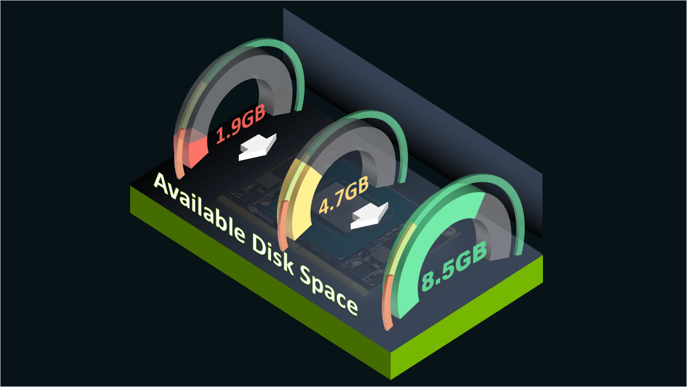

# Guide to Minimizing Jetson Disk Usage

This online guide explains ways to minimize Jetson's disk/storage usage, while sharing tips and actual commands to analyze the disk usage to further optimize the storage usage.

## Steps to Minimize

This guide details various steps to minimize the disk usage on your Jetson, while sharing tips on analyzing disk usage, actual commands, and the example outputs on different versions of JetPack.

## Example Result

You will find that you can regain up to 8GB of available disk space depending on your JetPack version and configuration.

!!! info "Example on Jetson Xavier NX production module with JetPack 4.6.2"

    |   | Disk Space Used | Available Space | Available Percentage |
    |---|--:|--:|--:|
    | (Original) Full JetPack (`[A]`)  | 11.6 GB | **1.9 GB** | 13.3 % |
    | CUI configuration (`[B]`)        | 8.4 GB | **4.7 GB** | 32.7 % |
    | Packages removed (`[D]`)      | 6.0 GB | **8.5 GB** | 55.9 %  |

## Verification

It will also demonstrate a way to verify the minimized set up by using a DeepStream reference application as an example AI application.

