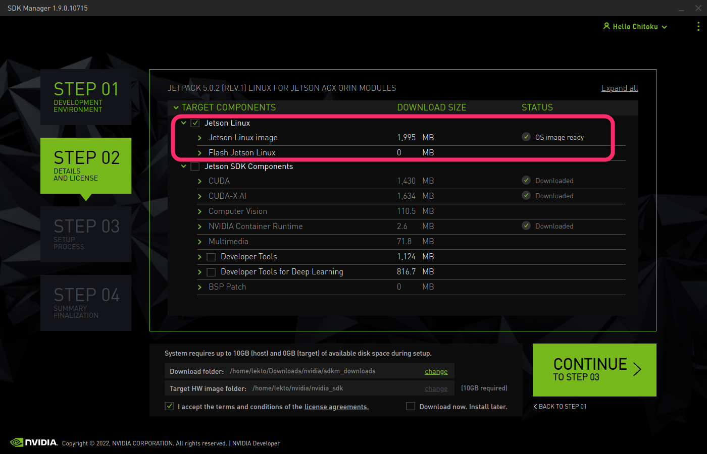
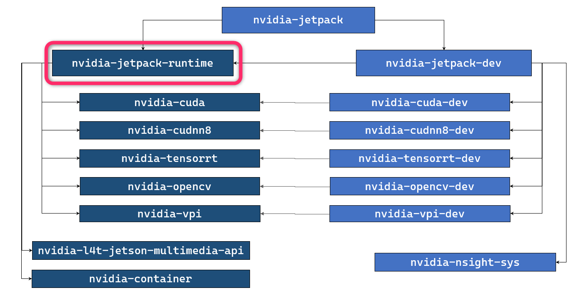

# "JetPack Runtime" configuration for JetPack 5.0.2 (and above)

If you are on JetPack 5.0.2 and above, and if you prefer to run your application(s) natively on Jetson (without using Docker containers), you can install all runtime-oriented JetPack component packages to foam "JetPack Runtime" configuration.

!!! quote ""

    ```
    sudo apt install nvidia-jetpack-runtime
    ```
    
!!! example "Disk space used for JetPack Runtime configuration"

    |  | JetPack 5.0.2<br>(Rel 35.1.0)<br>Jetson AGX Orin<br>Developer Kit | JetPack 5.0.2<br>(Rel 35.1.0)<br>Jetson AGX Xavier<br>Developer Kit | JetPack 5.0.2<br>(Rel 35.1.0)<br>Jetson Xavier NX<br>Developer Kit |
    |---|--:|--:|--:|
    | *Base L4T* | 5.6 GB | nnn GB | 5.6 GB  |
    | JetPack **Runtime** | {==9.7 GB==} | {==nnn GB==} | {==9.7 GB==} |
    | *JetPack Full* | 16.6 GB | nnn GB | nnn GB |

## Step 1. Flash L4T

Flash your Jetson with just the regular L4T (Linux for Tegra).

!!! note ""
    === ":material-console: Using CUI L4T flasher tool"

        Follow the Quick Start page of Jetson Linux Developer Guide ([r35.1](https://docs.nvidia.com/jetson/archives/r35.1/DeveloperGuide/text/IN/QuickStart.html)).

        ```
        mkdir L4T_r35.1
        cd L4T_r35.1
        wget https://developer.nvidia.com/embedded/l4t/r35_release_v1.0/release/jetson_linux_r35.1.0_aarch64.tbz2
        wget https://developer.nvidia.com/embedded/l4t/r35_release_v1.0/release/tegra_linux_sample-root-filesystem_r35.1.0_aarch64.tbz2
        L4T_RELEASE_PACKAGE=jetson_linux_r35.1.0_aarch64.tbz2
        SAMPLE_FS_PACKAGE=tegra_linux_sample-root-filesystem_r35.1.0_aarch64.tbz2
        tar xf ${L4T_RELEASE_PACKAGE}
        cd Linux_for_Tegra/rootfs/
        sudo tar xpf ../../${SAMPLE_FS_PACKAGE}
        cd ..
        sudo ./apply_binaries.sh
        ```

        Put your Jetson into Force Recovery mode, and issue the following.

        ```
        BOARD=jetson-agx-orin-devkit
        sudo ./flash.sh ${BOARD} mmcblk0p1
        ```

    === ":material-script-text-play:Using `prepare_l4t_dir.sh` script"

        You can use `prepare_l4t_dir.sh` script to automate the preparation of `Linux_for_Tegra` directory.

        ```
        git clone https://github.com/NVIDIA-AI-IOT/jetson-min-disk
        cd jetson-min-disk
        BOARD=jetson-agx-orin-devkit
        ./scripts/prepare_l4t_dir.sh -b ${BOARD} -v r35.1.0
        cd $(cat LAST_L4T_DIR)
        sudo ./flash.sh ${BOARD} mmcblk0p1
        ```

    === ":material-television-guide:Using SDK Manager"

        - Launch SDK Manager on your host Ubuntu PC
        - On "Step 01", de-select **Host Machine**, select your **Target Hardware**, select "JetPack 5.0.2 (rev.1) or JetPack 5.0.2 Runtime (rev.1)" for **TARGET OPERATING SYSTEM**
        - On "Step 02", select "Jetson Linux" and de-select "Jetson SDK Components".
            
        - On "Step 03", flashing dialog pops up. Select items accordingly and hit **Flash** button.

## Step 2. Install `nvidia-jetpack-runtime`

After flashing is done, boot your Jetson, complete the initial setup (OEM-config) flow if necessary.

Once ready, with Internet connection secured, execute the following.

```
sudo apt update
sudo apt install nvidia-jetpack-runtime
```

## Done - Verification

You can copy your applications onto this Jetson to see if it functions as expected.

This will validate your Jetson as the deployment platform.


!!! info "Specific runtimes for your application"

    Of course, if you know the exact runtimes your applications require, you can choose to install those specific runtimes, rather than installing all the runtimes by specifying `nvidia-jetpack-runtime`.
    
    
