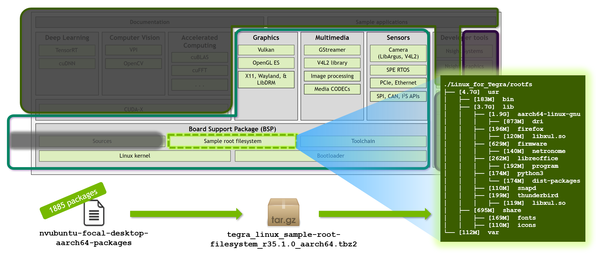
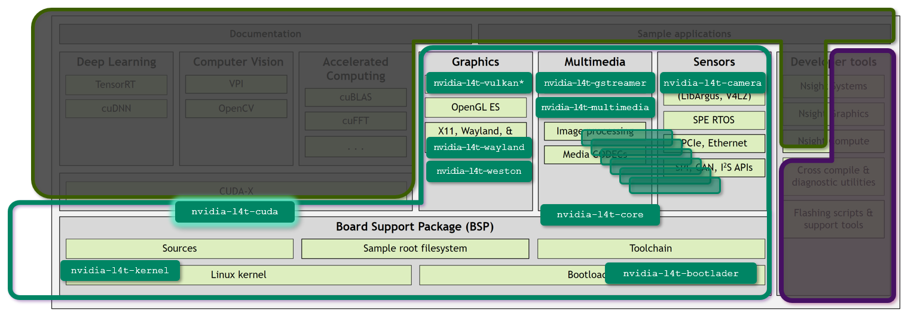

# "Minimized L4T" configuration for JetPack 5.x

You can create a minimized configuration of L4T by reducing the standard Debian packages that composes the base RootFS image or/and by reducing the `nvidia-l4t` specific packages installed on top of the RootFS image to foam L4T. <br>
You may need to installed some of the removed `nvidia-l4t` packages on the container side.

!!! example "Disk space used for JetPack Runtime configuration"

    |  | JetPack 5.0.2<br>(Rel 35.1.0)<br>Jetson AGX Orin<br>Developer Kit | JetPack 5.0.2<br>(Rel 35.1.0)<br>Jetson AGX Xavier<br>Developer Kit | JetPack 5.0.2<br>(Rel 35.1.0)<br>Jetson Xavier NX<br>Developer Kit |
    |---|--:|--:|--:|
    | *Base L4T* | 5.6 GB | nnn GB | 5.6 GB  |
    | ***minplus*** flavor L4T | {==2.7 GB==} | {==nnn GB==} | {==2.6 GB==} |
    | ***bone300*** flavor L4T | {==682 MB==} | {==nnn GB==} | {==670 GB==} |

## L4T composition

### Standard Debian packages for RootFS image



!!! info "Link to the RootFS flavor definition"

    - [`nvubuntu-focal-desktop-aarch64-packages`](https://github.com/NVIDIA-AI-IOT/jetson-min-disk/blob/main/rfs_flavors/nvubuntu-focal-desktop-aarch64-packages)
    - [`nvubuntu-focal-minimal-aarch64-packages`](https://github.com/NVIDIA-AI-IOT/jetson-min-disk/blob/main/rfs_flavors/nvubuntu-focal-minimal-aarch64-packages)
    - [`nvubuntu-focal-bone300-aarch64-packages`](https://github.com/NVIDIA-AI-IOT/jetson-min-disk/blob/main/rfs_flavors/nvubuntu-focal-bone300-aarch64-packages)

### `nvidia-l4t` specific packages 



!!! note "Full list of nvidia-l4t packages"

    ```
     160854 KiB 	nvidia-l4t-3d-core            	NVIDIA GL EGL Package
         31 KiB 	nvidia-l4t-apt-source         	NVIDIA L4T apt source list debian package
     198666 KiB 	nvidia-l4t-bootloader         	NVIDIA Bootloader Package
      20839 KiB 	nvidia-l4t-camera             	NVIDIA Camera Package
       1504 KiB 	nvidia-l4t-configs            	NVIDIA configs debian package
      10422 KiB 	nvidia-l4t-core               	NVIDIA Core Package
      22790 KiB 	nvidia-l4t-cuda               	NVIDIA CUDA Package
       4094 KiB 	nvidia-l4t-display-kernel     	NVIDIA Display Kernel Modules Package
      16487 KiB 	nvidia-l4t-firmware           	NVIDIA Firmware Package
         77 KiB 	nvidia-l4t-gbm                	NVIDIA GBM Package
         38 KiB 	nvidia-l4t-gputools           	NVIDIA dgpu helper Package
      69598 KiB 	nvidia-l4t-graphics-demos     	NVIDIA graphics demo applications
       5131 KiB 	nvidia-l4t-gstreamer          	NVIDIA GST Application files
      16737 KiB 	nvidia-l4t-init               	NVIDIA Init debian package
      16421 KiB 	nvidia-l4t-initrd             	NVIDIA initrd debian package
        134 KiB 	nvidia-l4t-jetson-io          	NVIDIA Jetson.IO debian package
        159 KiB 	nvidia-l4t-jetsonpower-gui-too	NVIDIA Jetson Power GUI Tools debian package
     237542 KiB 	nvidia-l4t-kernel             	NVIDIA Kernel Package
       4772 KiB 	nvidia-l4t-kernel-dtbs        	NVIDIA Kernel DTB Package
      70953 KiB 	nvidia-l4t-kernel-headers     	NVIDIA Linux Tegra Kernel Headers Package
        596 KiB 	nvidia-l4t-libvulkan          	NVIDIA Vulkan Loader Package
      31183 KiB 	nvidia-l4t-multimedia         	NVIDIA Multimedia Package
        742 KiB 	nvidia-l4t-multimedia-utils   	NVIDIA Multimedia Package
         65 KiB 	nvidia-l4t-nvfancontrol       	NVIDIA Nvfancontrol debian package
        205 KiB 	nvidia-l4t-nvpmodel           	NVIDIA Nvpmodel debian package
         86 KiB 	nvidia-l4t-nvpmodel-gui-tools 	NVIDIA Nvpmodel GUI Tools debian package
        999 KiB 	nvidia-l4t-nvsci              	NVIDIA NvSci Package
        110 KiB 	nvidia-l4t-oem-config         	NVIDIA OEM-Config Package
        235 KiB 	nvidia-l4t-openwfd            	NVIDIA OpenWFD Package
       8212 KiB 	nvidia-l4t-optee              	OP-TEE userspace daemons, test programs and libraries
         85 KiB 	nvidia-l4t-pva                	NVIDIA PVA Package
       3336 KiB 	nvidia-l4t-tools              	NVIDIA Public Test Tools Package
       6922 KiB 	nvidia-l4t-vulkan-sc          	NVIDIA Vulkan SC run-time package
      19617 KiB 	nvidia-l4t-vulkan-sc-dev      	NVIDIA Vulkan SC Dev package
      14000 KiB 	nvidia-l4t-vulkan-sc-samples  	NVIDIA Vulkan SC samples package
      83151 KiB 	nvidia-l4t-vulkan-sc-sdk      	NVIDIA Vulkan SC SDK package
         77 KiB 	nvidia-l4t-wayland            	NVIDIA Wayland Package
       4749 KiB 	nvidia-l4t-weston             	NVIDIA Weston Package
        226 KiB 	nvidia-l4t-x11                	NVIDIA X11 Package
        602 KiB 	nvidia-l4t-xusb-firmware      	NVIDIA USB Firmware Package

         52 KiB 	jetson-gpio-common            	Jetson GPIO library package (common files)
        105 KiB 	python-jetson-gpio            	Jetson GPIO library package (Python 2)
        105 KiB 	python3-jetson-gpio           	Jetson GPIO library package (Python 3)
    ```

!!! info "Link to the L4T Package Lists"

    - [`l4t_all.list`](https://github.com/NVIDIA-AI-IOT/jetson-min-disk/blob/main/l4t_pkg_lists/l4t_all.list)
    - [`l4t_k8.list`](https://github.com/NVIDIA-AI-IOT/jetson-min-disk/blob/main/l4t_pkg_lists/l4t_k8.list)
    - [`l4t_k10.list`](https://github.com/NVIDIA-AI-IOT/jetson-min-disk/blob/main/l4t_pkg_lists/l4t_k10.list)


## Instruction

Below, we show how you set up the `Linux_for_Tegra` directory for **Jetson AGX Orin** based on `r35.1.0` with:

- 300 Debian packages for BSP rootfs ([`nvubuntu-focal-bone300-aarch64-packages`](https://github.com/NVIDIA-AI-IOT/jetson-min-disk/blob/main/rfs_flavors/nvubuntu-focal-bone300-aarch64-packages))
- kernel + 8 packages for `nvidia-l4t` packages ([`l4t_k8.list`](https://github.com/NVIDIA-AI-IOT/jetson-min-disk/blob/main/l4t_pkg_lists/l4t_k8.list))

### Step 1. Prepare a minimized flavor L4T

Use a L4T utility script to prepare the customized `Linux_for_Tegra` directory.

!!! note ""

    === ":material-script-text-play:Using `prepare_l4t_dir.sh` script"

        You can use `prepare_l4t_dir.sh` script to automate the preparation of `Linux_for_Tegra` directory.

        ```
        BOARD=jetson-agx-orin-devkit

        cd
        git clone https://github.com/NVIDIA-AI-IOT/jetson-min-disk
        cd jetson-min-disk
        ./scripts/prepare_l4t_dir.sh -b ${BOARD} -v r35.1.0 --flavor bone300 --l4tpkg k8
        cd $(cat LAST_L4T_DIR)
        sudo ./flash.sh ${BOARD} mmcblk0p1
        ```

### Step 2. Install `nvidia-container`

After flashing is done, boot your Jetson, and execute the following.

```
sudo apt update
sudo apt install nvidia-container
sudo systemctl restart docker
sudo usermod -aG docker $USER
newgrp docker
```

### Step 3. Setting up directories for containers

We will set up some directories to be mounted by containers.

```
USER=username
HOST_IP=192.168.1.101
SCRIPT_DIR=/home/${USERNAME}/jetson-min-disk/scripts/

mkdir /tmp/l4t-packages

scp ${USER}@${HOST_IP}:${SCRIPT_DIR}/mod_deb/nvidia-l4t-core_35.1.0-20220825113828nolib_arm64.deb /tmp/l4t-packages/
scp ${USER}@${HOST_IP}:${SCRIPT_DIR}/mod_deb/nvidia-l4t-cuda_35.1.0-20220825113828nolib_arm64.deb /tmp/l4t-packages/
```

In the `l4t-packages` directory, we prepare additional/customized Debian packages to be installed inside the containers.

??? tip "How to customize the Debian package: Creation of empty package"

    ```
    fakeroot sh -c '
        mkdir tmp
        dpkg-deb -R nvidia-l4t-cuda_35.1.0-20220825113828_arm64.deb tmp
        rm -rf ./tmp/usr
        dpkg-deb -b tmp nvidia-l4t-cuda_35.1.0-20220825113828nolib_arm64.deb
        rm -rf ./tmp
        '
    ```

### Step 4. Running a container

=== "DeepStream"

    ```
    mkdir _output
    sudo docker run -it --rm --net=host --runtime nvidia -w /opt/nvidia/deepstream/deepstream \
        -v ${PWD}/_output:/opt/nvidia/deepstream/deepstream/_output \
        -v /tmp/l4t-packages:/l4t-packages \
        nvcr.io/nvidia/deepstream-l4t:6.1.1-samples
    ```

=== "jetnet"

    ```
    git clone https://github.com/NVIDIA-AI-IOT/jetnet
    cd jetnet
    sudo docker run \
        --network host \
        --gpus all \
        --runtime nvidia
        -it \
        --rm \
        --name=jetnet \
        -v $(pwd):/jetnet \
        --device /dev/video0 \
        -v /tmp/.X11-unix:/tmp/.X11-unix \
        -e DISPLAY=$DISPLAY \
        -v /tmp/l4t-packages:/l4t-packages \
        jaybdub/jetnet:l4t-35.1.0 \
        /bin/bash -c "cd /jetnet && python3 setup.py develop && /bin/bash"
    ```

### Step 5. Install additional packages inside the container

Install `nvidia-l4t` packages inside the container. <br>
(Remember, many `nvidia-l4t` packages were removed from the base L4T, so the end application in the container may not find necessary libraries on the host.)

Depending on the applications and its functionality, the required `nvidia-l4t` package vary.<br>
It takes some trials to identify packages necessary to ensure the application's execution.

Note some `nvidia-l4t` packages don't like its dependent packages (like `nvidia-l4t-core` and `nvidia-l4t-cuda`) installed on the host side.<br>
The method demonstrated below makes the package manager think those packages are installed, although it does not actually install any files in the container.

=== "DeepStream"

    ```
    mkdir -p /opt/nvidia/l4t-packages/
    touch /opt/nvidia/l4t-packages/.nv-l4t-disable-boot-fw-update-in-preinstall
    dpkg -i /l4t-packages/nvidia-l4t-core_35.1.0-20220825113828nolib_arm64.deb
    dpkg -i /l4t-packages/nvidia-l4t-cuda_35.1.0-20220825113828nolib_arm64.deb
    bash -c 'echo "deb https://repo.download.nvidia.com/jetson/t234 r35.1 main" >> /etc/apt/sources.list'
    apt-get update
    apt-get install nvidia-l4t-multimedia
    apt-get install nvidia-l4t-gstreamer
    apt-get install nvidia-l4t-3d-core 
    ldconfig
    ```

=== "jetnet"

    ```
    mkdir -p /opt/nvidia/l4t-packages/
    touch /opt/nvidia/l4t-packages/.nv-l4t-disable-boot-fw-update-in-preinstall
    dpkg -i /l4t-packages/nvidia-l4t-core_35.1.0-20220825113828nolib_arm64.deb
    dpkg -i /l4t-packages/nvidia-l4t-cuda_35.1.0-20220825113828nolib_arm64.deb
    bash -c 'echo "deb https://repo.download.nvidia.com/jetson/t234 r35.1 main" >> /etc/apt/sources.list'
    apt-get update
    apt-get install nvidia-l4t-multimedia
    apt-get install nvidia-l4t-3d-core 
    ldconfig
    ```

### Step 6. Run the DeepStream sample app

Run the following inside the container.

=== "DeepStream"

    ```
    deepstream-app -c samples/configs/deepstream-app/source2_1080p_dec_infer-resnet_demux_int8.txt
    ```

=== "jetnet"

    ```
    jetnet demo jetnet.mmdet.MASK_RCNN_R50_FPN_1X_COCO_TRT_FP16
    ```

??? info "Log of the container"

    === "DeepStream"

        ```
        root@jao-JP502-bone300-k8:/opt/nvidia/deepstream/deepstream-6.1# mkdir -p /opt/nvidia/l4t-packages/
        root@jao-JP502-bone300-k8:/opt/nvidia/deepstream/deepstream-6.1# touch /opt/nvidia/l4t-packages/.nv-l4t-disable-boot-fw-update-in-preinstall
        root@jao-JP502-bone300-k8:/opt/nvidia/deepstream/deepstream-6.1# dpkg -i /l4t-packages/nvidia-l4t-core_35.1.0-20220825113828nolib_arm64.deb
        Selecting previously unselected package nvidia-l4t-core.
        (Reading database ... 41602 files and directories currently installed.)
        Preparing to unpack .../nvidia-l4t-core_35.1.0-20220825113828nolib_arm64.deb ...
        Pre-installing... skip compatibility checking.
        Unpacking nvidia-l4t-core (35.1.0-20220825113828) ...
        Setting up nvidia-l4t-core (35.1.0-20220825113828) ...

        Configuration file '/etc/ld.so.conf.d/nvidia-tegra.conf'
        ==> File on system created by you or by a script.
        ==> File also in package provided by package maintainer.
        What would you like to do about it ?  Your options are:
            Y or I  : install the package maintainer's version
            N or O  : keep your currently-installed version
            D     : show the differences between the versions
            Z     : start a shell to examine the situation
        The default action is to keep your current version.
        *** nvidia-tegra.conf (Y/I/N/O/D/Z) [default=N] ? N
        root@jao-JP502-bone300-k8:/opt/nvidia/deepstream/deepstream-6.1# dpkg -i /l4t-packages/nvidia-l4t-cuda_35.1.0-20220825113828nolib_arm64.deb
        Selecting previously unselected package nvidia-l4t-cuda.
        (Reading database ... 41613 files and directories currently installed.)
        Preparing to unpack .../nvidia-l4t-cuda_35.1.0-20220825113828nolib_arm64.deb ...
        Unpacking nvidia-l4t-cuda (35.1.0-20220825113828) ...
        Setting up nvidia-l4t-cuda (35.1.0-20220825113828) ...
        root@jao-JP502-bone300-k8:/opt/nvidia/deepstream/deepstream-6.1# bash -c 'echo "deb https://repo.download.nvidia.com/jetson/t234 r35.1 main" >> /etc/apt/sources.list'
        root@jao-JP502-bone300-k8:/opt/nvidia/deepstream/deepstream-6.1# apt-get update
        Get:1 https://repo.download.nvidia.com/jetson/common r35.1 InRelease [2555 B]
        Get:2 https://repo.download.nvidia.com/jetson/t234 r35.1 InRelease [2550 B]
        Get:3 https://repo.download.nvidia.com/jetson/common r35.1/main arm64 Packages [19.1 kB]
        Hit:4 http://ports.ubuntu.com/ubuntu-ports focal InRelease
        Get:5 http://ports.ubuntu.com/ubuntu-ports focal-updates InRelease [114 kB]
        Get:6 https://repo.download.nvidia.com/jetson/t234 r35.1/main arm64 Packages [10.3 kB]
        Get:7 http://ports.ubuntu.com/ubuntu-ports focal-backports InRelease [108 kB]
        Get:8 http://ports.ubuntu.com/ubuntu-ports focal-security InRelease [114 kB]
        Get:9 http://ports.ubuntu.com/ubuntu-ports focal-updates/universe arm64 Packages [1143 kB]
        Get:10 http://ports.ubuntu.com/ubuntu-ports focal-updates/restricted arm64 Packages [4576 B]
        Get:11 http://ports.ubuntu.com/ubuntu-ports focal-updates/main arm64 Packages [1961 kB]
        Get:12 http://ports.ubuntu.com/ubuntu-ports focal-updates/multiverse arm64 Packages [9303 B]
        Get:13 http://ports.ubuntu.com/ubuntu-ports focal-backports/main arm64 Packages [54.8 kB]
        Get:14 http://ports.ubuntu.com/ubuntu-ports focal-backports/universe arm64 Packages [27.5 kB]
        Get:15 http://ports.ubuntu.com/ubuntu-ports focal-security/restricted arm64 Packages [4331 B]
        Get:16 http://ports.ubuntu.com/ubuntu-ports focal-security/universe arm64 Packages [845 kB]
        Get:17 http://ports.ubuntu.com/ubuntu-ports focal-security/main arm64 Packages [1570 kB]
        Fetched 5990 kB in 2s (2519 kB/s)
        Reading package lists... Done
        root@jao-JP502-bone300-k8:/opt/nvidia/deepstream/deepstream-6.1# apt-get install nvidia-l4t-multimedia
        Reading package lists... Done
        Building dependency tree
        Reading state information... Done
        The following packages were automatically installed and are no longer required:
        libavfilter7 libavformat58 libbluray2 libmysofa1 libpostproc55 librubberband2 libssh-gcrypt-4 libswscale5 libvidstab1.1
        Use 'apt autoremove' to remove them.
        The following additional packages will be installed:
        nvidia-l4t-multimedia-utils nvidia-l4t-nvsci
        The following NEW packages will be installed:
        nvidia-l4t-multimedia nvidia-l4t-multimedia-utils nvidia-l4t-nvsci
        0 upgraded, 3 newly installed, 0 to remove and 67 not upgraded.
        Need to get 8479 kB of archives.
        After this operation, 33.7 MB of additional disk space will be used.
        Do you want to continue? [Y/n] Y
        Get:1 https://repo.download.nvidia.com/jetson/t234 r35.1/main arm64 nvidia-l4t-multimedia-utils arm64 35.1.0-20220825113828 [253 kB]
        Get:2 https://repo.download.nvidia.com/jetson/t234 r35.1/main arm64 nvidia-l4t-nvsci arm64 35.1.0-20220825113828 [330 kB]
        Get:3 https://repo.download.nvidia.com/jetson/t234 r35.1/main arm64 nvidia-l4t-multimedia arm64 35.1.0-20220825113828 [7896 kB]
        Fetched 8479 kB in 1s (6809 kB/s)
        debconf: delaying package configuration, since apt-utils is not installed
        Selecting previously unselected package nvidia-l4t-multimedia-utils.
        (Reading database ... 41616 files and directories currently installed.)
        Preparing to unpack .../nvidia-l4t-multimedia-utils_35.1.0-20220825113828_arm64.deb ...
        Unpacking nvidia-l4t-multimedia-utils (35.1.0-20220825113828) ...
        Selecting previously unselected package nvidia-l4t-nvsci.
        Preparing to unpack .../nvidia-l4t-nvsci_35.1.0-20220825113828_arm64.deb ...
        Unpacking nvidia-l4t-nvsci (35.1.0-20220825113828) ...
        Selecting previously unselected package nvidia-l4t-multimedia.
        Preparing to unpack .../nvidia-l4t-multimedia_35.1.0-20220825113828_arm64.deb ...
        Unpacking nvidia-l4t-multimedia (35.1.0-20220825113828) ...
        Setting up nvidia-l4t-multimedia-utils (35.1.0-20220825113828) ...
        Setting up nvidia-l4t-nvsci (35.1.0-20220825113828) ...
        Setting up nvidia-l4t-multimedia (35.1.0-20220825113828) ...
        root@jao-JP502-bone300-k8:/opt/nvidia/deepstream/deepstream-6.1# apt-get install nvidia-l4t-gstreamer
        Reading package lists... Done
        Building dependency tree
        Reading state information... Done
        The following packages were automatically installed and are no longer required:
        libavfilter7 libavformat58 libbluray2 libmysofa1 libpostproc55 librubberband2 libssh-gcrypt-4 libswscale5 libvidstab1.1
        Use 'apt autoremove' to remove them.
        The following additional packages will be installed:
        libegl1-mesa nvidia-l4t-camera
        The following NEW packages will be installed:
        libegl1-mesa nvidia-l4t-camera nvidia-l4t-gstreamer
        0 upgraded, 3 newly installed, 0 to remove and 67 not upgraded.
        Need to get 6971 kB of archives.
        After this operation, 26.7 MB of additional disk space will be used.
        Do you want to continue? [Y/n] Y
        Get:1 https://repo.download.nvidia.com/jetson/t234 r35.1/main arm64 nvidia-l4t-camera arm64 35.1.0-20220825113828 [5392 kB]
        Get:2 http://ports.ubuntu.com/ubuntu-ports focal-updates/universe arm64 libegl1-mesa arm64 21.2.6-0ubuntu0.1~20.04.2 [6408 B]
        Get:3 https://repo.download.nvidia.com/jetson/t234 r35.1/main arm64 nvidia-l4t-gstreamer arm64 35.1.0-20220825113828 [1573 kB]
        Fetched 6971 kB in 1s (6837 kB/s)
        debconf: delaying package configuration, since apt-utils is not installed
        Selecting previously unselected package libegl1-mesa:arm64.
        (Reading database ... 41701 files and directories currently installed.)
        Preparing to unpack .../libegl1-mesa_21.2.6-0ubuntu0.1~20.04.2_arm64.deb ...
        Unpacking libegl1-mesa:arm64 (21.2.6-0ubuntu0.1~20.04.2) ...
        Selecting previously unselected package nvidia-l4t-camera.
        Preparing to unpack .../nvidia-l4t-camera_35.1.0-20220825113828_arm64.deb ...
        Unpacking nvidia-l4t-camera (35.1.0-20220825113828) ...
        Selecting previously unselected package nvidia-l4t-gstreamer.
        Preparing to unpack .../nvidia-l4t-gstreamer_35.1.0-20220825113828_arm64.deb ...
        Unpacking nvidia-l4t-gstreamer (35.1.0-20220825113828) ...
        Setting up libegl1-mesa:arm64 (21.2.6-0ubuntu0.1~20.04.2) ...
        Setting up nvidia-l4t-camera (35.1.0-20220825113828) ...
        Setting up nvidia-l4t-gstreamer (35.1.0-20220825113828) ...
        root@jao-JP502-bone300-k8:/opt/nvidia/deepstream/deepstream-6.1# ldconfig
        root@jao-JP502-bone300-k8:/opt/nvidia/deepstream/deepstream-6.1# deepstream-app -c samples/configs/deepstream-app/source2_1080p_dec_infer-resnet_demux_int8.txt

        (gst-plugin-scanner:508): GStreamer-WARNING **: 13:15:12.430: Failed to load plugin '/usr/lib/aarch64-linux-gnu/gstreamer-1.0/libgstchromaprint.so': libavcodec.so.58: cannot open shared object file: No such file or directory
        No EGL Display
        nvbufsurftransform: Could not get EGL display connection
        nvbuf_utils: ERROR getting proc addr of eglCreateImageKHR
        nvbuf_utils: ERROR getting proc addr of eglDestroyImageKHR
        nvbuf_utils: Could not get EGL display connection
        nvbuf_utils: ERROR getting proc addr of eglCreateImageKHR
        nvbuf_utils: ERROR getting proc addr of eglDestroyImageKHR
        (Argus) Error FileOperationFailed: Connecting to nvargus-daemon failed: No such file or directory (in src/rpc/socket/client/SocketClientDispatch.cpp, function openSocketConnection(), line 204)
        (Argus) Error FileOperationFailed: Cannot create camera provider (in src/rpc/socket/client/SocketClientDispatch.cpp, function createCameraProvider(), line 106)

        (gst-plugin-scanner:508): GStreamer-WARNING **: 13:15:12.722: Failed to load plugin '/usr/lib/aarch64-linux-gnu/gstreamer-1.0/deepstream/libnvdsgst_udp.so': librivermax.so.0: cannot open shared object file: No such file or directory

        (gst-plugin-scanner:508): GStreamer-WARNING **: 13:15:12.745: Failed to load plugin '/usr/lib/aarch64-linux-gnu/gstreamer-1.0/deepstream/libnvdsgst_inferserver.so': libtritonserver.so: cannot open shared object file: No such file or directory
        No EGL Display
        nvbufsurftransform: Could not get EGL display connection
        nvbuf_utils: ERROR getting proc addr of eglCreateImageKHR
        nvbuf_utils: ERROR getting proc addr of eglDestroyImageKHR
        nvbuf_utils: Could not get EGL display connection
        nvbuf_utils: ERROR getting proc addr of eglCreateImageKHR
        nvbuf_utils: ERROR getting proc addr of eglDestroyImageKHR
        nvbuf_utils: Could not get EGL display connection
        nvbuf_utils: ERROR getting proc addr of eglCreateImageKHR
        nvbuf_utils: ERROR getting proc addr of eglDestroyImageKHR
        Opening in BLOCKING MODE
        Opening in BLOCKING MODE
        WARNING: Deserialize engine failed because file path: /opt/nvidia/deepstream/deepstream-6.1/samples/configs/deepstream-app/../../models/Primary_Detector/resnet10.caffemodel_b1gpu0_int8.engine open error
        0:00:04.369571651   507 0xaaab19f2e430 WARN                 nvinfer gstnvinfer.cpp:643:gst_nvinfer_logger:<primary_gie> NvDsInferContext[UID 1]: Warning from NvDsInferContextImpl::deserializeEngineAndBackend() <nvdsinfer_context_impl.cpp:1897> [UID = 1]: deserialize engine from file :/opt/nvidia/deepstream/deepstream-6.1/samples/configs/deepstream-app/../../models/Primary_Detector/resnet10.caffemodel_b1gpu0_int8.engine failed
        0:00:04.515170200   507 0xaaab19f2e430 WARN                 nvinfer gstnvinfer.cpp:643:gst_nvinfer_logger:<primary_gie> NvDsInferContext[UID 1]: Warning from NvDsInferContextImpl::generateBackendContext() <nvdsinfer_context_impl.cpp:2002> [UID = 1]: deserialize backend context from engine from file :/opt/nvidia/deepstream/deepstream-6.1/samples/configs/deepstream-app/../../models/Primary_Detector/resnet10.caffemodel_b1gpu0_int8.engine failed, try rebuild
        0:00:04.515215641   507 0xaaab19f2e430 INFO                 nvinfer gstnvinfer.cpp:646:gst_nvinfer_logger:<primary_gie> NvDsInferContext[UID 1]: Info from NvDsInferContextImpl::buildModel() <nvdsinfer_context_impl.cpp:1923> [UID = 1]: Trying to create engine from model files
        WARNING: [TRT]: The implicit batch dimension mode has been deprecated. Please create the network with NetworkDefinitionCreationFlag::kEXPLICIT_BATCH flag whenever possible.
        0:00:52.282508491   507 0xaaab19f2e430 INFO                 nvinfer gstnvinfer.cpp:646:gst_nvinfer_logger:<primary_gie> NvDsInferContext[UID 1]: Info from NvDsInferContextImpl::buildModel() <nvdsinfer_context_impl.cpp:1955> [UID = 1]: serialize cuda engine to file: /opt/nvidia/deepstream/deepstream-6.1/samples/models/Primary_Detector/resnet10.caffemodel_b1_gpu0_int8.engine successfully
        INFO: [Implicit Engine Info]: layers num: 3
        0   INPUT  kFLOAT input_1         3x368x640
        1   OUTPUT kFLOAT conv2d_bbox     16x23x40
        2   OUTPUT kFLOAT conv2d_cov/Sigmoid 4x23x40

        nvbufsurface: eglGetDisplay failed with error 0x300c
        nvbufsurface: Can't get EGL display
        0:00:52.459813791   507 0xaaab19f2e430 WARN                 nvinfer gstnvinfer.cpp:943:gst_nvinfer_start:<primary_gie> error: Failed to set buffer pool to active
        ** ERROR: <main:716>: Failed to set pipeline to PAUSED
        Quitting
        ERROR from primary_gie: Failed to set buffer pool to active
        Debug info: /dvs/git/dirty/git-master_linux/deepstream/sdk/src/gst-plugins/gst-nvinfer/gstnvinfer.cpp(943): gst_nvinfer_start (): /GstPipeline:pipeline/GstBin:primary_gie_bin/GstNvInfer:primary_gie
        App run failed
        root@jao-JP502-bone300-k8:/opt/nvidia/deepstream/deepstream-6.1#
        root@jao-JP502-bone300-k8:/opt/nvidia/deepstream/deepstream-6.1# apt-get install nvidia-l4t-3d-core
        Reading package lists... Done
        Building dependency tree
        Reading state information... Done
        The following packages were automatically installed and are no longer required:
        libavfilter7 libavformat58 libbluray2 libmysofa1 libpostproc55 librubberband2 libssh-gcrypt-4 libswscale5 libvidstab1.1
        Use 'apt autoremove' to remove them.
        The following additional packages will be installed:
        nvidia-l4t-firmware nvidia-l4t-init nvidia-l4t-libvulkan nvidia-l4t-wayland nvidia-l4t-x11
        The following NEW packages will be installed:
        nvidia-l4t-3d-core nvidia-l4t-firmware nvidia-l4t-init nvidia-l4t-libvulkan nvidia-l4t-wayland nvidia-l4t-x11
        0 upgraded, 6 newly installed, 0 to remove and 67 not upgraded.
        Need to get 67.9 MB of archives.
        After this operation, 200 MB of additional disk space will be used.
        Do you want to continue? [Y/n] Y
        Get:1 https://repo.download.nvidia.com/jetson/t234 r35.1/main arm64 nvidia-l4t-firmware arm64 35.1.0-20220825113828 [1972 kB]
        Get:2 https://repo.download.nvidia.com/jetson/t234 r35.1/main arm64 nvidia-l4t-init arm64 35.1.0-20220825113828 [91.4 kB]
        Get:3 https://repo.download.nvidia.com/jetson/t234 r35.1/main arm64 nvidia-l4t-libvulkan arm64 35.1.0-20220825113828 [157 kB]
        Get:4 https://repo.download.nvidia.com/jetson/t234 r35.1/main arm64 nvidia-l4t-wayland arm64 35.1.0-20220825113828 [40.4 kB]
        Get:5 https://repo.download.nvidia.com/jetson/t234 r35.1/main arm64 nvidia-l4t-x11 arm64 35.1.0-20220825113828 [107 kB]
        Get:6 https://repo.download.nvidia.com/jetson/t234 r35.1/main arm64 nvidia-l4t-3d-core arm64 35.1.0-20220825113828 [65.5 MB]
        Fetched 67.9 MB in 6s (12.3 MB/s)
        debconf: delaying package configuration, since apt-utils is not installed
        Selecting previously unselected package nvidia-l4t-firmware.
        (Reading database ... 41788 files and directories currently installed.)
        Preparing to unpack .../0-nvidia-l4t-firmware_35.1.0-20220825113828_arm64.deb ...
        Unpacking nvidia-l4t-firmware (35.1.0-20220825113828) ...
        dpkg: error processing archive /tmp/apt-dpkg-install-i4uic9/0-nvidia-l4t-firmware_35.1.0-20220825113828_arm64.deb (--unpack):
        unable to create '/lib/firmware/tegra19x/nvhost_nvdec040_ns.fw.dpkg-new' (while processing './lib/firmware/tegra19x/nvhost_nvdec040_ns.fw'): Read-only file system
        dpkg: error while cleaning up:
        unable to remove newly-extracted version of '/lib/firmware/tegra19x/nvhost_nvdec040_ns.fw': Read-only file system
        dpkg-deb: error: paste subprocess was killed by signal (Broken pipe)
        Selecting previously unselected package nvidia-l4t-init.
        Preparing to unpack .../1-nvidia-l4t-init_35.1.0-20220825113828_arm64.deb ...
        Unpacking nvidia-l4t-init (35.1.0-20220825113828) ...
        Selecting previously unselected package nvidia-l4t-libvulkan.
        Preparing to unpack .../2-nvidia-l4t-libvulkan_35.1.0-20220825113828_arm64.deb ...
        Unpacking nvidia-l4t-libvulkan (35.1.0-20220825113828) ...
        Selecting previously unselected package nvidia-l4t-wayland.
        Preparing to unpack .../3-nvidia-l4t-wayland_35.1.0-20220825113828_arm64.deb ...
        Unpacking nvidia-l4t-wayland (35.1.0-20220825113828) ...
        Selecting previously unselected package nvidia-l4t-x11.
        Preparing to unpack .../4-nvidia-l4t-x11_35.1.0-20220825113828_arm64.deb ...
        Unpacking nvidia-l4t-x11 (35.1.0-20220825113828) ...
        Selecting previously unselected package nvidia-l4t-3d-core.
        Preparing to unpack .../5-nvidia-l4t-3d-core_35.1.0-20220825113828_arm64.deb ...
        Unpacking nvidia-l4t-3d-core (35.1.0-20220825113828) ...
        Errors were encountered while processing:
        /tmp/apt-dpkg-install-i4uic9/0-nvidia-l4t-firmware_35.1.0-20220825113828_arm64.deb
        E: Sub-process /usr/bin/dpkg returned an error code (1)
        root@jao-JP502-bone300-k8:/opt/nvidia/deepstream/deepstream-6.1# ldconfig
        root@jao-JP502-bone300-k8:/opt/nvidia/deepstream/deepstream-6.1# deepstream-app -c samples/configs/deepstream-app/source2_1080p_dec_infer-resnet_demux_int8.txt
        Opening in BLOCKING MODE
        Opening in BLOCKING MODE
        WARNING: Deserialize engine failed because file path: /opt/nvidia/deepstream/deepstream-6.1/samples/configs/deepstream-app/../../models/Primary_Detector/resnet10.caffemodel_b1gpu0_int8.engine open error
        0:00:03.729908716   598 0xaaaaf78a9c30 WARN                 nvinfer gstnvinfer.cpp:643:gst_nvinfer_logger:<primary_gie> NvDsInferContext[UID 1]: Warning from NvDsInferContextImpl::deserializeEngineAndBackend() <nvdsinfer_context_impl.cpp:1897> [UID = 1]: deserialize engine from file :/opt/nvidia/deepstream/deepstream-6.1/samples/configs/deepstream-app/../../models/Primary_Detector/resnet10.caffemodel_b1gpu0_int8.engine failed
        0:00:03.872224256   598 0xaaaaf78a9c30 WARN                 nvinfer gstnvinfer.cpp:643:gst_nvinfer_logger:<primary_gie> NvDsInferContext[UID 1]: Warning from NvDsInferContextImpl::generateBackendContext() <nvdsinfer_context_impl.cpp:2002> [UID = 1]: deserialize backend context from engine from file :/opt/nvidia/deepstream/deepstream-6.1/samples/configs/deepstream-app/../../models/Primary_Detector/resnet10.caffemodel_b1gpu0_int8.engine failed, try rebuild
        0:00:03.872269088   598 0xaaaaf78a9c30 INFO                 nvinfer gstnvinfer.cpp:646:gst_nvinfer_logger:<primary_gie> NvDsInferContext[UID 1]: Info from NvDsInferContextImpl::buildModel() <nvdsinfer_context_impl.cpp:1923> [UID = 1]: Trying to create engine from model files
        WARNING: [TRT]: The implicit batch dimension mode has been deprecated. Please create the network with NetworkDefinitionCreationFlag::kEXPLICIT_BATCH flag whenever possible.
        0:00:49.976836324   598 0xaaaaf78a9c30 INFO                 nvinfer gstnvinfer.cpp:646:gst_nvinfer_logger:<primary_gie> NvDsInferContext[UID 1]: Info from NvDsInferContextImpl::buildModel() <nvdsinfer_context_impl.cpp:1955> [UID = 1]: serialize cuda engine to file: /opt/nvidia/deepstream/deepstream-6.1/samples/models/Primary_Detector/resnet10.caffemodel_b1_gpu0_int8.engine successfully
        INFO: [Implicit Engine Info]: layers num: 3
        0   INPUT  kFLOAT input_1         3x368x640
        1   OUTPUT kFLOAT conv2d_bbox     16x23x40
        2   OUTPUT kFLOAT conv2d_cov/Sigmoid 4x23x40

        0:00:50.211166901   598 0xaaaaf78a9c30 INFO                 nvinfer gstnvinfer_impl.cpp:328:notifyLoadModelStatus:<primary_gie> [UID 1]: Load new model:/opt/nvidia/deepstream/deepstream-6.1/samples/configs/deepstream-app/config_infer_primary.txt sucessfully

        Runtime commands:
                h: Print this help
                q: Quit

                p: Pause
                r: Resume


        **PERF:  FPS 0 (Avg)    FPS 1 (Avg)
        **PERF:  0.00 (0.00)    0.00 (0.00)
        ** INFO: <bus_callback:194>: Pipeline ready

        WARNING from src_elem: No decoder available for type 'audio/mpeg, mpegversion=(int)4, framed=(boolean)true, stream-format=(string)raw, level=(string)2, base-profile=(string)lc, profile=(string)lc, codec_data=(buffer)119056e500, rate=(int)48000, channels=(int)2'.
        Debug info: gsturidecodebin.c(920): unknown_type_cb (): /GstPipeline:pipeline/GstBin:multi_src_bin/GstBin:src_sub_bin0/GstURIDecodeBin:src_elem
        WARNING from src_elem: No decoder available for type 'audio/mpeg, mpegversion=(int)4, framed=(boolean)true, stream-format=(string)raw, level=(string)2, base-profile=(string)lc, profile=(string)lc, codec_data=(buffer)119056e500, rate=(int)48000, channels=(int)2'.
        Debug info: gsturidecodebin.c(920): unknown_type_cb (): /GstPipeline:pipeline/GstBin:multi_src_bin/GstBin:src_sub_bin1/GstURIDecodeBin:src_elem
        Opening in BLOCKING MODE
        Opening in BLOCKING MODE
        NvMMLiteOpen : Block : BlockType = 261
        NvMMLiteOpen : Block : BlockType = 261
        NVMEDIA: Reading vendor.tegra.display-size : status: 6
        NVMEDIA: Reading vendor.tegra.display-size : status: 6
        NvMMLiteBlockCreate : Block : BlockType = 261
        NvMMLiteBlockCreate : Block : BlockType = 261
        ** INFO: <bus_callback:180>: Pipeline running

        NvMMLiteOpen : Block : BlockType = 4
        NvMMLiteOpen : Block : BlockType = 4
        ===== NVMEDIA: NVENC =====
        ===== NVMEDIA: NVENC =====
        NvMMLiteBlockCreate : Block : BlockType = 4
        NvMMLiteBlockCreate : Block : BlockType = 4
        H264: Profile = 66, Level = 0
        NVMEDIA: Need to set EMC bandwidth : 846000
        NVMEDIA_ENC: bBlitMode is set to TRUE
        H264: Profile = 66, Level = 0
        NVMEDIA: Need to set EMC bandwidth : 846000
        NVMEDIA_ENC: bBlitMode is set to TRUE
        **PERF:  33.49 (33.33)  33.59 (33.37)
        **PERF:  30.02 (31.53)  30.01 (31.55)
        **PERF:  29.92 (31.02)  29.97 (31.03)
        **PERF:  29.98 (30.76)  30.00 (30.77)
        **PERF:  29.90 (30.61)  29.83 (30.61)
        **PERF:  29.84 (30.50)  29.83 (30.51)
        **PERF:  30.39 (30.46)  30.40 (30.47)
        **PERF:  29.61 (30.35)  29.78 (30.41)
        **PERF:  29.99 (30.34)  30.00 (30.36)
        ** INFO: <bus_callback:217>: Received EOS. Exiting ...

        Quitting
        App run successful
        root@jao-JP502-bone300-k8:/opt/nvidia/deepstream/deepstream-6.1# 
        ```


### Troubleshooting

When DeepStream app shows an error related to GStreamer, you may need to perform the following. 

```
rm ~/.cache/gstreamer-1.0/registry.aarch64.bin 
```

## Resulting 4T configuration

### `bone300` + `k8`

??? example "Installed package list"

    ```
    Filesystem      Size  Used Avail Use% Mounted on
    /dev/mmcblk0p1   54G  682M   51G   2% /
        624 KiB 	adduser                       	add and remove users and groups
       4007 KiB 	apt                           	commandline package manager
        387 KiB 	base-files                    	Debian base system miscellaneous files
        229 KiB 	base-passwd                   	Debian base system master password and group files
       1688 KiB 	bash                          	GNU Bourne Again SHell
        107 KiB 	binutils                      	GNU assembler, linker and binary utilities
      13184 KiB 	binutils-aarch64-linux-gnu    	GNU binary utilities, for aarch64-linux-gnu target
        424 KiB 	binutils-common               	Common files for the GNU assembler, linker and binary utilities
        109 KiB 	bridge-utils                  	Utilities for configuring the Linux Ethernet bridge
        585 KiB 	bsdmainutils                  	collection of more utilities from FreeBSD
        284 KiB 	bsdutils                      	basic utilities from 4.4BSD-Lite
         95 KiB 	bubblewrap                    	setuid wrapper for unprivileged chroot and namespace manipulation
        175 KiB 	bzip2                         	high-quality block-sorting file compressor - utilities
        375 KiB 	ca-certificates               	Common CA certificates
       6480 KiB 	coreutils                     	GNU core utilities
        269 KiB 	crda                          	wireless Central Regulatory Domain Agent
        386 KiB 	cryptsetup                    	disk encryption support - startup scripts
        512 KiB 	cryptsetup-bin                	disk encryption support - command line tools
        220 KiB 	dash                          	POSIX-compliant shell
        575 KiB 	dbus                          	simple interprocess messaging system (daemon and utilities)
        127 KiB 	dbus-user-session             	simple interprocess messaging system (systemd --user integration)
         78 KiB 	dconf-gsettings-backend       	simple configuration storage system - GSettings back-end
        110 KiB 	dconf-service                 	simple configuration storage system - D-Bus service
        284 KiB 	dctrl-tools                   	Command-line tools to process Debian package information
        520 KiB 	debconf                       	Debian configuration management system
        217 KiB 	debianutils                   	Miscellaneous utilities specific to Debian
         64 KiB 	debtree                       	package dependency graphs on steroids
        446 KiB 	device-tree-compiler          	Device Tree Compiler for Flat Device Trees
        496 KiB 	diffutils                     	File comparison utilities
        876 KiB 	dirmngr                       	GNU privacy guard - network certificate management service
         17 KiB 	distro-info-data              	information about the distributions' releases (data files)
        277 KiB 	dmsetup                       	Linux Kernel Device Mapper userspace library
         18 KiB 	dns-root-data                 	DNS root data including root zone and DNSSEC key
        760 KiB 	dnsmasq-base                  	Small caching DNS proxy and DHCP/TFTP server
       6697 KiB 	dpkg                          	Debian package management system
       1410 KiB 	e2fsprogs                     	ext2/ext3/ext4 file system utilities
        486 KiB 	fdisk                         	collection of partitioning utilities
         82 KiB 	file                          	Recognize the type of data in a file using "magic" numbers
        648 KiB 	findutils                     	utilities for finding files--find, xargs
         99 KiB 	fuse                          	Filesystem in Userspace
        265 KiB 	gcc-10-base                   	GCC, the GNU Compiler Collection (base package)
        413 KiB 	gnupg                         	GNU privacy guard - a free PGP replacement
        380 KiB 	gnupg-l10n                    	GNU privacy guard - localization files
       1485 KiB 	gnupg-utils                   	GNU privacy guard - utility programs
         50 KiB 	gnupg2                        	GNU privacy guard - a free PGP replacement (dummy transitional package)
       1115 KiB 	gpg                           	GNU Privacy Guard -- minimalist public key operations
        878 KiB 	gpg-agent                     	GNU privacy guard - cryptographic agent
        275 KiB 	gpg-wks-client                	GNU privacy guard - Web Key Service client
        247 KiB 	gpg-wks-server                	GNU privacy guard - Web Key Service server
        389 KiB 	gpgconf                       	GNU privacy guard - core configuration utilities
        548 KiB 	gpgsm                         	GNU privacy guard - S/MIME version
        487 KiB 	gpgv                          	GNU privacy guard - signature verification tool
        472 KiB 	grep                          	GNU grep, egrep and fgrep
       3526 KiB 	groff-base                    	GNU troff text-formatting system (base system components)
        244 KiB 	gzip                          	GNU compression utilities
         46 KiB 	hostname                      	utility to set/show the host name or domain name
        133 KiB 	init-system-helpers           	helper tools for all init systems
       2680 KiB 	iproute2                      	networking and traffic control tools
       2096 KiB 	iptables                      	administration tools for packet filtering and NAT
        108 KiB 	iputils-ping                  	Tools to test the reachability of network hosts
        722 KiB 	isc-dhcp-client               	DHCP client for automatically obtaining an IP address
       1479 KiB 	isc-dhcp-server               	ISC DHCP server for automatic IP address assignment
        275 KiB 	iw                            	tool for configuring Linux wireless devices
        217 KiB 	kexec-tools                   	tools to support fast kexec reboots
        827 KiB 	keyboard-configuration        	system-wide keyboard preferences
        247 KiB 	kmod                          	tools for managing Linux kernel modules
        132 KiB 	krb5-locales                  	internationalization support for MIT Kerberos
        301 KiB 	less                          	pager program similar to more
         65 KiB 	libacl1                       	access control list - shared library
        159 KiB 	libapparmor1                  	changehat AppArmor library
        213 KiB 	libapt-pkg-perl               	Perl interface to libapt-pkg
       3115 KiB 	libapt-pkg6.0                 	package management runtime library
         51 KiB 	libargon2-1                   	memory-hard hashing function - runtime library
        732 KiB 	libasn1-8-heimdal             	Heimdal Kerberos - ASN.1 library
        101 KiB 	libassuan0                    	IPC library for the GnuPG components
         52 KiB 	libattr1                      	extended attribute handling - shared library
         24 KiB 	libaudit-common               	Dynamic library for security auditing - common files
        148 KiB 	libaudit1                     	Dynamic library for security auditing
        124 KiB 	libavahi-client3              	Avahi client library
        112 KiB 	libavahi-common-data          	Avahi common data files
        109 KiB 	libavahi-common3              	Avahi common library
       2092 KiB 	libbinutils                   	GNU binary utilities (private shared library)
        443 KiB 	libblkid1                     	block device ID library
        213 KiB 	libbluetooth3                 	Library to use the BlueZ Linux Bluetooth stack
        694 KiB 	libbrotli1                    	library implementing brotli encoder and decoder (shared libraries)
        191 KiB 	libbsd0                       	utility functions from BSD systems - shared library
         94 KiB 	libbz2-1.0                    	high-quality block-sorting file compressor library - runtime
       3186 KiB 	libc-bin                      	GNU C Library: Binaries
      10468 KiB 	libc6                         	GNU C Library: Shared libraries
         37 KiB 	libcap-ng0                    	An alternate POSIX capabilities library
         52 KiB 	libcap2                       	POSIX 1003.1e capabilities (library)
        100 KiB 	libcap2-bin                   	POSIX 1003.1e capabilities (utilities)
         78 KiB 	libcbor0.6                    	library for parsing and generating CBOR (RFC 7049)
         91 KiB 	libcom-err2                   	common error description library
        221 KiB 	libcrypt1                     	libcrypt shared library
        479 KiB 	libcryptsetup12               	disk encryption support - shared library
        185 KiB 	libctf-nobfd0                 	Compact C Type Format library (runtime, no BFD dependency)
        121 KiB 	libctf0                       	Compact C Type Format library (runtime, BFD dependency)
        649 KiB 	libcurl3-gnutls               	easy-to-use client-side URL transfer library (GnuTLS flavour)
       1613 KiB 	libdb5.3                      	Berkeley v5.3 Database Libraries [runtime]
        462 KiB 	libdbus-1-3                   	simple interprocess messaging system (library)
        102 KiB 	libdconf1                     	simple configuration storage system - runtime library
         69 KiB 	libdebconfclient0             	Debian Configuration Management System (C-implementation library)
        492 KiB 	libdevmapper1.02.1            	Linux Kernel Device Mapper userspace library
       2123 KiB 	libdns-export1109             	Exported DNS Shared Library
         45 KiB 	libdrm-common                 	Userspace interface to kernel DRM services -- common files
        124 KiB 	libdrm2                       	Userspace interface to kernel DRM services -- runtime
        242 KiB 	libedit2                      	BSD editline and history libraries
        192 KiB 	libelf1                       	library to read and write ELF files
         25 KiB 	libestr0                      	Helper functions for handling strings (lib)
        354 KiB 	libexpat1                     	XML parsing C library - runtime library
        535 KiB 	libext2fs2                    	ext2/ext3/ext4 file system libraries
         57 KiB 	libfastjson4                  	fast json library for C
        549 KiB 	libfdisk1                     	fdisk partitioning library
         58 KiB 	libfdt1                       	Flat Device Trees manipulation library
         57 KiB 	libffi7                       	Foreign Function Interface library runtime
        160 KiB 	libfido2-1                    	library for generating and verifying FIDO 2.0 objects
        135 KiB 	libfribidi0                   	Free Implementation of the Unicode BiDi algorithm
        300 KiB 	libfuse2                      	Filesystem in Userspace (library)
         95 KiB 	libgcc-s1                     	GCC support library
         95 KiB 	libgcc1                       	GCC support library (dependency package)
        835 KiB 	libgcrypt20                   	LGPL Crypto library - runtime library
         40 KiB 	libgdbm-compat4               	GNU dbm database routines (legacy support runtime version) 
         82 KiB 	libgdbm6                      	GNU dbm database routines (runtime version) 
        249 KiB 	libgirepository-1.0-1         	Library for handling GObject introspection data (runtime library)
       4042 KiB 	libglib2.0-0                  	GLib library of C routines
        306 KiB 	libglib2.0-bin                	Programs for the GLib library
        104 KiB 	libglib2.0-data               	Common files for GLib library
        519 KiB 	libgmp10                      	Multiprecision arithmetic library
       2244 KiB 	libgnutls30                   	GNU TLS library - main runtime library
        168 KiB 	libgpg-error0                 	GnuPG development runtime library
         59 KiB 	libgpm2                       	General Purpose Mouse - shared library
        410 KiB 	libgssapi-krb5-2              	MIT Kerberos runtime libraries - krb5 GSS-API Mechanism
        300 KiB 	libgssapi3-heimdal            	Heimdal Kerberos - GSSAPI support library
        339 KiB 	libgts-0.7-5                  	library to deal with 3D computational surface meshes
        187 KiB 	libgts-bin                    	utility binaries for libgts
         60 KiB 	libgudev-1.0-0                	GObject-based wrapper library for libudev
        274 KiB 	libhcrypto4-heimdal           	Heimdal Kerberos - crypto library
        104 KiB 	libheimbase1-heimdal          	Heimdal Kerberos - Base library
         81 KiB 	libheimntlm0-heimdal          	Heimdal Kerberos - NTLM support library
        237 KiB 	libhogweed5                   	low level cryptographic library (public-key cryptos)
        348 KiB 	libhx509-5-heimdal            	Heimdal Kerberos - X509 support library
        239 KiB 	libidn11                      	GNU Libidn library, implementation of IETF IDN specifications
        208 KiB 	libidn2-0                     	Internationalized domain names (IDNA2008/TR46) library
         78 KiB 	libip4tc2                     	netfilter libip4tc library
         78 KiB 	libip6tc2                     	netfilter libip6tc library
         86 KiB 	libirs-export161              	Exported IRS Shared Library
        497 KiB 	libisc-export1105             	Exported ISC Shared Library
        215 KiB 	libisccfg-export163           	Exported ISC CFG Shared Library
         56 KiB 	libiw30                       	Wireless tools - library
         79 KiB 	libjansson4                   	C library for encoding, decoding and manipulating JSON data
        729 KiB 	libjs-jquery                  	JavaScript library for dynamic web applications
         88 KiB 	libjson-c4                    	JSON manipulation library - shared library
        291 KiB 	libk5crypto3                  	MIT Kerberos runtime libraries - Crypto Library
         42 KiB 	libkeyutils1                  	Linux Key Management Utilities (library)
        133 KiB 	libkmod2                      	libkmod shared library
        644 KiB 	libkrb5-26-heimdal            	Heimdal Kerberos - libraries
       1097 KiB 	libkrb5-3                     	MIT Kerberos runtime libraries
        163 KiB 	libkrb5support0               	MIT Kerberos runtime libraries - Support library
        226 KiB 	libksba8                      	X.509 and CMS support library
        507 KiB 	libldap-2.4-2                 	OpenLDAP libraries
        102 KiB 	libldap-common                	OpenLDAP common files for libraries
         54 KiB 	liblocale-gettext-perl        	module using libc functions for internationalization in Perl
        418 KiB 	libltdl7                      	System independent dlopen wrapper for GNU libtool
        140 KiB 	liblz4-1                      	Fast LZ compression algorithm library - runtime
        251 KiB 	liblzma5                      	XZ-format compression library
       5723 KiB 	libmagic-mgc                  	File type determination library using "magic" numbers (compiled magic file)
        208 KiB 	libmagic1                     	Recognize the type of data in a file using "magic" numbers - library
        483 KiB 	libmbim-glib4                 	Support library to use the MBIM protocol
         29 KiB 	libmbim-proxy                 	Proxy to communicate with MBIM ports
       1121 KiB 	libmm-glib0                   	D-Bus service for managing modems - shared libraries
         42 KiB 	libmnl0                       	minimalistic Netlink communication library
        478 KiB 	libmount1                     	device mounting library
        235 KiB 	libmpdec2                     	library for decimal floating point arithmetic (runtime library)
        308 KiB 	libncurses6                   	shared libraries for terminal handling
        392 KiB 	libncursesw6                  	shared libraries for terminal handling (wide character support)
         40 KiB 	libndp0                       	Library for Neighbor Discovery Protocol
        134 KiB 	libnetfilter-conntrack3       	Netfilter netlink-conntrack library
        384 KiB 	libnettle7                    	low level cryptographic library (symmetric and one-way cryptos)
        188 KiB 	libnewt0.52                   	Not Erik's Windowing Toolkit - text mode windowing with slang
         40 KiB 	libnfnetlink0                 	Netfilter netlink library
        216 KiB 	libnftnl11                    	Netfilter nftables userspace API library
        208 KiB 	libnghttp2-14                 	library implementing HTTP/2 protocol (shared library)
        176 KiB 	libnl-3-200                   	library for dealing with netlink sockets
         52 KiB 	libnl-genl-3-200              	library for dealing with netlink sockets - generic netlink
        531 KiB 	libnl-route-3-200             	library for dealing with netlink sockets - route interface
       1394 KiB 	libnm0                        	GObject-based client library for NetworkManager
         32 KiB 	libnpth0                      	replacement for GNU Pth using system threads
        404 KiB 	libnss-systemd                	nss module providing dynamic user and group name resolution
         68 KiB 	libnuma1                      	Libraries for controlling NUMA policy
       1299 KiB 	libp11-kit0                   	library for loading and coordinating access to PKCS#11 modules - runtime
        941 KiB 	libpam-modules                	Pluggable Authentication Modules for PAM
        290 KiB 	libpam-modules-bin            	Pluggable Authentication Modules for PAM - helper binaries
        304 KiB 	libpam-runtime                	Runtime support for the PAM library
        625 KiB 	libpam-systemd                	system and service manager - PAM module
        219 KiB 	libpam0g                      	Pluggable Authentication Modules library
        445 KiB 	libparted2                    	disk partition manipulator - shared library
        325 KiB 	libpcap0.8                    	system interface for user-level packet capture
        105 KiB 	libpci3                       	PCI utilities (shared library)
        524 KiB 	libpcre2-8-0                  	New Perl Compatible Regular Expression Library- 8 bit runtime files
        601 KiB 	libpcre3                      	Old Perl 5 Compatible Regular Expression Library - runtime files
        189 KiB 	libpcrecpp0v5                 	Old Perl 5 Compatible Regular Expression Library - C++ runtime files
         71 KiB 	libpcsclite1                  	Middleware to access a smart card using PC/SC (library)
      26547 KiB 	libperl5.30                   	shared Perl library
         76 KiB 	libpipeline1                  	Unix process pipeline manipulation library
         71 KiB 	libpolkit-agent-1-0           	PolicyKit Authentication Agent API
        153 KiB 	libpolkit-gobject-1-0         	PolicyKit Authorization API
        120 KiB 	libpopt0                      	lib for parsing cmdline parameters
        123 KiB 	libprocps8                    	library for accessing process information from /proc
        140 KiB 	libproxy1v5                   	automatic proxy configuration management library (shared)
         87 KiB 	libpsl5                       	Library for Public Suffix List (shared libraries)
         38 KiB 	libpython3-stdlib             	interactive high-level object-oriented language (default python3 version)
       5357 KiB 	libpython3.8                  	Shared Python runtime library (version 3.8)
       4785 KiB 	libpython3.8-minimal          	Minimal subset of the Python language (version 3.8)
       7655 KiB 	libpython3.8-stdlib           	Interactive high-level object-oriented language (standard library, version 3.8)
       3468 KiB 	libqmi-glib5                  	Support library to use the Qualcomm MSM Interface (QMI) protocol
         31 KiB 	libqmi-proxy                  	Proxy to communicate with QMI ports
        428 KiB 	libreadline8                  	GNU readline and history libraries, run-time libraries
        136 KiB 	libroken18-heimdal            	Heimdal Kerberos - roken support library
        131 KiB 	librtmp1                      	toolkit for RTMP streams (shared library)
        148 KiB 	libsasl2-2                    	Cyrus SASL - authentication abstraction library
        224 KiB 	libsasl2-modules              	Cyrus SASL - pluggable authentication modules
         61 KiB 	libsasl2-modules-db           	Cyrus SASL - pluggable authentication modules (DB)
        140 KiB 	libseccomp2                   	high level interface to Linux seccomp filter
        194 KiB 	libselinux1                   	SELinux runtime shared libraries
         36 KiB 	libsemanage-common            	Common files for SELinux policy management libraries
        289 KiB 	libsemanage1                  	SELinux policy management library
        730 KiB 	libsepol1                     	SELinux library for manipulating binary security policies
       1731 KiB 	libslang2                     	S-Lang programming library - runtime version
        342 KiB 	libsmartcols1                 	smart column output alignment library
       1300 KiB 	libsqlite3-0                  	SQLite 3 shared library
        103 KiB 	libss2                        	command-line interface parsing library
        479 KiB 	libssh-4                      	tiny C SSH library (OpenSSL flavor)
       3613 KiB 	libssl1.1                     	Secure Sockets Layer toolkit - shared libraries
       2389 KiB 	libstdc++6                    	GNU Standard C++ Library v3
        874 KiB 	libsystemd0                   	systemd utility library
        116 KiB 	libtasn1-6                    	Manage ASN.1 structures (runtime)
         41 KiB 	libteamdctl0                  	library for communication with `teamd` process
        522 KiB 	libtinfo5                     	shared low-level terminfo library (legacy version)
        529 KiB 	libtinfo6                     	shared low-level terminfo library for terminal handling
        179 KiB 	libuchardet0                  	universal charset detection library - shared library
        331 KiB 	libudev1                      	libudev shared library
       1549 KiB 	libunistring2                 	Unicode string library for C
        132 KiB 	libusb-1.0-0                  	userspace USB programming library
        118 KiB 	libuuid1                      	Universally Unique ID library
        204 KiB 	libwind0-heimdal              	Heimdal Kerberos - stringprep implementation
        105 KiB 	libwrap0                      	Wietse Venema's TCP wrappers library
        104 KiB 	libxtables12                  	netfilter xtables library
        128 KiB 	libyaml-0-2                   	Fast YAML 1.1 parser and emitter library
        607 KiB 	libzstd1                      	fast lossless compression algorithm
        908 KiB 	login                         	system login tools
        135 KiB 	logrotate                     	Log rotation utility
         91 KiB 	logsave                       	save the output of a command in a log file
         58 KiB 	lsb-base                      	Linux Standard Base init script functionality
         66 KiB 	lsb-release                   	Linux Standard Base version reporting utility
        225 KiB 	mawk                          	Pattern scanning and text processing language
        114 KiB 	mime-support                  	MIME files 'mime.types' & 'mailcap', and support programs
       4004 KiB 	modemmanager                  	D-Bus service for managing modems
        406 KiB 	mount                         	tools for mounting and manipulating filesystems
        381 KiB 	ncurses-base                  	basic terminal type definitions
        606 KiB 	ncurses-bin                   	terminal-related programs and man pages
       4183 KiB 	ncurses-term                  	additional terminal type definitions
        808 KiB 	net-tools                     	NET-3 networking toolkit
         43 KiB 	netbase                       	Basic TCP/IP networking system
       7212 KiB 	network-manager               	network management framework (daemon and userspace tools)
        212 KiB 	network-manager-pptp          	network management framework (PPTP plugin core)
         31 KiB 	nvidia-l4t-apt-source         	NVIDIA L4T apt source list debian package
       1504 KiB 	nvidia-l4t-configs            	NVIDIA configs debian package
      10422 KiB 	nvidia-l4t-core               	NVIDIA Core Package
      22790 KiB 	nvidia-l4t-cuda               	NVIDIA CUDA Package
      16487 KiB 	nvidia-l4t-firmware           	NVIDIA Firmware Package
      16737 KiB 	nvidia-l4t-init               	NVIDIA Init debian package
     237542 KiB 	nvidia-l4t-kernel             	NVIDIA Kernel Package
       4772 KiB 	nvidia-l4t-kernel-dtbs        	NVIDIA Kernel DTB Package
         65 KiB 	nvidia-l4t-nvfancontrol       	NVIDIA Nvfancontrol debian package
       3336 KiB 	nvidia-l4t-tools              	NVIDIA Public Test Tools Package
       3961 KiB 	openssh-client                	secure shell (SSH) client, for secure access to remote machines
       1471 KiB 	openssh-server                	secure shell (SSH) server, for secure access from remote machines
        137 KiB 	openssh-sftp-server           	secure shell (SSH) sftp server module, for SFTP access from remote machines
       1217 KiB 	openssl                       	Secure Sockets Layer toolkit - cryptographic utility
        159 KiB 	parted                        	disk partition manipulator
       2536 KiB 	passwd                        	change and administer password and group data
       1193 KiB 	pci.ids                       	PCI ID Repository
        175 KiB 	pciutils                      	PCI utilities
        745 KiB 	perl                          	Larry Wall's Practical Extraction and Report Language
      10407 KiB 	perl-base                     	minimal Perl system
      17226 KiB 	perl-modules-5.30             	Core Perl modules
         92 KiB 	pinentry-curses               	curses-based PIN or pass-phrase entry dialog for GnuPG
        524 KiB 	policykit-1                   	framework for managing administrative policies and privileges
        961 KiB 	ppp                           	Point-to-Point Protocol (PPP) - daemon
        109 KiB 	pptp-linux                    	Point-to-Point Tunneling Protocol (PPTP) Client
        803 KiB 	procps                        	/proc file system utilities
        268 KiB 	python-apt-common             	Python interface to libapt-pkg (locales)
        189 KiB 	python3                       	interactive high-level object-oriented language (default python3 version)
        319 KiB 	python3-certifi               	root certificates for validating SSL certs and verifying TLS hosts (python3)
        411 KiB 	python3-chardet               	universal character encoding detector for Python3
         69 KiB 	python3-distro                	Linux OS platform information API
        289 KiB 	python3-idna                  	Python IDNA2008 (RFC 5891) handling (Python 3)
        120 KiB 	python3-minimal               	minimal subset of the Python language (default python3 version)
        567 KiB 	python3-pkg-resources         	Package Discovery and Resource Access using pkg_resources
        228 KiB 	python3-requests              	elegant and simple HTTP library for Python3, built for human beings
         58 KiB 	python3-six                   	Python 2 and 3 compatibility library (Python 3 interface)
        414 KiB 	python3-urllib3               	HTTP library with thread-safe connection pooling for Python3
        509 KiB 	python3.8                     	Interactive high-level object-oriented language (version 3.8)
       5232 KiB 	python3.8-minimal             	Minimal subset of the Python language (version 3.8)
         79 KiB 	readline-common               	GNU readline and history libraries, common files
        195 KiB 	resolvconf                    	name server information handler
        673 KiB 	rsync                         	fast, versatile, remote (and local) file-copying tool
       1524 KiB 	rsyslog                       	reliable system and kernel logging daemon
        328 KiB 	sed                           	GNU stream editor for filtering/transforming text
         62 KiB 	sensible-utils                	Utilities for sensible alternative selection
         54 KiB 	ssh-import-id                 	securely retrieve an SSH public key and install it locally
       2124 KiB 	sudo                          	Provide limited super user privileges to specific users
      14692 KiB 	systemd                       	system and service manager
        177 KiB 	systemd-sysv                  	system and service manager - SysV links
        235 KiB 	systemd-timesyncd             	minimalistic service to synchronize local time with NTP servers
         62 KiB 	sysvinit-utils                	System-V-like utilities
        880 KiB 	tar                           	GNU version of the tar archiving utility
        112 KiB 	tree                          	displays an indented directory tree, in color
         46 KiB 	ubuntu-keyring                	GnuPG keys of the Ubuntu archive
        188 KiB 	ucf                           	Update Configuration File(s): preserve user changes to config files
       9074 KiB 	udev                          	/dev/ and hotplug management daemon
        158 KiB 	usb-modeswitch                	mode switching tool for controlling "flip flop" USB devices
         97 KiB 	usb-modeswitch-data           	mode switching data for usb-modeswitch
       4181 KiB 	util-linux                    	miscellaneous system utilities
        964 KiB 	wget                          	retrieves files from the web
         34 KiB 	wireless-regdb                	wireless regulatory database
        287 KiB 	wireless-tools                	Tools for manipulating Linux Wireless Extensions
       3255 KiB 	wpasupplicant                 	client support for WPA and WPA2 (IEEE 802.11i)
        159 KiB 	zlib1g                        	compression library - runtime
    ```

??? example "Files and Directories over 10MB in tree format"

    > After installing `tree` package.

    ```
    ├── [ 78M]  boot
    │   ├── [ 32M]  Image
    │   ├── [ 32M]  Image.t19x
    ├── [104M]  opt
    │   ├── [ 16M]  nvidia
    │   │   └── [ 16M]  l4t-usb-device-mode
    │   │       ├── [ 16M]  filesystem.img
    │   └── [ 88M]  ota_package
    │       ├── [ 46M]  t19x
    │       │   └── [ 46M]  kernel_only_payload
    │       └── [ 41M]  t23x
    │           └── [ 41M]  kernel_only_payload
    ├── [ 16M]  run
    │   ├── [ 16M]  log
    │   │   └── [ 16M]  journal
    │   │       └── [ 16M]  113fa16107c9376c1d9a4a086351e0bf
    ├── [187M]  sys
    │   ├── [151M]  devices
    │   │   ├── [127M]  platform
    │   │   │   ├── [ 24M]  13e40000.host1x
    │   │   │   │   ├── [ 20M]  syncpt
    │   │   │   ├── [ 64M]  3270000.spi
    │   │   │   │   ├── [ 64M]  spi_master
    │   │   │   │   │   └── [ 64M]  spi6
    │   │   │   │   │       ├── [ 64M]  spi6.0
    │   │   │   │   │       │   ├── [ 64M]  mtd
    │   │   │   │   │       │   │   ├── [ 64M]  mtd0
    │   │   │   │   │       │   │   │   ├── [ 64M]  mtd0
    │   │   │   │   │       │   │   │   │   ├── [ 64M]  nvmem
    │   │   ├── [ 17M]  virtual
    │   ├── [ 26M]  kernel
    │   │   ├── [ 15M]  slab
    ├── [408M]  usr
    │   ├── [ 59M]  bin
    │   ├── [295M]  lib
    │   │   ├── [138M]  aarch64-linux-gnu
    │   │   │   ├── [ 23M]  perl
    │   │   │   │   ├── [ 23M]  5.30.0
    │   │   │   │   │   ├── [ 13M]  auto
    │   │   │   ├── [ 32M]  tegra
    │   │   │   │   ├── [ 22M]  libcuda.so.1.1
    │   │   ├── [ 16M]  firmware
    │   │   ├── [ 81M]  modules
    │   │   │   └── [ 81M]  5.10.104-tegra
    │   │   │       ├── [ 79M]  kernel
    │   │   │       │   ├── [ 60M]  drivers
    │   │   │       │   │   ├── [ 35M]  net
    │   │   │       │   │   │   ├── [ 15M]  ethernet
    │   │   │       │   │   │   └── [ 18M]  wireless
    │   │   ├── [ 18M]  python3.8
    │   │   ├── [ 17M]  udev
    │   ├── [ 21M]  sbin
    │   ├── [ 32M]  share
    │   │   ├── [ 17M]  perl
    │   │   │   └── [ 17M]  5.30.0
    └── [215M]  var
        ├── [ 77M]  cache
        │   ├── [ 74M]  apt
        │   │   ├── [ 37M]  pkgcache.bin
        │   │   └── [ 37M]  srcpkgcache.bin
        ├── [138M]  lib
        │   ├── [131M]  apt
        │   │   ├── [131M]  lists
        │   │   │   ├── [ 47M]  ports.ubuntu.com_ubuntu-ports_dists_focal_universe_binary-arm64_Packages
        │   │   │   ├── [ 26M]  ports.ubuntu.com_ubuntu-ports_dists_focal_universe_i18n_Translation-en
    ```


