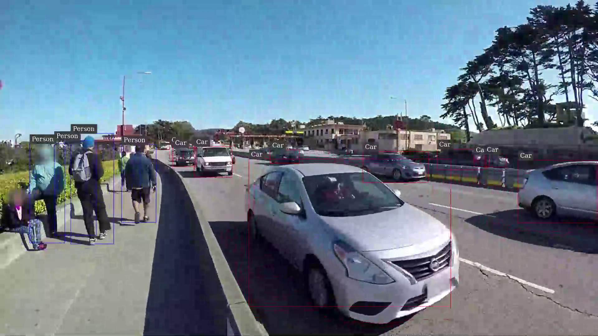

# Verification on JetPack 5.x

##  Background

JetPack 5.0 allows you to have CUDA installed in Docker containers and no longer expects CUDA, TensorRT to be installed on the host Jetson device.<br>
To be able to run a container on Jetson with GPU acceleration, all you need to do is to install `nvidia-docker` package on top of L4T (Jetson Linux).

So one viable approach is to aim for the minimal possible L4T configuration just enough to run a docker container.

The latest DeepStream containers (> `6.1.1`) are configured such way that it has CUDA, TensorRT and all the necessary libraries installed in the container, so they can be used to verify your minimally configured Jetson system. 

## Running DeepStream sample container

### On the host (Jetson natively)

```
export DISPLAY=:0
mkdir _output
sudo docker run -it --rm --net=host --runtime nvidia \
    -e DISPLAY=$DISPLAY \
    -v /tmp/.X11-unix/:/tmp/.X11-unix \
    -w /opt/nvidia/deepstream/deepstream \
    -v ${PWD}/_output:/opt/nvidia/deepstream/deepstream/_output \
    nvcr.io/nvidia/deepstream-l4t:6.1.1-samples
```

### Inside the container

!!! attention

    You need to run `/opt/nvidia/deepstream/deepstream/user_additional_install.sh` first in the container.

    [https://docs.nvidia.com/metropolis/deepstream/dev-guide/text/DS_docker_containers.html](https://docs.nvidia.com/metropolis/deepstream/dev-guide/text/DS_docker_containers.html)

    > With DS 6.1.1, DeepStream docker containers do not package libraries necessary for certain multimedia operations like audio data parsing, CPU decode, and CPU encode. This change could affect processing certain video streams/files like mp4 that include audio track. Please run the below script inside the docker images to install additional packages that might be necessary to use all of the DeepStreamSDK features : `/opt/nvidia/deepstream/deepstream/user_additional_install.sh`


Then execute the following.

```
rm ~/.cache/gstreamer-1.0/registry.aarch64.bin; deepstream-app -c samples/configs/deepstream-app/source2_1080p_dec_infer-resnet_demux_int8.txt
```

??? info "Example outputs of `deepstream` sample app"

    ```
    root@jao-jp502:/opt/nvidia/deepstream/deepstream-6.1# deepstream-app -c samples/configs/deepstream-app/source2_1080p_dec_infer-resnet_demux_int8.txt
    (Argus) Error FileOperationFailed: Connecting to nvargus-daemon failed: No such file or directory (in src/rpc/socket/client/SocketClientDispatch.cpp, function openSocketConnection(), line 204)
    (Argus) Error FileOperationFailed: Cannot create camera provider (in src/rpc/socket/client/SocketClientDispatch.cpp, function createCameraProvider(), line 106)

    (gst-plugin-scanner:490): GStreamer-WARNING **: 02:31:43.755: Failed to load plugin '/usr/lib/aarch64-linux-gnu/gstreamer-1.0/deepstream/libnvdsgst_inferserver.so': libtritonserver.so: cannot open shared object file: No such file or directory

    (gst-plugin-scanner:490): GStreamer-WARNING **: 02:31:43.840: Failed to load plugin '/usr/lib/aarch64-linux-gnu/gstreamer-1.0/deepstream/libnvdsgst_udp.so': librivermax.so.0: cannot open shared object file: No such file or directory
    Opening in BLOCKING MODE
    Opening in BLOCKING MODE
    WARNING: Deserialize engine failed because file path: /opt/nvidia/deepstream/deepstream-6.1/samples/configs/deepstream-app/../../models/Primary_Detector/resnet10.caffemodel_b1gpu0_int8.engine open error
    0:00:06.451429743   489 0xaaaaf9a594d0 WARN                 nvinfer gstnvinfer.cpp:643:gst_nvinfer_logger:<primary_gie> NvDsInferContext[UID 1]: Warning from NvDsInferContextImpl::deserializeEngineAndBackend() <nvdsinfer_context_impl.cpp:1897> [UID = 1]: deserialize engine from file :/opt/nvidia/deepstream/deepstream-6.1/samples/configs/deepstream-app/../../models/Primary_Detector/resnet10.caffemodel_b1gpu0_int8.engine failed
    0:00:06.657782259   489 0xaaaaf9a594d0 WARN                 nvinfer gstnvinfer.cpp:643:gst_nvinfer_logger:<primary_gie> NvDsInferContext[UID 1]: Warning from NvDsInferContextImpl::generateBackendContext() <nvdsinfer_context_impl.cpp:2002> [UID = 1]: deserialize backend context from engine from file :/opt/nvidia/deepstream/deepstream-6.1/samples/configs/deepstream-app/../../models/Primary_Detector/resnet10.caffemodel_b1gpu0_int8.engine failed, try rebuild
    0:00:06.658333822   489 0xaaaaf9a594d0 INFO                 nvinfer gstnvinfer.cpp:646:gst_nvinfer_logger:<primary_gie> NvDsInferContext[UID 1]: Info from NvDsInferContextImpl::buildModel() <nvdsinfer_context_impl.cpp:1923> [UID = 1]: Trying to create engine from model files
    WARNING: [TRT]: The implicit batch dimension mode has been deprecated. Please create the network with NetworkDefinitionCreationFlag::kEXPLICIT_BATCH flag whenever possible.
    0:01:07.113787909   489 0xaaaaf9a594d0 INFO                 nvinfer gstnvinfer.cpp:646:gst_nvinfer_logger:<primary_gie> NvDsInferContext[UID 1]: Info from NvDsInferContextImpl::buildModel() <nvdsinfer_context_impl.cpp:1955> [UID = 1]: serialize cuda engine to file: /opt/nvidia/deepstream/deepstream-6.1/samples/models/Primary_Detector/resnet10.caffemodel_b1_gpu0_int8.engine successfully
    INFO: [Implicit Engine Info]: layers num: 3
    0   INPUT  kFLOAT input_1         3x368x640
    1   OUTPUT kFLOAT conv2d_bbox     16x23x40
    2   OUTPUT kFLOAT conv2d_cov/Sigmoid 4x23x40

    0:01:07.461988493   489 0xaaaaf9a594d0 INFO                 nvinfer gstnvinfer_impl.cpp:328:notifyLoadModelStatus:<primary_gie> [UID 1]: Load new model:/opt/nvidia/deepstream/deepstream-6.1/samples/configs/deepstream-app/config_infer_primary.txt sucessfully

    Runtime commands:
            h: Print this help
            q: Quit

            p: Pause
            r: Resume


    **PERF:  FPS 0 (Avg)    FPS 1 (Avg)
    **PERF:  0.00 (0.00)    0.00 (0.00)
    ** INFO: <bus_callback:194>: Pipeline ready

    Opening in BLOCKING MODE
    Opening in BLOCKING MODE
    NvMMLiteOpen : Block : BlockType = 261
    NVMEDIA: Reading vendor.tegra.display-size : status: 6
    NvMMLiteOpen : Block : BlockType = 261
    NvMMLiteBlockCreate : Block : BlockType = 261
    NVMEDIA: Reading vendor.tegra.display-size : status: 6
    NvMMLiteBlockCreate : Block : BlockType = 261
    ** INFO: <bus_callback:180>: Pipeline running

    NvMMLiteOpen : Block : BlockType = 4
    ===== NVMEDIA: NVENC =====
    NvMMLiteOpen : Block : BlockType = 4
    ===== NVMEDIA: NVENC =====
    NvMMLiteBlockCreate : Block : BlockType = 4
    NvMMLiteBlockCreate : Block : BlockType = 4
    H264: Profile = 66, Level = 0
    NVMEDIA: Need to set EMC bandwidth : 846000
    H264: Profile = 66, Level = 0
    NVMEDIA_ENC: bBlitMode is set to TRUE
    NVMEDIA: Need to set EMC bandwidth : 846000
    NVMEDIA_ENC: bBlitMode is set to TRUE
    **PERF:  33.71 (33.14)  33.58 (33.20)
    **PERF:  29.80 (31.62)  29.98 (31.65)
    **PERF:  29.79 (31.00)  30.17 (31.15)
    **PERF:  30.15 (30.80)  30.01 (30.86)
    **PERF:  30.28 (30.67)  30.04 (30.68)
    **PERF:  29.98 (30.53)  29.80 (30.53)
    **PERF:  30.00 (30.45)  30.00 (30.46)
    **PERF:  30.03 (30.42)  30.13 (30.42)
    **PERF:  30.04 (30.37)  30.06 (30.38)
    ** INFO: <bus_callback:217>: Received EOS. Exiting ...

    Quitting
    App run successful
    ```

Once done, you can copy the output transcoded video files to your host for later inspection.

```
ls
mv out_*.mp4 ./
```

The processed video snapshot should look like following.



